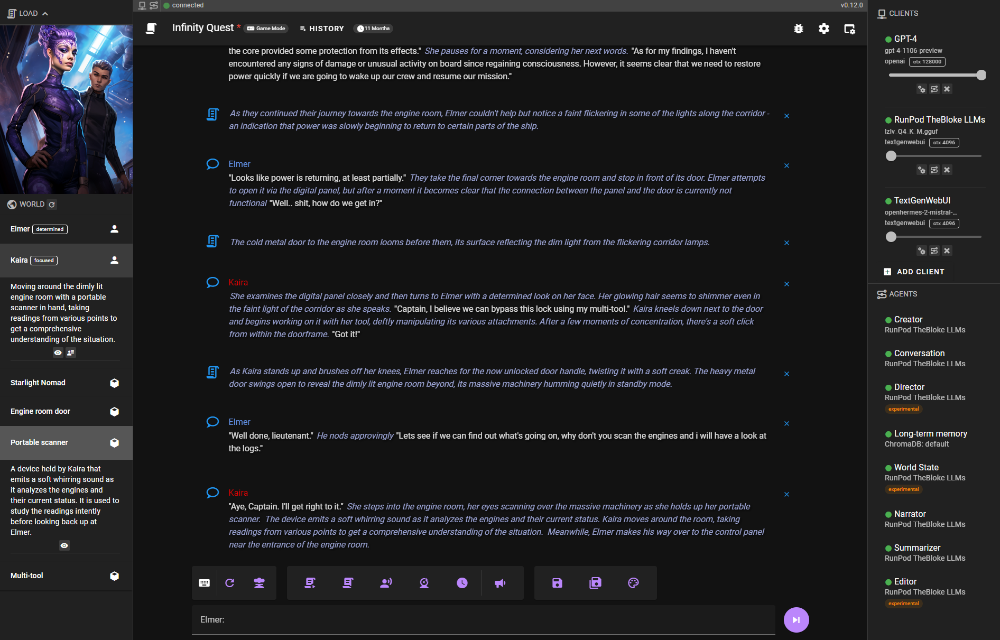
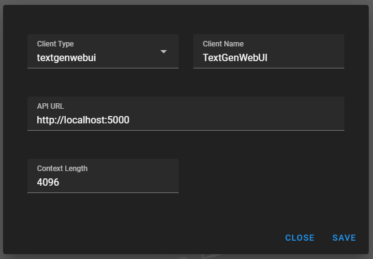
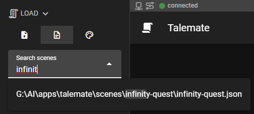

# Talemate

Allows you to play roleplay scenarios with large language models. 


|||
|------------------------------------------|------------------------------------------|

> :warning: **It does not run any large language models itself but relies on existing APIs. Currently supports OpenAI, text-generation-webui and LMStudio.**

This means you need to either have:
- an [OpenAI](https://platform.openai.com/overview) api key
- OR setup local (or remote via runpod) LLM inference via one of these options:
    - [oobabooga/text-generation-webui](https://github.com/oobabooga/text-generation-webui)
    - [LMStudio](https://lmstudio.ai/)

## Current features

- responive modern ui
- agents
    - conversation: handles character dialogue
    - narration: handles narrative exposition
    - summarization: handles summarization to compress context while maintain history
    - director: can be used to direct the story / characters
    - editor: improves AI responses (very hit and miss at the moment)
    - world state: generates world snapshot and handles passage of time (objects and characters)
    - creator: character / scenario creator
    - tts: text to speech via elevenlabs, coqui studio, coqui local
- multi-client support (agents can be connected to separate APIs)
- long term memory
    - chromadb integration
    - passage of time
- narrative world state
- narrative tools
- creative tools 
    - AI backed character creation with template support (jinja2)
    - AI backed scenario creation
- runpod integration
- overridable templates for all prompts. (jinja2)

## Planned features

Kinda making it up as i go along, but i want to lean more into gameplay through AI, keeping track of gamestates, moving away from simply roleplaying towards a more game-ified experience.

In no particular order:


- Extension support
    - modular agents and clients
- Improved world state
- Dynamic player choice generation
- Better creative tools
    - node based scenario / character creation
- Improved and consistent long term memory
- Improved director agent
    - Right now this doesn't really work well on anything but GPT-4 (and even there it's debatable). It tends to steer the story in a way that introduces pacing issues. It needs a model that is creative but also reasons really well i think.
- Gameplay loop governed by AI
    - objectives
    - quests
    - win / lose conditions
- Automatic1111 client for in place visual generation

# Quickstart

## Installation

Post [here](https://github.com/vegu-ai/talemate/issues/17) if you run into problems during installation.

### Windows

1. Download and install Python 3.10 or Python 3.11 from the [official Python website](https://www.python.org/downloads/windows/). :warning: python3.12 is currently not supported.
1. Download and install Node.js from the [official Node.js website](https://nodejs.org/en/download/). This will also install npm.
1. Download the Talemate project to your local machine. Download from [the Releases page](https://github.com/vegu-ai/talemate/releases).
1. Unpack the download and run `install.bat` by double clicking it. This will set up the project on your local machine.
    -  :warning: If your installation errors with a notification to upgrade "Microsoft Visual C++" go to https://visualstudio.microsoft.com/visual-cpp-build-tools/ and click "Download Build Tools" and run it.
        -  During installation make sure you select the C++ development package (upper left corner)
        -  Run `reinstall.bat` inside talemate directory
1. Once the installation is complete, you can start the backend and frontend servers by running `start.bat`.
1. Navigate your browser to http://localhost:8080

### Linux

`python 3.10` or higher is required.

1. `git clone git@github.com:vegu-ai/talemate`
1. `cd talemate`
1. `source install.sh`
1. Start the backend: `python src/talemate/server/run.py runserver --host 0.0.0.0 --port 5050`.
1. Open a new terminal, navigate to the `talemate_frontend` directory, and start the frontend server by running `npm run serve`.

## Configuration

### OpenAI

To set your openai api key, open `config.yaml` in any text editor and uncomment / add

```yaml
openai:
    api_key: sk-my-api-key-goes-here
```

You will need to restart the backend for this change to take effect.

### RunPod

To set your runpod api key, open `config.yaml` in any text editor and uncomment / add

```yaml
runpod:
    api_key: my-api-key-goes-here
```
You will need to restart the backend for this change to take effect.

Once the api key is set Pods loaded from text-generation-webui templates (or the bloke's runpod llm template) will be autoamtically added to your client list in talemate. 

**ATTENTION**: Talemate is not a suitable for way for you to determine whether your pod is currently running or not. **Always** check the runpod dashboard to see if your pod is running or not.

## Recommended Models 
(as of2023.10.25)

Any of the top models in any of the size classes here should work well:
https://www.reddit.com/r/LocalLLaMA/comments/17fhp9k/huge_llm_comparisontest_39_models_tested_7b70b/

## Connecting to an LLM

On the right hand side click the "Add Client" button. If there is no button, you may need to toggle the client options by clicking this button:


### Text-generation-webui

> :warning: As of version 0.13.0 the legacy text-generator-webui API `--extension api` is no longer supported, please use their new `--extension openai` api implementation instead. 

In the modal if you're planning to connect to text-generation-webui, you can likely leave everything as is and just click Save.



### OpenAI

If you want to add an OpenAI client, just change the client type and select the apropriate model.


### Ready to go

You will know you are good to go when the client and all the agents have a green dot next to them.


## Load the introductory scenario "Infinity Quest"

Generated using talemate creative tools, mostly used for testing / demoing.

You can load it (and any other talemate scenarios or save files) by expanding the "Load" menu in the top left corner and selecting the middle tab. Then simple search for a partial name of the scenario you want to load and click on the result.



## Loading character cards

Supports both v1 and v2 chara specs.

Expand the "Load" menu in the top left corner and either click on "Upload a character card" or simply drag and drop a character card file into the same area.


Once a character is uploaded, talemate may actually take a moment because it needs to convert it to a talemate format and will also run additional LLM prompts to generate character attributes and world state.

Make sure you save the scene after the character is loaded as it can then be loaded as normal talemate scenario in the future.

## Further documentation

Please read the documents in the `docs` folder for more advanced configuration and usage.

- [Prompt template overrides](docs/templates.md)
- [Text-to-Speech (TTS)](docs/tts.md)
- [ChromaDB (long term memory)](docs/chromadb.md)
- [Runpod Integration](docs/runpod.md)
- Creative mode
