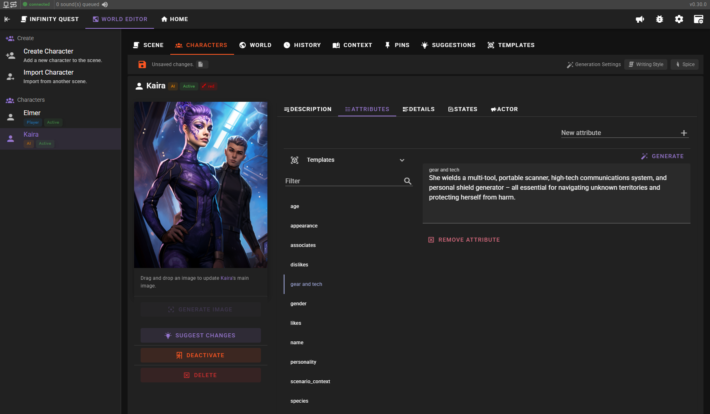

# Talemate

Roleplay with AI with a focus on strong narration and consistent world and game state tracking.

|||
|------------------------------------------|------------------------------------------|
|||

## Core Features

- Multiple agents for dialogue, narration, summarization, direction, editing, world state management, character/scenario creation, text-to-speech, and visual generation
- Supports per agent API selection
- Long-term memory and passage of time tracking
- Narrative world state management to reinforce character and world truths
- Creative tools for managing NPCs, AI-assisted character, and scenario creation with template support
- Node editor for creating complex scenarios and re-usable modules
- Context management for character details, world information, past events, and pinned information
- Customizable templates for all prompts using Jinja2
- Modern, responsive UI

## Documentation

- [Installation and Getting started](https://vegu-ai.github.io/talemate/)
- [User Guide](https://vegu-ai.github.io/talemate/user-guide/interacting/)

## Discord Community

Need help? Join the new [Discord community](https://discord.gg/8bGNRmFxMj)

## Supported APIs

- [OpenAI](https://platform.openai.com/overview)
- [Anthropic](https://www.anthropic.com/)
- [mistral.ai](https://mistral.ai/)
- [Cohere](https://www.cohere.com/)
- [Groq](https://www.groq.com/)
- [Google Gemini](https://console.cloud.google.com/)

Supported self-hosted APIs:
- [KoboldCpp](https://koboldai.org/cpp) ([Local](https://koboldai.org/cpp), [Runpod](https://koboldai.org/runpodcpp), [VastAI](https://koboldai.org/vastcpp), also includes image gen support)
- [oobabooga/text-generation-webui](https://github.com/oobabooga/text-generation-webui) (local or with runpod support)
- [LMStudio](https://lmstudio.ai/)
- [TabbyAPI](https://github.com/theroyallab/tabbyAPI/)

Generic OpenAI api implementations (tested and confirmed working):
- [DeepInfra](https://deepinfra.com/)
- [llamacpp](https://github.com/ggerganov/llama.cpp) with the `api_like_OAI.py` wrapper
- let me know if you have tested any other implementations and they failed / worked or landed somewhere in between
