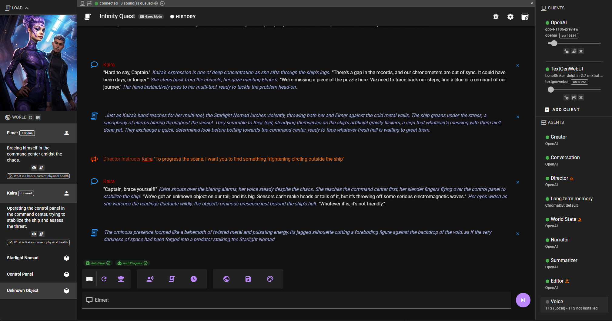

# Talemate

Roleplay with AI with a focus on strong narration and consistent world and game state tracking.

|||
|------------------------------------------|------------------------------------------|
|||
|||

> :warning: **It does not run any large language models itself but relies on existing APIs. Currently supports OpenAI, Anthropic, mistral.ai, self-hosted text-generation-webui and LMStudio. 0.18.0 also adds support for generic OpenAI api implementations, but generation quality on that will vary.**

Supported APIs:
- [OpenAI](https://platform.openai.com/overview)
- [Anthropic](https://www.anthropic.com/)
- [mistral.ai](https://mistral.ai/)

Supported self-hosted APIs:
- [oobabooga/text-generation-webui](https://github.com/oobabooga/text-generation-webui) (local or with runpod support)
- [LMStudio](https://lmstudio.ai/)

Generic OpenAI api implementations (tested and confirmed working):
- [DeepInfra](https://deepinfra.com/)
- [llamacpp](https://github.com/ggerganov/llama.cpp) with the `api_like_OAI.py` wrapper
- let me know if you have tested any other implementations and they failed / worked or landed somewhere in between

## Current features

- responsive modern ui
- agents
    - conversation: handles character dialogue
    - narration: handles narrative exposition
    - summarization: handles summarization to compress context while maintaining history
    - director: can be used to direct the story / characters
    - editor: improves AI responses (very hit and miss at the moment)
    - world state: generates world snapshot and handles passage of time (objects and characters)
    - creator: character / scenario creator
    - tts: text to speech via elevenlabs, OpenAI or local tts
    - visual: stable-diffusion client for in place visual generation via AUTOMATIC1111, ComfyUI or OpenAI
- multi-client support (agents can be connected to separate APIs)
- long term memory
    - chromadb integration
    - passage of time
- narrative world state
    - Automatically keep track and reinforce selected character and world truths / states.
- narrative tools
- creative tools 
    - manage multiple NPCs
    - AI backed character creation with template support (jinja2)
    - AI backed scenario creation
- context managegement
    - Manage character details and attributes
    - Manage world information / past events
    - Pin important information to the context (Manually or conditionally through AI)
- runpod integration
- overridable templates for all prompts. (jinja2)

## Planned features

Kinda making it up as i go along, but i want to lean more into gameplay through AI, keeping track of gamestates, moving away from simply roleplaying towards a more game-ified experience.

In no particular order:

- Extension support
    - modular agents and clients
- Improved world state
- Dynamic player choice generation
- Better creative tools
    - node based scenario / character creation
- Improved and consistent long term memory and accurate current state of the world
- Improved director agent
    - Right now this doesn't really work well on anything but GPT-4 (and even there it's debatable). It tends to steer the story in a way that introduces pacing issues. It needs a model that is creative but also reasons really well i think.
- Gameplay loop governed by AI
    - objectives
    - quests
    - win / lose conditions


# Instructions

Please read the documents in the `docs` folder for more advanced configuration and usage.

- [Quickstart](#quickstart)
    - [Installation](#installation)
    - [Connecting to an LLM](#connecting-to-an-llm)
        - [Text-generation-webui](#text-generation-webui)
            - [Recommended Models](#recommended-models)
        - [OpenAI / mistral.ai / Anthropic](#openai--mistralai--anthropic)
        - [DeepInfra via OpenAI Compatible client](#deepinfra-via-openai-compatible-client)
    - [Ready to go](#ready-to-go)
    - [Load the introductory scenario "Infinity Quest"](#load-the-introductory-scenario-infinity-quest)
    - [Loading character cards](#loading-character-cards)
- [Text-to-Speech (TTS)](docs/tts.md)
- [Visual Generation](docs/visual.md)
- [ChromaDB (long term memory) configuration](docs/chromadb.md)
- [Runpod Integration](docs/runpod.md)
- [Prompt template overrides](docs/templates.md)

# Quickstart

## Installation

Post [here](https://github.com/vegu-ai/talemate/issues/17) if you run into problems during installation.

There is also a [troubleshooting guide](docs/troubleshoot.md) that might help.

### Windows

1. Download and install Python 3.10 or Python 3.11 from the [official Python website](https://www.python.org/downloads/windows/). :warning: python3.12 is currently not supported.
1. Download and install Node.js v20 from the [official Node.js website](https://nodejs.org/en/download/). This will also install npm. :warning: v21 is currently not supported.
1. Download the Talemate project to your local machine. Download from [the Releases page](https://github.com/vegu-ai/talemate/releases).
1. Unpack the download and run `install.bat` by double clicking it. This will set up the project on your local machine.
1. Once the installation is complete, you can start the backend and frontend servers by running `start.bat`.
1. Navigate your browser to http://localhost:8080

### Linux

`python 3.10` or `python 3.11` is required. :warning: `python 3.12` not supported yet. 

`nodejs v19 or v20` :warning: `v21` not supported yet.

1. `git clone git@github.com:vegu-ai/talemate`
1. `cd talemate`
1. `source install.sh`
1. Start the backend: `python src/talemate/server/run.py runserver --host 0.0.0.0 --port 5050`.
1. Open a new terminal, navigate to the `talemate_frontend` directory, and start the frontend server by running `npm run serve`.

# Connecting to an LLM

On the right hand side click the "Add Client" button. If there is no button, you may need to toggle the client options by clicking this button:


## Text-generation-webui

> :warning: As of version 0.13.0 the legacy text-generator-webui API `--extension api` is no longer supported, please use their new `--extension openai` api implementation instead. 

In the modal if you're planning to connect to text-generation-webui, you can likely leave everything as is and just click Save.


### Specifying the correct prompt template

For good results it is **vital** that the correct prompt template is specified for whichever model you have loaded.

Talemate does come with a set of pre-defined templates for some popular models, but going forward, due to the sheet number of models released every day, understanding and specifying the correct prompt template is something you should familiarize yourself with.

If the text-gen-webui client shows a yellow triangle next to it, it means that the prompt template is not set, and it is currently using the default `VICUNA` style prompt template.


Click the two cogwheels to the right of the triangle to open the client settings.


You can first try by clicking the `DETERMINE VIA HUGGINGFACE` button, depending on the model's README file, it may be able to determine the correct prompt template for you. (basically the readme needs to contain an example of the template)

If that doesn't work, you can manually select the prompt template from the dropdown. 

In the case for `bartowski_Nous-Hermes-2-Mistral-7B-DPO-exl2_8_0` that is `ChatML` - select it from the dropdown and click `Save`.


### Recommended Models 

As of 2024.03.07 my personal regular drivers (the ones i test with) are:

- Kunoichi-7B
- sparsetral-16x7B
- Nous-Hermes-2-Mistral-7B-DPO
- brucethemoose_Yi-34B-200K-RPMerge
- dolphin-2.7-mixtral-8x7b
- rAIfle_Verdict-8x7B
- Mixtral-8x7B-instruct

That said, any of the top models in any of the size classes here should work well (i wouldn't recommend going lower than 7B):

https://www.reddit.com/r/LocalLLaMA/comments/18yp9u4/llm_comparisontest_api_edition_gpt4_vs_gemini_vs/

## OpenAI / mistral.ai / Anthropic

The setup is the same for all three, the example below is for OpenAI.

If you want to add an OpenAI client, just change the client type and select the apropriate model.


If you are setting this up for the first time, you should now see the client, but it will have a red dot next to it, stating that it requires an API key.


Click the `SET API KEY` button. This will open a modal where you can enter your API key.


Click `Save` and after a moment the client should have a green dot next to it, indicating that it is ready to go.


## DeepInfra via OpenAI Compatible client

You can use the OpenAI compatible client to connect to [DeepInfra](https://deepinfra.com/).


```
API URL: https://api.deepinfra.com/v1/openai
```

Models on DeepInfra that work well with Talemate:

- [mistralai/Mixtral-8x7B-Instruct-v0.1](https://deepinfra.com/mistralai/Mixtral-8x7B-Instruct-v0.1) (max context 32k, 8k recommended)
- [cognitivecomputations/dolphin-2.6-mixtral-8x7b](https://deepinfra.com/cognitivecomputations/dolphin-2.6-mixtral-8x7b) (max context 32k, 8k recommended)
- [lizpreciatior/lzlv_70b_fp16_hf](https://deepinfra.com/lizpreciatior/lzlv_70b_fp16_hf) (max context 4k)

## Ready to go

You will know you are good to go when the client and all the agents have a green dot next to them.


## Load the introductory scenario "Infinity Quest"

Generated using talemate creative tools, mostly used for testing / demoing.

You can load it (and any other talemate scenarios or save files) by expanding the "Load" menu in the top left corner and selecting the middle tab. Then simple search for a partial name of the scenario you want to load and click on the result.


## Loading character cards

Supports both v1 and v2 chara specs.

Expand the "Load" menu in the top left corner and either click on "Upload a character card" or simply drag and drop a character card file into the same area.


Once a character is uploaded, talemate may actually take a moment because it needs to convert it to a talemate format and will also run additional LLM prompts to generate character attributes and world state.

Make sure you save the scene after the character is loaded as it can then be loaded as normal talemate scenario in the future.
