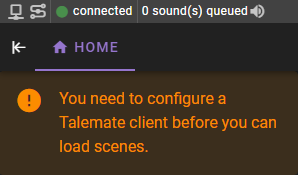

# Connect a client

Once Talemate is up and running and you are connected, you will see a notification in the corner instructing you to configured a client.

Talemate uses client(s) to connect to local or remote AI text generation APIs like koboldcpp, text-generation-webui or OpenAI.

## Add a new client

On the right hand side click the "Add Client" button. If there is no button, you may need to toggle the client options by clicking this button

Then click the `Add Client` button.

Which will open the client configuration dialog.

## Choose an API / Client Type

We have support for multiple local and remote APIs. You can choose to use one or more of them.

##### Remote APIs

- [OpenAI](/user-guide/clients/types/openai/)
- [Anthropic](/user-guide/clients/types/anthropic/)
- [mistral.ai](https://mistral.ai/)
- [Cohere](https://www.cohere.com/)
- [Groq](https://www.groq.com/)
- [Google Gemini](https://console.cloud.google.com/)

##### Local APIs

- [KoboldCpp](https://koboldai.org/cpp)
- [Text-Generation-WebUI](/user-guide/clients/types/text-generation-webui/) 
- [LMStudio](https://lmstudio.ai/)

##### Unofficial OpenAI API implementations

- [DeepInfra](https://deepinfra.com/)
- [llamacpp](https://github.com/ggerganov/llama.cpp) with the `api_like_OAI.py` wrapper

## Assign the client to the agents

Whenever you add your first client, Talemate will automatically assign it to all agents. Once the client is configured and assigned, all agents should have a green dot next to them. (Or grey if the agent is currently disabled)

You can tell the client is assigned to the agent by checking the tag beneath the agent name, which will contain the client name if it is assigned.

## Its not assigned!

If for some reason the client is not assigned to the agent, you can manually assign it to all agents by clicking the `Assign to all agents` button.

