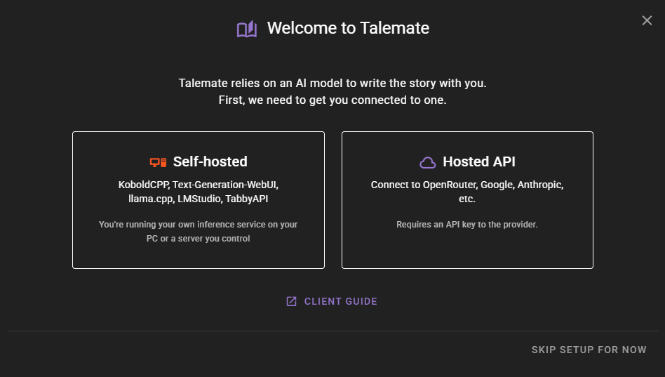
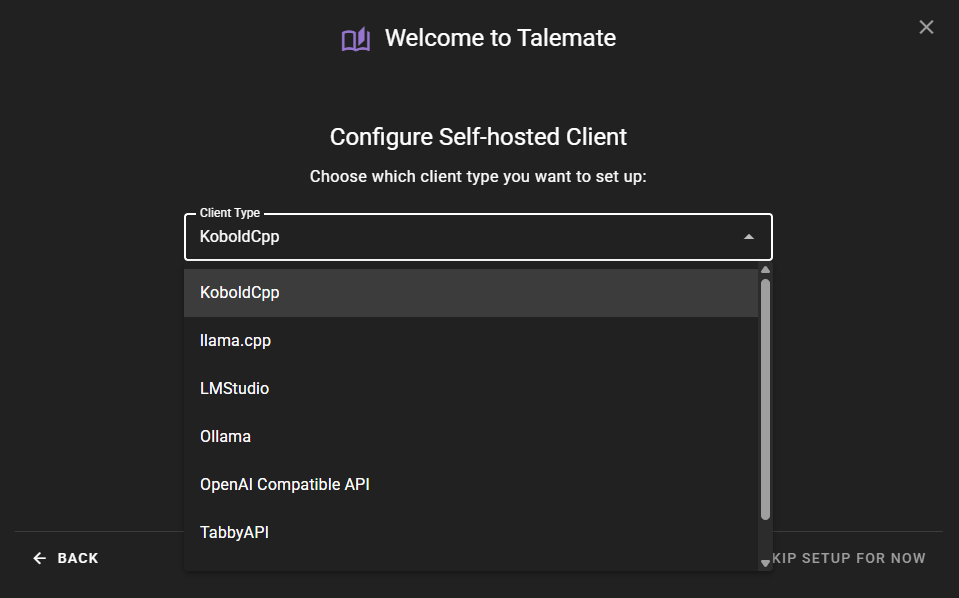

# Setup Wizard

When you launch Talemate for the first time, a setup wizard will guide you through the initial configuration. This wizard helps you connect to an AI model and configure essential settings so you can start creating stories right away.

## Step 1: Choose Your AI Provider Type

The first decision is how you want to connect to an AI model. Talemate offers two options:

### Self-hosted

Choose this if you are running your own AI inference service on your computer or a server you control. This includes:

- KoboldCpp
- Text-Generation-WebUI
- llama.cpp
- LMStudio
- TabbyAPI

### Hosted API

Choose this if you want to use a cloud-based AI service. This requires an API key from the provider. Supported services include:

- OpenRouter
- Google
- Anthropic
- And others

## Step 2: Add Your Client

After selecting your provider type, you will choose a specific client to configure.

For **Hosted API** users, OpenRouter is selected by default. For **Self-hosted** users, KoboldCpp is selected by default.

Select your preferred client from the dropdown and click **Add Client** to open the client configuration dialog.

Once you complete the client configuration, the wizard will automatically advance to the next step.

!!! info "Reasoning Models"
    If you are using a reasoning model (like DeepSeek R1 or GLM), you will need to enable reasoning in the client settings after setup. For OpenRouter users, the default model selected during the wizard (Gemini 3 Flash) has reasoning enabled automatically, but if you switch to a different reasoning-capable model, you'll need to enable it manually in the client settings.

## Step 3: Configure Long-term Memory

Talemate uses embeddings to store and retrieve story details over time. This includes character names, relationships, locations, and other facts that should persist as your story grows.

### Embeddings Model

You have two options:

**Better (Recommended)**

Uses the `Alibaba-NLP/gte-base-en-v1.5` model. This provides more capable memory recall and is recommended for the best experience. The model weights are approximately 550MB and will be downloaded when you first load a scene. If using CUDA, plan for roughly 1GB or more of free VRAM.

**Standard**

A smaller, less capable model. Choose this only if you cannot spare the VRAM for the recommended model.

### Device

Choose where the embeddings model should run:

**CUDA**

Faster performance on NVIDIA GPUs. Recommended if you have an NVIDIA GPU with sufficient free VRAM. The wizard will detect your CUDA availability and display your GPU information.

**CPU**

Works on any system. Use this if you do not have an NVIDIA GPU or prefer not to use GPU memory for embeddings.

The wizard will automatically detect your system capabilities and suggest appropriate defaults based on your available hardware.

!!! note "Changing these settings later"
    You can change the embeddings model and device at any time in **Agents -> Memory**.

## Step 4: Configure Visual Agent (Optional)

This step only appears if you selected **Google** or **OpenRouter** as your client in Step 2.

Since these providers support image generation and analysis, you can configure the Visual Agent to use them for:

- Creating images
- Editing images
- Analyzing images

Choose **Enable** to automatically configure the Visual Agent, or **Skip** to configure it manually later.

## Completing the Wizard

After completing all steps, click **Apply & finish** to save your settings and close the wizard. You are now ready to start using Talemate.

## Skipping the Wizard

If you prefer to configure Talemate manually, you can click **Skip setup for now** at any time. The wizard will close and you can configure clients and settings through the regular interface.

The wizard will not appear again once you have added at least one client. If you skipped the wizard without adding a client, it will appear again the next time you launch Talemate.

## Re-accessing Setup Options

The setup wizard is designed for first-time setup only. However, all the settings it configures can be accessed through the regular interface:

- **Client configuration**: Click **Add Client** in the clients panel on the right side of the screen
- **Memory settings**: Navigate to **Agents -> Memory** and open the settings
- **Visual Agent settings**: Navigate to **Agents -> Visual** and open the settings
