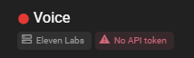
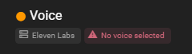
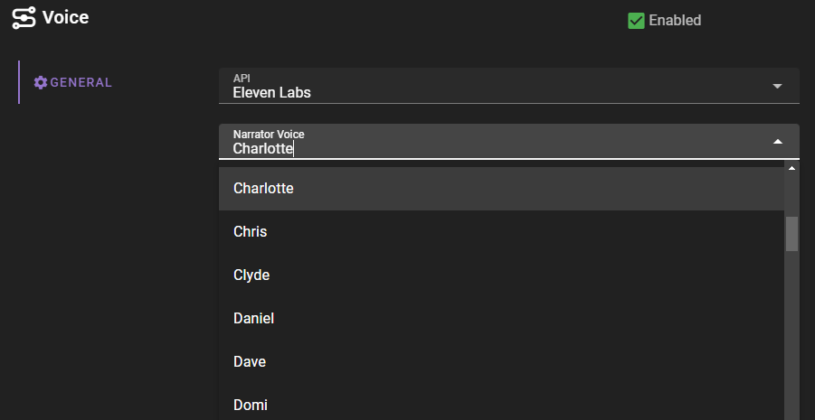

# ElevenLabs

If you have not configured the ElevenLabs TTS API, the voice agent will show that the API key is missing.

See the [ElevenLabs API setup](../apis/elevenlabs.md) for instructions on how to set up the API key.

### Select a voice

Now it may show that you currently do not have a voice selected

Click on the agent to open the agent settings.

Then click on the `Narrator Voice` dropdown and select a voice.

The selection is saved automatically, click anywhere outside the agent settings to close the settings.

The Voice agent should now show that the voice is selected and be ready to use.

