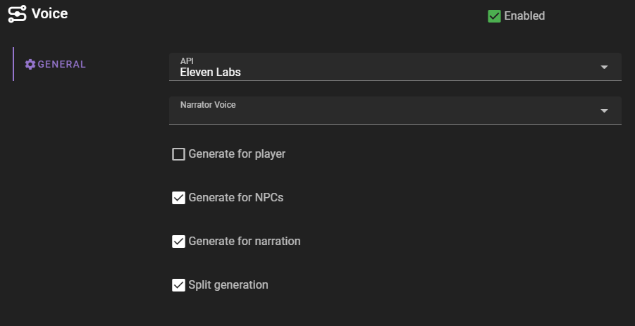

# Overview

Talemate supports Text-to-Speech (TTS) functionality, allowing users to convert text into spoken audio. This document outlines the steps required to configure TTS for Talemate using different providers, including ElevenLabs and a local TTS API.

## Enable the Voice agent

Start by enabling the voice agent, if it is currently disabled. 

