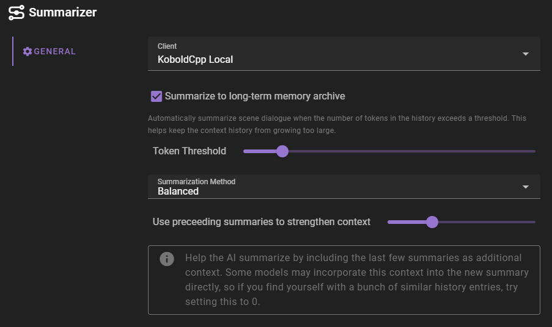

# Settings

##### Summarize to long term memory archive

Automatically summarize scene dialogue when the number of tokens in the history exceeds a threshold. This helps keep the context history from growing too large.

###### Token threshold

The number of tokens in the history that will trigger the summarization process.

###### Summarization method

The method used to summarize the scene dialogue. 

- `Balanced` - medium length summary
- `Short & Concise` - short summary
- `Lengthy & Detailed` - long summary
- `Factual list` - numbered list of events that transpired

###### Use preceeding summaries to strengthen context

Help the AI summarize by including the last few summaries as additional context. Some models may incorporate this context into the new summary directly, so if you find yourself with a bunch of similar history entries, try setting this to 0.