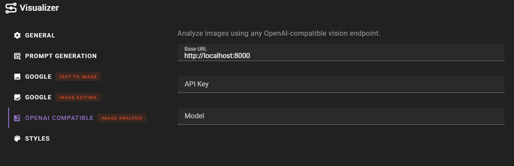

# OpenAI Compatible (Vision)

!!! info "New in 0.36.0"
    The OpenAI Compatible vision backend provides image analysis through any OpenAI-compatible vision endpoint.

The OpenAI Compatible backend for image analysis allows you to connect to any API endpoint that implements the OpenAI chat completions format with multimodal vision support. This includes local inference servers like llama.cpp, Ollama, vLLM, and other OpenAI-compatible services running vision-capable models.

## Prerequisites

- An OpenAI-compatible API endpoint that supports multimodal vision input
- A vision-capable model loaded on the endpoint

## Setup

1. Open the **Visualizer** agent settings
2. Set the **Backend (image analysis)** dropdown to **OpenAI Compatible**
3. Configure the backend settings that appear below

### Configuration

##### Base URL

The base URL of your OpenAI-compatible API endpoint. For example:

- `http://localhost:8080` (llama.cpp)
- `http://localhost:8000` (vLLM)

The `/v1` path is appended automatically if not already present.

##### API Key

Optional API key for authentication. Leave empty if your endpoint does not require authentication. A placeholder value is used automatically when no key is provided.

##### Model

The model name to use for vision analysis. This may be optional depending on the API endpoint -- some single-model servers do not require it, while multi-model servers need it to route requests correctly.

## Usage

Once configured, the backend is used automatically whenever image analysis is requested through the Visualizer agent. This includes:

- Analyzing images in the [Visual Library](/talemate/user-guide/agents/visualizer/visual-library/)
- Automatic analysis of reference images during prompt generation (when enabled)
- Any other feature that requires image understanding

## Troubleshooting

**Connection errors**: Verify that the base URL is correct and the server is running. The backend tests the connection by attempting to list available models.

**Empty or missing responses**: Ensure the model loaded on your endpoint actually supports multimodal vision input. Not all models support image analysis even if they run on a vision-capable server.

**Model not found**: If using a multi-model server, verify that the model name matches exactly what the server expects (check the server's model list).
