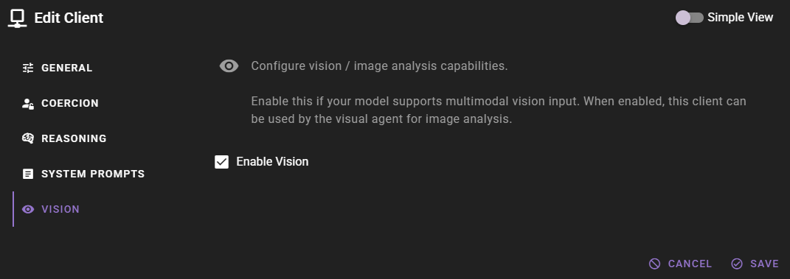
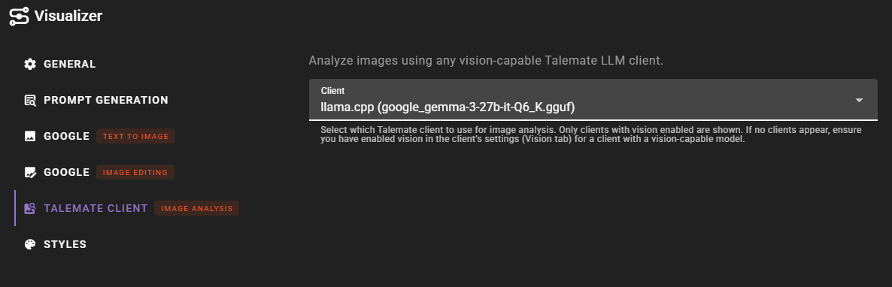

# Talemate Client (Vision)

!!! info "New in 0.36.0"
    The Talemate Client vision backend allows you to use any vision-capable Talemate LLM client for image analysis.

The Talemate Client backend for image analysis lets you reuse an existing Talemate LLM client connection for vision tasks. Instead of configuring a separate endpoint, you select one of your already-configured LLM clients that has vision capabilities enabled.

## Prerequisites

- A Talemate LLM client configured and connected with a vision-capable model
- Vision must be **enabled** in the client's settings (see [Enabling Vision on a Client](#enabling-vision-on-a-client) below)

## Enabling Vision on a Client

Before a client can be used for image analysis, you need to enable its vision capabilities:

1. Open the client's settings by clicking on the client in the sidebar
2. Look for the **Vision** configuration section
3. Enable the **Enable Vision** toggle

!!! warning "Model Must Support Vision"
    Only enable vision if the model currently loaded on the client actually supports multimodal vision input. For local models this generally means a mmproj (multimodal projector) file was loaded alongside the model. Enabling vision on a text-only model will result in errors when image analysis is attempted.

Vision support is currently available on the following clients:

- KoboldCpp
- llama.cpp
- text-generation-webui

## Setup

1. Ensure at least one of your LLM clients has vision enabled (see above)
2. Open the **Visualizer** agent settings
3. Set the **Backend (image analysis)** dropdown to **Talemate Client**
4. In the backend settings that appear, select the client to use from the **Client** dropdown

The client dropdown only shows clients that have vision enabled. If no clients appear, you need to enable vision on at least one client first.

## Advantages

Using the Talemate Client backend has several advantages over configuring a separate OpenAI Compatible endpoint:

- **No duplicate configuration** -- reuses your existing client connection and credentials
- **Model awareness** -- the backend automatically knows which model is loaded
- **Centralized management** -- client status, connection, and model changes are handled in one place
- **Dynamic selection** -- the client list updates automatically when you enable or disable vision on clients

## Usage

Once configured, the backend is used automatically whenever image analysis is requested. The selected client handles the vision request using the same connection it uses for text generation.

## Troubleshooting

**No clients in dropdown**: Ensure you have at least one client with vision enabled. Open your client settings and check the Vision section.

**Client not connected**: The selected client must be connected and enabled. Check the client's status in the sidebar.

**Vision not enabled error**: The selected client has `vision_enabled` set to false. Open the client settings and enable vision in the Vision section.

**Analysis errors**: Verify that the model loaded on the client actually supports multimodal vision input. Some models may be listed as vision-capable but require specific configurations.
