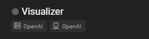
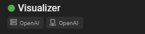
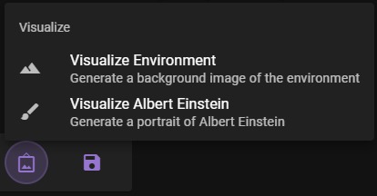
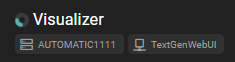
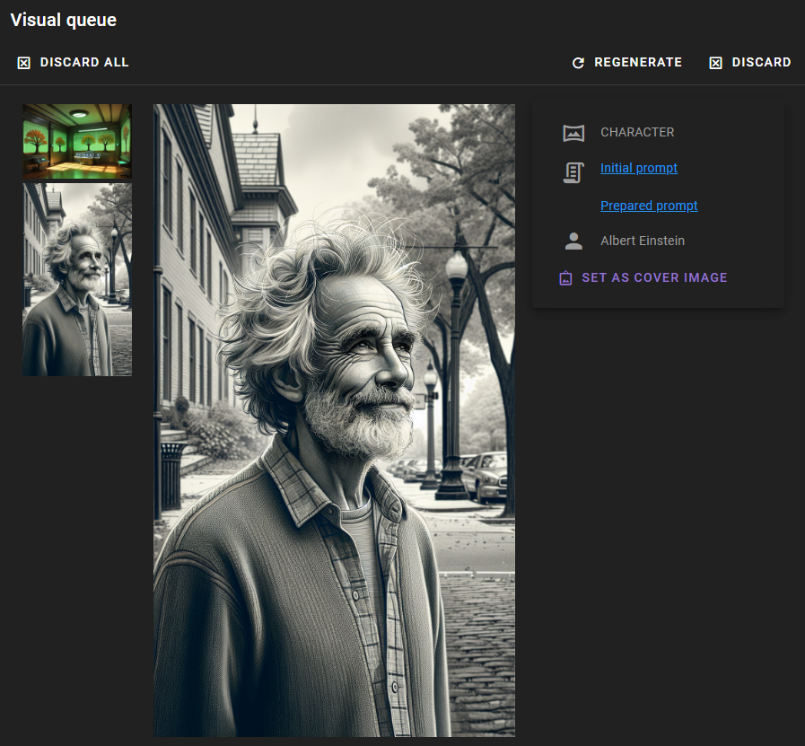

# Overview

The visual agent currently allows for some bare bones visual generation using various stable-diffusion APIs. This is early development and experimental.

Its important to note that the visualization agent actually specifies two clients. One is the **backend for the visual generation**, and the other is the **text generation client to use for prompt generation**.

The client for prompt generation can be assigned to the agent as you would for any other agent. The backend for visual generation is assigned in the Visualizer config.

## Enable the Visualizer agent

If your visualizer agent is disabled - indicated by the grey dot next to the agent - you can enable it by clicking on the agent and checking the `Enable` checkbox near the top of the agent settings.

 

!!! abstract "Next: Configure a backend"
    Before you can use the visualizer agent, you need to configure a backend for it.

    - [OpenAI](openai.md)
    - [AUTOMATIC1111](automatic1111.md)
    - [ComfyUI](comfyui.md)

## How to use

Once enabled and configured successfully, the agent will show a green dot next to it.

At that point it will automatically enable the visualization menu for you to use (once you have a scene loaded).

Right now you can generate a portrait for any NPC in the scene or a background image for the scene itself.

Image generation by default will actually happen in the background, allowing you to continue using Talemate while the image is being generated. 

You can tell if an image is being generated by the blueish spinner next to the visualization agent.

Once the image is generated, it will be avaible for you to view via the visual queue button on top of the screen.

Click it to open the visual queue and view the generated images.

### Character Portrait

For character potraits you can chose whether or not to replace the main portrait for the character (the one being displated in the left sidebar when a talemate scene is active).

### Background Image

Right now there is nothing to do with the background image, other than to view it in the visual queue. More functionality will be added in the future.