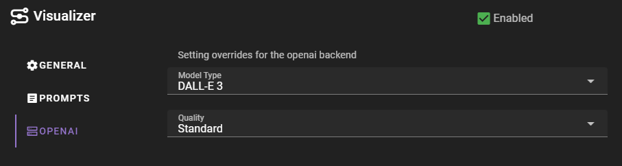

# OpenAI

Most straightforward to use, as it runs on the OpenAI API, and requires minimal setup.

You will need to have an API key and set it in the application config. See [here](../../apis/openai.md) for setting up the OpenAI API key.

## Settings

##### Model type

Which OpenAI image generation model to use. 

- DALL-E 3 (recommended)
- DALL-E 2

##### Quality

The quality of the image generation. Higher quality will take longer to generate and be more expensive.

- Standard
- HD

!!! quote "OpenAI API documentation on quality"
    The quality property is available when using DALL·E 3. It defaults to “standard”, which will create images quickly and at lower cost. Users can specify quality: "hd” (and pay a higher price) to give the model more time to generate images, resulting in higher image quality, but also higher latency.