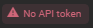
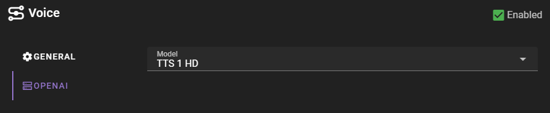

# OpenAI

If you are using OpenAI for voice generation, you will need to provide an API key.

See the [OpenAI API setup](../../apis/openai.md) for instructions on how to set up the API key.

## Settings

##### Model

Which model to use for generation.

- TTS-1
- TTS-1 HD

!!! quote "OpenAI API documentation on quality"
    For real-time applications, the standard tts-1 model provides the lowest latency but at a lower quality than the tts-1-hd model. Due to the way the audio is generated, tts-1 is likely to generate content that has more static in certain situations than tts-1-hd. In some cases, the audio may not have noticeable differences depending on your listening device and the individual person.

Generally i have found that HD is fast enough for talemate, so this is the default.