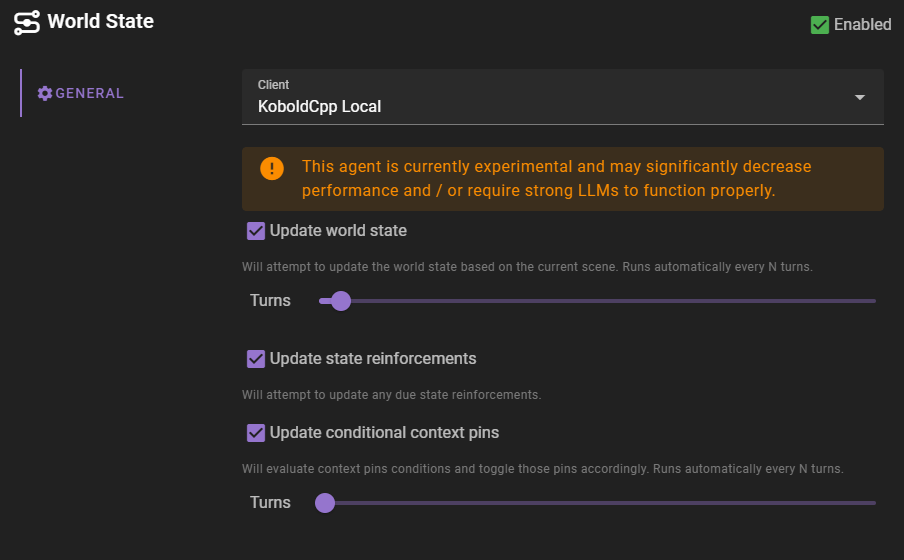

# Settings

##### Update world state

Will attempt to update the [world state snapshot](/user-guide/world-state/) based on the current scene. Runs automatically every N turns.

###### Turns

How many turns to wait before the world state is updated.

##### Update state reinforcements

Will attempt to update any due tracked states

This is checked every turn and if there are any state reinforcements that are due, they will be updated.

--8<-- "docs/snippets/tips.md:what_is_a_tracked_state"

##### Update conditional context pins

Will attempt to evaluate and update any due [conditional context pins](/user-guide/world-editor/pins/#automatically-pinning-entries).

###### Turns

How many turns to wait before the conditional context pins are updated.