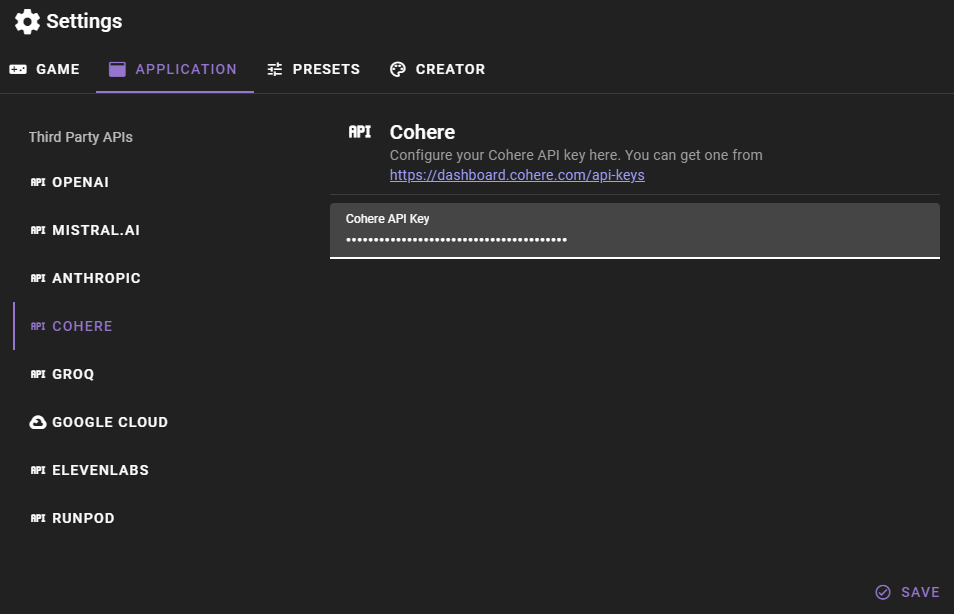

# Cohere API Setup

Talemate can use Cohere for text generation.

You need to have an API key for Cohere and set it in the application config. You can manage your Cohere API keys at [https://dashboard.cohere.com/api-keys](https://dashboard.cohere.com/api-keys)

Once you have your key open the Talemate settings and click the `APPLICATION` tab and then the `COHERE` category. Here you can add your Cohere API key.

Then click `Save` to save your changes.