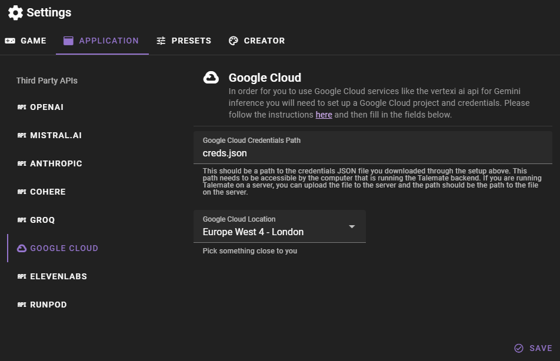

# Google Cloud Setup

Unlike the other service APIs the setup for Google Cloud in order to use their Gemini AI is a bit more involved as you will need to set up a google cloud project and credentials for it.

Please follow their [instructions for setup](https://cloud.google.com/vertex-ai/docs/start/client-libraries) - which includes setting up a project, enabling the Vertex AI API, creating a service account, and downloading the credentials.

Once you have downloaded the credentials, copy the JSON file into the talemate directory. You can rename it to something that's easier to remember, like `creds.json`.

Then click `Save` to save your changes.

## Settings

##### Google Cloud Credentials Path

This should be a path to the credentials JSON file you downloaded through the setup above. This path needs to be accessible by the computer that is running the Talemate backend. If you are running Talemate on a server, you can upload the file to the server and the path should be the path to the file on the server.

##### Google Cloud Location

This should be the location that is closest to you. This is used to determine where the API requests are sent to.