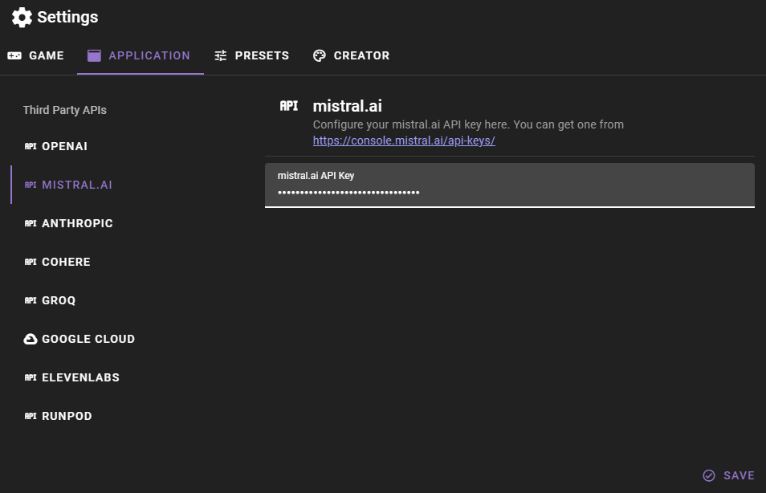

# Mistral.ai API Setup

Talemate can use Mistral.ai for text generation.

You need to have an API key for Mistral.ai and set it in the application config. You can manage your Mistral.ai API keys at [https://console.mistral.ai/api-keys/](https://console.mistral.ai/api-keys/)

Once you have your key open the Talemate settings and click the `APPLICATION` tab and then the `MISTRAL.AI` category. Here you can add your Mistral.ai API key.

Then click `Save` to save your changes.