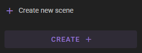
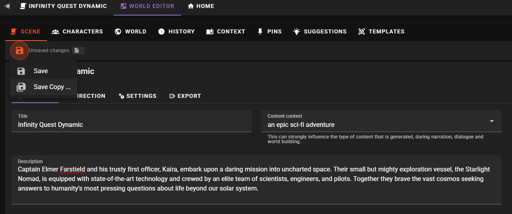
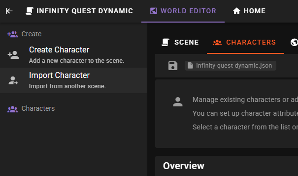
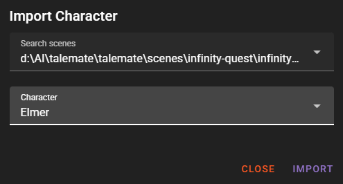
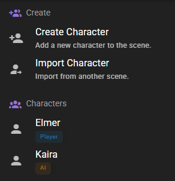
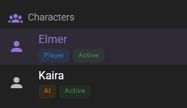
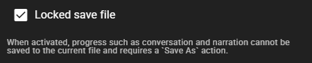
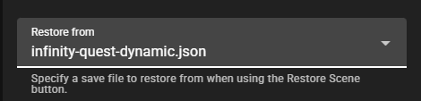
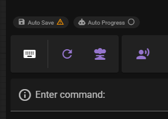

# 1 - Scene Project

Creating the scene project and saving it.

## 1.1 - Create the scene project

Load up talemate and find the **Create :material-plus:** button in the left sidebar.

Click it.

Ignore the node editor for now and head to the **:material-earth-box: World Editor** tab.

Fill in `Title`, `Description` and `Content Context`

Then click the **Save** button. Enter a file name `infinity-quest-dynamic` and click **Save**.

## 1.2 - Lets import characters

Since this is going to be a dynamic version of the existing `Infinity Quest` project, we can just import the two main characters from the existing project.

Head over to the **Characters** tab and click the **Import Character** button on the left.

In the modal that opens up, search for the `infinity-quest.json` scene file and then select the `Elmer` character.

Click **Import**.

Repeat the process for the `Kaira` character.

Both characters should now be in the character list.

Make sure to then also activate both characters. Click on each name in the character list and then click the **Activate** button.

**Save** the scene project again.

## 1.3 - Finalize

When working on a scene you should always do two things:

1. Lock the save file - this will prevent auto-saving of any progress in the scene that may happen during testing. When a save is locked a save outside of the world editor will always trigger a `Save As` dialog, forcing you to save the scene under a new name.
2. Set a restoration file - set this to the file we just saved at `infinity-quest-dynamic.json`.

Head over to **Scene**, then **Settings** and set both fields accordingly:

Save the scene project again.

### Optionally

I also like to disable `auto progress` while working on the scene, unless its something that needs to be tested specifically. You can do that back in the main screen above the message input field.

