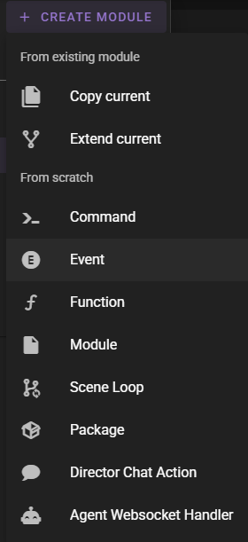

# 2 - Initial Nodes

## 2.1 - Scene Loop

In the **Infinity Quest Dynamic** tab you will see the node editor on the left and the scene history on the right.

To begin with we need to ensure that our scene has a custom `Scene Loop`.

The `Scene Loop` is the main node that will be used to drive the scene.

Since for this scene we are concerned with setting up the initial story in a dynamic way, but are not overly concerned with changing any of the actual loop logic we can chose to inherit the scene loop from the default talemate loop.

The scene loop node should already be selected in the *Modules** library.


Find the **:material-plus: Create Module** button and select **Extend Current**.


In the modal leave everything as is and click **Continue**.

This will create a copy of the scene loop node and add it to the scene.


In the node window you will see a bunch of `(Inherited, Locked)` groups. These come from the default talemate loop that was extended and cannot be edited or changed in this copy. If the default talemate loop is changed in the future, this copy will automatically inherit the changes to these nodes.

!!! note More about inheritance
    Read the [Node Editor - Inheritance](/talemate/user-guide/node-editor/core-concepts/module-inheritance/) documentation for more information about how inheritance works in the node editor.

## 2.2 - Hooking into scene initialisation

Since we are interested in doing stuff that happens when the scene is first started, we need to somehow hook into the scene initialisation.

We can do this using an event module.

Find the **:material-plus: Create Module** button and select **Event**.



In the modal fill in the `Name` and `Registry` fields:

- **Name**: `On Scene Init`
- **Registry**: `infinity-quest/$N`

The `registry` value determines where in the node creation menu the new module will exist. Its also a unique id for the module itself. `$N` will be replaced with a normalized version of `Name`.


Click **Continue**.

The event module will be created and automatically loaded. You should be presented with an empty node canvas.


For now, go back to the `Scene Loop` by clicking on it in the **Modules** library.

Double click the canvas above the existing nodes and type in "on scene" and select the `On Scene Init` node that we created moments ago.


!!! note "Alternatively - Right click for node context menu"
    You can also right click on the canvas above the nodes and select **Add Node** to add a new node.
    
    The path should be `Add Node > infinity-quest > On Scene Init`

    
    

!!! tip "When inherting a scene loop - place custom nodes above the inherited nodes"
    Its good practice to place custom nodes above the inherited nodes.

    The idea being that the original node will extend down the canvas and the space above will be available for custom nodes.

Once the `On Scene Init` node is added, it should appear where your mouse was when you initiated the node creation.


Click on the `event_name` node property and type in `scene_loop_init`.


Next click **Save** in the top right of the node editor.

We are now hooked into the scene initialisation and can start working on dynamic scene creation.

## 2.3 - Testing the scene initialisation

Lets test that this works by adding some simple generated narration on scene initialisation.

Open the `On Scene Init` node module.

Search for the following nodes and (remember double click for search or right click for node context menu) add them to the canvas:

- `Generate Progress Narration`
- `Make Bool`
- `Make Text`
- `Set Introduction`

Then hook them up like so:


In the `Make Text` node click on the `value` node property and type in 

```
Generate the introduction to a random exciting scenario 
for the crew of the Starlight Nomad
```

Hit Ctrl+Enter to submit the instruction.

**Save** the node module.

Click the **:material-play:** button in the top right of the node editor.


If everything is hooked up correctly you should see the `Generate Progress Narration` node work for a bit and then the introduction text should be updated from its generation.


Keep playing the module to see the introduction text being updated with each new generation.

You can then also test this outside of the node editor by switching to gameplay mode in the scene tools.


It will load the scene and the intro text should update once more.

Switch back to the node editor using the same menu.

## 2.4 - Ok, but this happens every time the scene is loaded?

Currently - yes. Which is not what we want.

So lets change that.

Open the `On Scene Init` node module.

In order for this to happen only once during the lifetime of the scene, we need to do a couple of things.

1. Once we generate an introduction, we need to set a permanent state variable to indicate that we have already generated an introduction.
2. Check if the introduction is already set. If it is, we skip the generation.

First lets organize the nodes a bit. Its generally recommended to use groups liberally and as soon as possible, as it keeps the canvas clean and easy to understand.

Right click the canvas and click `Add Group`.

Resize and move the Group so it encompasses the current nodes.

Then right click the group and select `Edit Group > Set Title` and title it "Generated Introduction".


Next remove the `Make Bool` node as we will not be needing it. (Select it and press the **Delete** key)


Find and add the following nodes to the canvas:

- `Get State`
- `Set State`
- `Switch`

### 2.4.1 - Setting the state

1. Connect the `Set Introduction` node's `state` output to the `Set State` node's `value` input.
1. In the `Set State` node set the `name` field to `intro_generated` and the `scope` to `game`.
1. `Shift+Click` the `Set State` node title to auto-title it.

With this we're essentially saying if the `Set Introduction` node is executed set the `intro_generated` state variable to `true`.

### 2.4.2 - Checking the state

1. Grab the `Switch` node and connect it to the `value` output of the `Get State` node.
1. In the `Switch` node set the `pass_through` field to `false`.
1. Connect the `state` input of the `Generate Progress Narration` node to the `Switch` node's `no` output.
1. Connect the `state` input of the `Set Introduction` node to the `Switch` node's `no` output.
1. In the `Get State` node set the `name` field to `intro_generated` and the `scope` to `game`.
1. `Shift+Click` the `Get State` node title to auto-title it.

Here we are using the `Switch` node to only route to the `Generate Progress Narration` node if the `intro_generated` state variable is `false` or not set.


Now clicking the play button should only generate the introduction text once.

And you can verify that the game state has been saved by opening the **Debug Tools** and then the **Edit Scene State** window.


