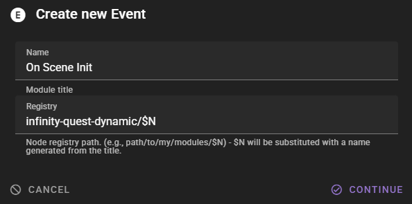

# 2 - Initial Nodes

## 2.1 - Scene Loop

In the **Infinity Quest Dynamic** tab you will see the node editor on the left and the scene history on the right.

To begin with we need to ensure that our scene has a custom `Scene Loop`.

The `Scene Loop` is the main node that will be used to drive the scene. It is where turn selection and other scene logic is handled.

For this scene we are interested in setting up the initial story premise in a dynamic way.

We **do not** care about changing any of the actual loop logic.

With this in mind we can extend a new scene loop from the default talemate loop. This will give us a copy of the default loop that we can add to while keeping the rest of the loop logic up to date with any future improvements.

The `scene-loop` module should already be selected in the **:material-group: Modules** library.


Click the **:material-plus: Create Module** button and in the menu select **:material-source-fork: Extend Current**.


In the modal **leave everything as is** and click **Continue**.

This will create a copy of the scene loop node and add it to the scene. 

This copy is owned by the scene and you can modify it.

The node editor will automatically open to the copy.


!!! info "Module colors"
    - Modules owned by the scene are colored purple. 
    - Modules owned by talemate are colored grey.

!!! info "Locked groups"
    In the node window you will see a bunch of `(Inherited, Locked)` groups. These come from the default talemate loop that was extended and cannot be edited or changed in this copy. 
    
    **The benefit:** If the default talemate loop is changed in the future, this copy will automatically inherit the changes to these nodes.

    

    Read the [Node Editor - Inheritance](/talemate/user-guide/node-editor/core-concepts/module-inheritance/) documentation for more information about how inheritance works in the node editor.

## 2.2 - Hooking into scene initialisation

Generating a story premise is something that must happen at the start of the scene.

We need to somehow hook into the scene initialisation.

We can do this using an event module.

!!! info "Event modules"
    `Events` are signals sent by talemate during the scene loop. There are many different events and the `Event` module is a node module that can listen to a specific event and do stuff when it happens.

    Learn more about events in the [Events](/talemate/user-guide/node-editor/core-concepts/events/) documentation.

Find the **:material-plus: Create Module** button and select **:material-alpha-e-circle:Event**.


In the modal fill in the `Name` and `Registry` fields:

- **Name**: `On Scene Init`
- **Registry**: `infinity-quest-dynamic/$N`

The `registry` value determines where in the node creation menu the new module will exist. Its also a unique id for the module itself. `$N` will be replaced with a normalized version of `Name`.



Click **Continue**.

The event module will be created and automatically loaded. You should be presented with an empty node canvas.


For now, go back to the `Scene Loop` by clicking on it in the **:material-group: Modules** library.

--8<-- "docs/user-guide/howto/infinity-quest-dynamic/.snippets.md:load-scene-loop"

Double click the canvas above the `Prevent Infinite AI Turns` group.

The **Search for Node** window will open up.

Type `on scene` into the **Search** field and select the `On Scene Init` node that we created moments ago.


!!! note "Alternatively - Right click for node context menu"
    You can also right click on the canvas above the nodes and select **Add Node** to add a new node.
    
    The path should be `Add Node > infinity-quest > On Scene Init`

    
    

!!! tip "When extending a module - place custom nodes above the inherited nodes"
    Its good practice to place custom nodes above the inherited nodes.

    The idea being that the original node will extend down the canvas and the space above will be available for custom nodes.

Once the `On Scene Init` node is added, it should appear where your mouse was when you initiated the node creation.


Click on the `event_name` node property and type in `scene_loop_init`.


Next click **Save** in the top right of the node editor. 

--8<-- "docs/snippets/common.md:save-graph"

We are now hooked into the scene initialisation and can start working on dynamic scene creation.

## 2.3 - Testing the scene initialisation

Lets test that this works by adding some simple generated narration on scene initialisation.

Open the `On Scene Init` node module.

--8<-- "docs/user-guide/howto/infinity-quest-dynamic/.snippets.md:load-on-scene-init"

Search for the following nodes and (remember double click for search or right click for node context menu) add them to the canvas:

- `Generate Progress Narration` - This node will be used to generate the introduction text, using the narrator agent.
- `Make Bool` - We will use this as a basic **ON** state for the generation node.
- `Make Text` - This will be used for us to provide instructions to the narrator agent.
- `Set Introduction` - This will store the generated introduction text with the scene's `intro` property.

Once you have added all the nodes, hook them up like so:


!!! note "How to connect nodes"
    Nodes have `input` and `output` sockets.

    Output sockets are on the right and input sockets are on the left.

    Drag from the right-side socket of the node you want to connect from to the left-side socket of the node you want to connect to.

In the `Make Text` node click on the `value` node property and type in 

```
Generate the introduction to a random exciting scenario 
for the crew of the Starlight Nomad
```

Hit `Ctrl`+`Enter` to submit the instruction.

--8<-- "docs/snippets/common.md:save-graph"

Click the **:material-play:** button in the top right of the node editor.


If everything is hooked up correctly you should see the `Generate Progress Narration` node work for a bit and then the introduction text should be updated from its generation.


Keep playing the module to see the introduction text being updated with each new generation.

You can then also test this outside of the node editor by switching to gameplay mode in the scene tools.


It will load the scene and the intro text should update once more.

Switch back to the node editor using the same menu.

## 2.4 - Ok, but this happens every time the scene is loaded?

Currently - yes. Which is not what we want.

So lets change that.

--8<-- "docs/user-guide/howto/infinity-quest-dynamic/.snippets.md:load-on-scene-init"

In order for this to happen only once during the lifetime of the scene, we need to do a couple of things.

1. Once we generate an introduction, we need to set a permanent state variable to indicate that we have already generated an introduction.
2. Check if the introduction is already set. If it is, we skip the generation.

First lets organize the nodes a bit. Its generally recommended to use groups liberally and as soon as possible, as it keeps the canvas clean and easy to understand.

Right click the canvas and click `Add Group`.

Resize and move the Group so it encompasses the current nodes.

Then right click the group and select `Edit Group > Title` and title it "Generated Introduction".


Next remove the `Make Bool` node as we will not be needing it. (Select it and press the **Delete** key)


Find and add the following nodes to the canvas:

- `Get State` - We will use this to check if the introduction has been generated.
- `Set State` - We will use this to set the introduction as generated.
- `Switch` - We will use this to only generate the introduction if it has not been generated yet.

### 2.4.1 - Setting the state

!!! note "Instructions going forward"
    Going forward node connection instructions will be provided in the format:

    `<Node>.output_name` :material-transit-connection-horizontal: `<Node>.input_name`

1. `<Set Introduction>.state` :material-transit-connection-horizontal: `<Set State>.value`
1. In the `Set State` node set the `name` field to `intro_generated` and the `scope` to `game`.
1. `Shift+Click` the `Set State` node title to auto-title it.

!!! note "Auto titling"
    This is a feature **some** nodes have that automatically titles the node based on the value of their properties. In the case of the `Set State` node, it will title the node to `SET {scope}.{name}`, so in this case `SET game.intro_generated`.

    Hold `Shift` and click the node **title** to auto-title it.

With this we're essentially saying if the `Set Introduction` node is executed set the `intro_generated` state variable to `true`.

### 2.4.2 - Checking the state

1. `<Get State>.value` :material-transit-connection-horizontal: `<Switch>.value`
1. In the `Switch` node set the `pass_through` field to `false`.
1. `<Switch>.no` :material-transit-connection-horizontal: `<Generate Progress Narration>.state`
1. `<Switch>.no` :material-transit-connection-horizontal: `<Set Introduction>.state`
1. In the `Get State` node set the `name` field to `intro_generated` and the `scope` to `game`.
1. `Shift+Click` the `Get State` node title to auto-title it.

Here we are using the `Switch` node to only route to the `Generate Progress Narration` node if the `intro_generated` state variable is `false` or not set. (or not truthy, for people familiar with this concept)


--8<-- "docs/snippets/common.md:save-graph"

Now clicking the **:material-play:** button should only generate the introduction text once.

And you can verify that the game state has been saved by opening the **Debug Tools** and then the **Edit Scene State** window.


!!! info "Debug Tools"
    The **Debug Tools** are a set of tools that are used to debug the scene, AI prompts and other things.

    They are accessible by clicking the **:material-bug:** button in the top right of the talemate window.