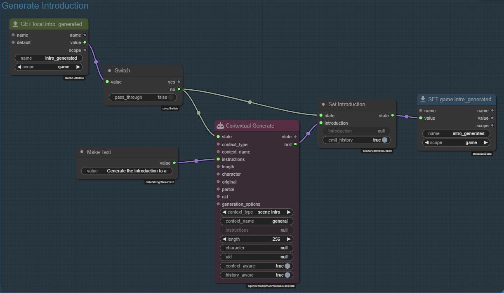
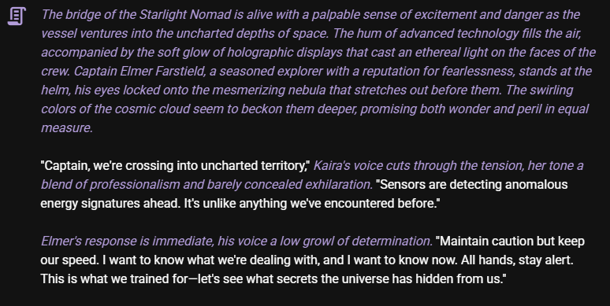
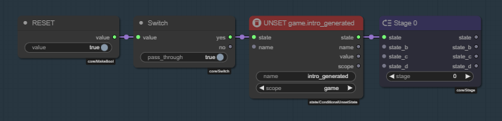
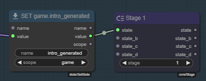
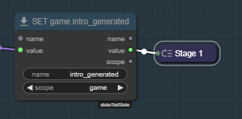
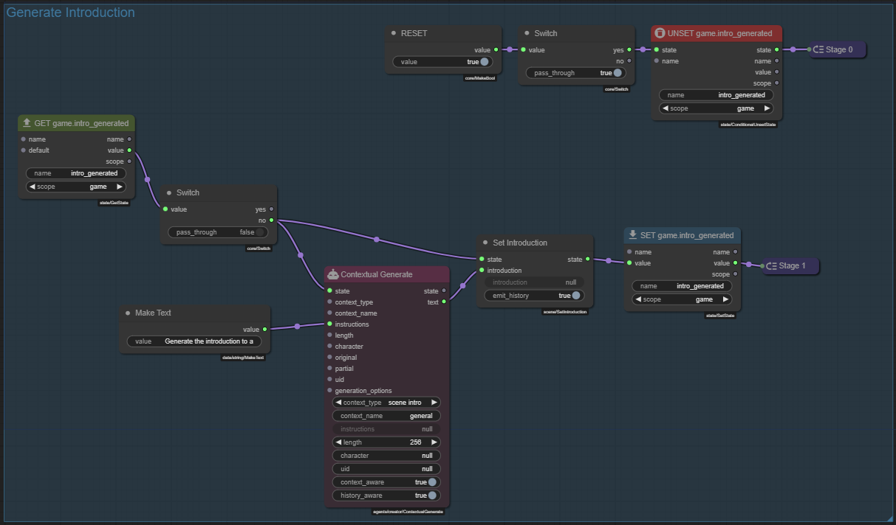

# 3 - Beam me up, Scotty!

Right now we have a version of Infinity Quest that when started queries whatever AI model you have setup to randomly generate a random scene introduction based on what little scene information is available, hopefully delivering something that could start off an interesting story.

Kinda cool, but we can do better.

## 3.1 - Use context generation instead of narrator generation

Talemate already has a dedicated node to generate the scene introduction text, which considers a bunch of factors that may be important specifically when generating a story introduction.

We should use this node instead of the narrator generation node.

Load the `On Scen Init` module that we made in part 2.

1. Remove the `Generate Progress Narration` node.
1. Add a `Contextual Generate` node.
1. Connect the `Switch` node's `no` output to the `Contextual Generate` node's `state` input.
1. Connect the `Contextual Generate` node's `text` output to the `Set Introduction` node's `introduction` input.
1. Connect the `Make Text` node's `text` output to the `Contextual Generate` node's `instructions` input.

Then in the `Contextual Generate` node's properties:

1. Set `context_type` to `scene intro`
1. Set `context_name` to `general` (value doesn't matter for this, just fill in something)
1. Set `length` to `256` (or whatever you want the max. length of the introduction to be, tokens)

The result should hopefully a bit more fitting for a story introduction text (or it may not be, AI things!)

## 3.2 - Make testing this.. not awkward.

Right now since we are only allowing one introduction to be generated, for testing it'd be helpful if we could simply toggle the check for this on or off, so we can regenerate the introduction as many times as we want, while we're working on this.

We can do this by staging out the module execution into two separate stages.

Stage 0 - reset the game state for `intro_generated` IF we manually flip a switch.

Stage 1 - generate the introduction as we do now.

Find and add the following nodes:

1. `Stage` (x2)
1. `Make Bool`
1. `Unset State (Conditional)` - Make sure its the `Conditional` version, not the `Unset State` version.
1. `Switch`

!!! tip "ALt click and drag to clone a node"
    You can hold `alt` and click and drag a node to clone it.

### Stage 0 - Reset the `intro_generated` state

1. `Make Bool.value` -> `Switch.value`
1. `Switch.yes` -> `Unset State (Conditional).state`
1. `<Unset State (Conditional)>.state` -> `<Stage>.state`
1. `<Unset State (Conditional)>.name` -> `intro_generated`
1. `<Unset State (Conditional)>.scope` -> `game`
1. Shift click the `Stage` node title to auto title it to `Stage 0`
1. Shift click the `Unset State (Conditional)` node title to auto title it to `UNSET game.intro_generated`
1. Right click the `Make Bool` node and select `Edit Title` and change it to `RESET`.

### Stage 1 - Generate the introduction

1. Connect any `SET game.intro_generated` output to `Stage` node's `state` input
2. Set `Stage.stage` to `1`
3. Shift click the `Stage` node title to auto title it to `Stage 1`
4. Click the node icon to minimize it

!!! note "Staging out the module execution"
    A node chain connected to a stage node will be executed in order of the stage number. The node change at Stage 0 runs before the node change at Stage 1. This allows us to control the flow of the module execution.

    Read more about staging in the [Node Editor Core Concepts - Staging](/talemate/user-guide/node-editor/core-concepts/staging) part of the documentation.

Now when the `RESET` switch is flipped, the `intro_generated` state will be unset, and since that happens before the `Generate Progress Narration` node runs, it will trigger a new introduction to be generated.

## 3.3 - Oh look, its another gravity well!

Anyone who has asked AI to generate novel story beats knows that its not always... great. It will repeat the same concepts a lot and be off to trope-land in no time. Obviously this depends on the model, but we can do some stuff to increase our odds of getting something interesting!

