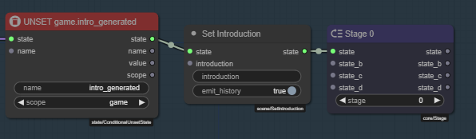
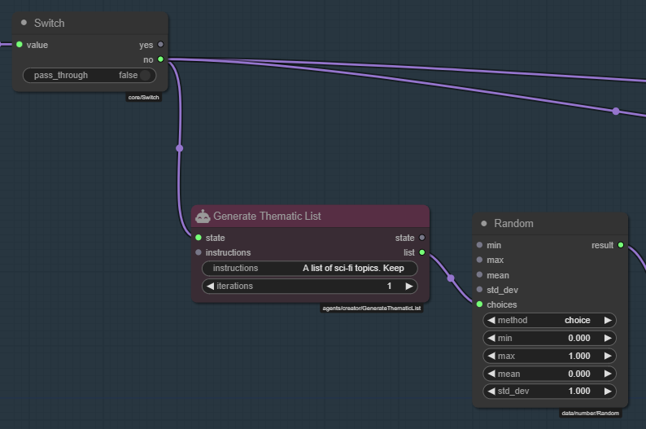
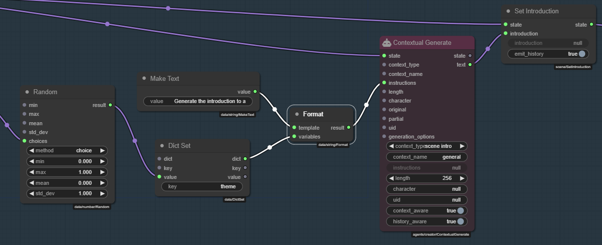
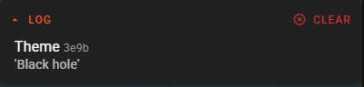
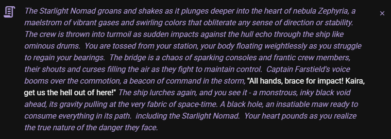

# 3 - Beam me up, Scotty!

Right now we have a version of Infinity Quest that when started queries whatever AI model you have setup to randomly generate a random scene introduction based on what little scene information is available, hopefully delivering something that could start off an interesting story.

Kinda cool, but we can do better.

## 3.1 - Use context generation instead of narrator generation

Talemate already has a dedicated node to generate the scene introduction text, which considers a bunch of factors that may be important specifically when generating a story introduction.

We should use this node instead of the narrator generation node.

Load the `On Scen Init` module that we made in part 2.

1. Remove the `Generate Progress Narration` node.
1. Add a `Contextual Generate` node.
1. `<Switch>.no` :material-transit-connection-horizontal: `<Contextual Generate>.state`
1. `<Contextual Generate>.text` :material-transit-connection-horizontal: `<Set Introduction>.introduction`
1. `<Make Text>.text` :material-transit-connection-horizontal: `<Contextual Generate>.instructions`

Then in the `Contextual Generate` node's properties:

1. Set `context_type` to `scene intro`
1. Set `context_name` to `general` (value doesn't matter for this, just fill in something)
1. Set `length` to `256` (or whatever you want the max. length of the introduction to be, tokens)


The result should hopefully a bit more fitting for a story introduction text (or it may not be, AI things!)


## 3.2 - Make testing this.. not awkward.

Right now since we are only allowing one introduction to be generated, for testing it'd be helpful if we could simply toggle the check for this on or off, so we can regenerate the introduction as many times as we want, while we're working on this.

We can do this by staging out the module execution into two separate stages.

Stage 0 - reset the game state for `intro_generated` IF we manually flip a switch.

Stage 1 - generate the introduction as we do now.


### Stage 0 - Reset the `intro_generated` state

Add the following nodes:

1. `Stage` (x2)
1. `Make Bool`
1. `Unset State (Conditional)` - Make sure its the `Conditional` version, not the `Unset State` version.
1. `Switch`

!!! tip "ALt click and drag to clone a node"
    You can hold `alt` and click and drag a node to clone it.


Connect the nodes:

1. `<Make Bool>.value` :material-transit-connection-horizontal: `<Switch>.value`
1. `<Switch>.yes` :material-transit-connection-horizontal: `<Unset State (Conditional)>.state`
1. `<Unset State (Conditional)>.state` :material-transit-connection-horizontal: `<Stage>.state`

---

**Unset State (Conditional)**

- **name**: `intro_generated`
- **scope**: `game`

---

1. Shift click the `Stage` node title to auto title it to `Stage 0`
1. Shift click the `Unset State (Conditional)` node title to auto title it to `UNSET game.intro_generated`
1. Right click the `Make Bool` node and select `Edit Title` and change it to `RESET`.


### Stage 1 - Generate the introduction

1. `<SET game.intro_generated>.value` :material-transit-connection-horizontal: `<Stage>.state`
2. Set `Stage.stage` to `1`
3. Shift click the `Stage` node title to auto title it to `Stage 1`
4. Click the node icon to minimize it


!!! note "Staging out the module execution"
    A node chain connected to a stage node will be executed in order of the stage number. The node chain at Stage 0 runs before the node chain at Stage 1. This allows control over the flow of the module execution.

    Read more about staging in the [Node Editor Core Concepts - Staging](/talemate/user-guide/node-editor/core-concepts/staging) part of the documentation.

Now when the `RESET` switch is flipped, the `intro_generated` state will be unset, and since that happens before the `Generate Progress Narration` node runs, it will trigger a new introduction to be generated.


## 3.3 - Something odd.

You may realize that as you click regenerate the introduction may become stale or change very little.

This is because once we have generated an introduction that introduction will be part of the context for the next generation and will influence it. 

The severity of this problem will vary from model to model.

The fix is easy, simply wipe the introduction before generating a new one.

Hold `Alt` and drag the `Set Introduction` node to clone it, then hook it inbetween the `UNSET game.intro_generated` and `Stage 0` nodes.

Make sure to edit it's `introduction` input to be a blank string.



## 3.4 - Oh look, its another gravity well!

Anyone who has asked AI to generate novel story beats knows that its not always... great. It will repeat the same concepts a lot and be off to trope-land in no time. Obviously this depends on the model, but we can do some stuff to increase our odds of getting something interesting!

If we were to give the AI a random concept to inform the generation, that's one way to to steer it off its biases.

### Random theme to inform the generation

1. Generate a list of concepts (using the creator agent)
1. Pick a random concept from the list
1. Format the instructions so it includes the concept

Add the following nodes:

1. `Generate Thematic List` - this prompts the creator agent to generate a list of concepts
1. `Random` - this picks a random concept from the list
1. `Dict Set` - this sets the `theme` state variable to the random concept
1. `Format` - this formats the instructions so it includes the concept

---

**Generate Thematic List**

- **instructions**:
    ```
    A list of sci-fi topics. Keep each item short (1-3 words).
    ```

---

**Random**

- **method**: `choice`

---

Connect the nodes:

1. `<Switch>.no` :material-transit-connection-horizontal: `<Generate Thematic List>.state`
1. `<Generate Thematic List>.list` :material-transit-connection-horizontal: `<Random>.choices`

---



---

**Dict Set**

- **key**: `theme`

---

**Make Text**

- **value**:
    ```
    Generate the introduction to a random exciting scenario 
    for the crew of the Starlight Nomad.
    ```

---

Connect the nodes:

1. `<Random>.result` :material-transit-connection-horizontal: `<Dict Set>.value`
1. `<Make Text>.value` :material-transit-connection-horizontal: `<Format>.template`
1. `<Dict Set>.dict` :material-transit-connection-horizontal: `<Format>.variables`
1. `<Format>.result` :material-transit-connection-horizontal: `<Contextual Generate>.instructions`

---



---

Finally add a `Watch` node and connect it:

- `<Random>.result` :material-transit-connection-horizontal: `<Watch>.value`

This allows you to watch the `theme` state variable and see the changes as we pick a new random theme.

Lets run to test this out.

So here it generated a list of sci-fi topics, picked "Black hole" and then generated the introduction based on this selection:




!!! tip "Increase the number of items in the list"
    You can increase the iterations of the list generation by editing the `iterations` property of the `Generate Thematic List` node.

    The first iteration will generate 20 items and any additional iterations will add 10 items to the list. Each iteration is a separate request to the creator agent and there are likely diminishing returns the more iterations you do. (there are only so many topics..)

!!! tip "Maintain a manual list"
    You don't have to use the creator agent to generate a list of themes. You can maintain a manual list of themes by using the `Make List` node, which allows you to edit a list using JSON.

