# 4 - Get organized

Before increasing the complexity of the current graph any further, lets do a couple things.

## 4.1 - Create a new submodule

--8<-- "docs/user-guide/howto/infinity-quest-dynamic/.snippets.md:load-on-scene-init"

As graphs get more complex it may make sense to split out certain parts of the graph into separate node modules.

Hold `Ctrl` and drag a rectangle to select node chain from `<Generate Thematic List>` to `<Contextual Generate|>`.

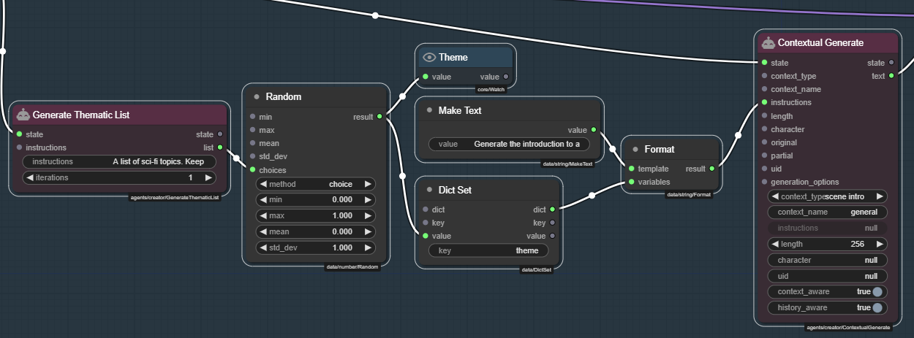

Then click the **:material-plus: CREATE MODULE** button and select **Module**.

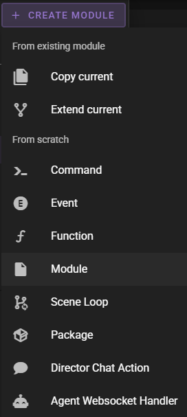

When a group of nodes is selected and you create a new module, the nodes will be copied into the new module. The `Create new module` dialog that appears will state:

> You are creating a new module from a selection of N nodes.

Fille in the `Name` and `Registry` fields and click **Continue**.

- Name: `Generate Premise`
- Registry: `infinity-quest-dynamic/$N`

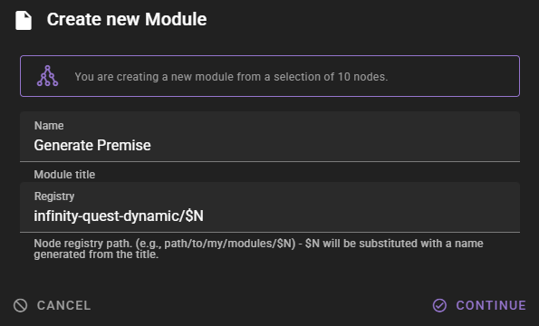

You will be taken to the new module.

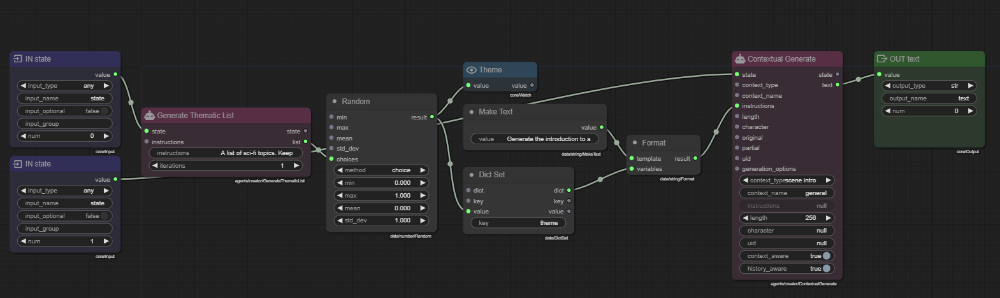

As we can see it has copied the nodes, but it has also created some input and output socket nodes.

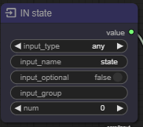 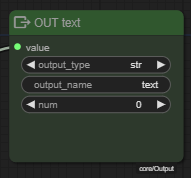

It will do its best to label and type those correctly, but we will need to do some cleaning up.

### Regroup

We lost the group, so select all the nodes (hold `Ctrl` and drag a rectangle around them) then right click the canvas and select **Creater group from selection**.

You may also want to move some of the nodes around to tidy up the group, especially the automatically generated input and output socket nodes may be positioned poorly.

### Fixing the input sockets

The `IN - state` socket it created can stay as is. It will be `state` socket that we will feed the switch condition into.

But hold on, it looks like it created two `IN - state` sockets. We only need one.

Delete the other and connect the first one in its place.

### Fixing the output sockets

The `OUT - text` socket is good as is, it will pipe the result from the `<Contextual Generate>` node into a `text` socket.

### Cleaned up!

Your cleaned up module should look like this:

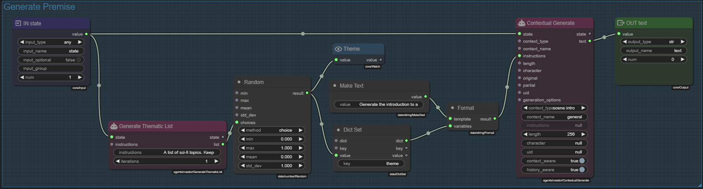

--8<-- "docs/snippets/common.md:save-graph"

### Replace in `On Scene Init`

--8<-- "docs/user-guide/howto/infinity-quest-dynamic/.snippets.md:load-on-scene-init"

Replace the node chain we just made into a submodule with the submodule.

First select the node chain we want to replace.

Then hit the `delete` key.

Find the `Generate Premise` node and add it to the graph.

1. `<Switch>.no` :material-transit-connection-horizontal: `<Generate Premise>.state`
1. `<Generate Premise>.text` :material-transit-connection-horizontal: `<Set Introduction>.introduction`

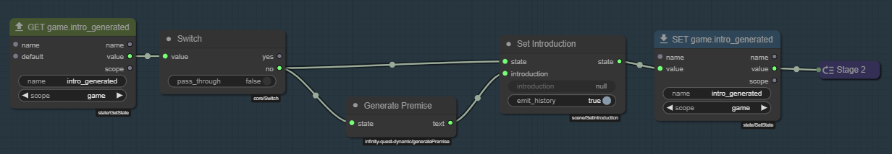

--8<-- "docs/snippets/common.md:save-graph"

Push the :material-play: button to confirm it still works.

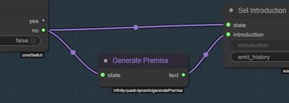

Looking good.

## 4.2 - Some polish

Lets improve the module a bit.

- Style the node so its more obvious its going to call agent actions.
- Add an output socket for the `theme` so we can investigate what theme was generated.

--8<-- "docs/user-guide/howto/infinity-quest-dynamic/.snippets.md:load-generate-premise"

Hold `Alt` and drag the existing `OUT text` node to clone it.

Change the `output_name` to `theme`.
Increase the `num` to `1`.

Hold `Shift` and click the title to auto title it to `OUT theme`.

- `<Theme>.value` :material-transit-connection-horizontal: `<OUT Theme>.value`

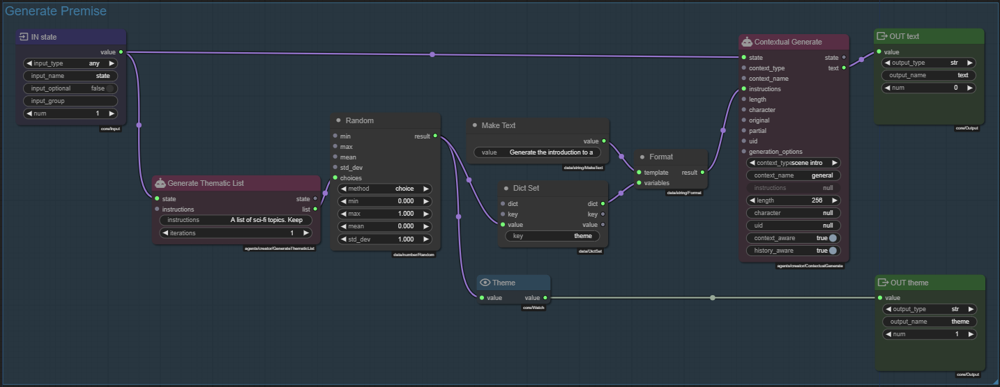

--8<-- "docs/snippets/common.md:save-graph"

Add a **Module Style** node to the graph and place it anywhere. It does not need to be connected to anything.

Right click the node and Select `Style Presets` -> `Agent Generation`.

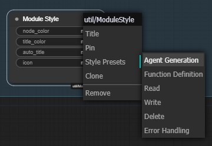

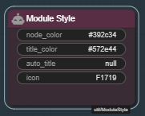

--8<-- "docs/snippets/common.md:save-graph"

---

--8<-- "docs/user-guide/howto/infinity-quest-dynamic/.snippets.md:load-on-scene-init"

Confirm that the `Generate Premise` node now has a theme output and a color style applied. (You may need to resize the node to fit the new output socket.)

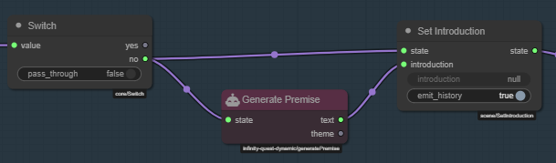

Add a new `Watch` node, set its title to `Theme` and connect it:

- `<Generate Premise>.theme` :material-transit-connection-horizontal: `<Watch>.value`

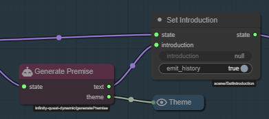

--8<-- "docs/snippets/common.md:save-graph"

Lets :material-play: play it. And we once again can observe what theme was generated.

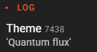