# 5 - Agentic Flow

In part 3 we left off at generating a random story premise for the crew of the Starlight Nomad.

To recap - We are using the `Creator` agent to generate a list of sci-fi topics and then picking a random one to inform the generation of the introduction.

We can leverage additional agents to further improve the quality of the introduction.

One of the biggest improvements of quality I've personally seen is when an instruction is first separately analyzed and clarified by a more analytical agent like the Summarizer or the Director to help inform the instruction given to the creative agent.

For example, if we get the theme "Quantum flux", we could ask the `Summarizer` to analyze and brainstorm what to do with the theme, before we clarify it into an instruction to give to the `Creator` agent to set up the premise.

## 5.1 - Plan

Load the `Generate Premise` module.


Right now the module has one stage that generated a random theme and then generates a premise based on that theme.

For a multi agent approach this needs to be broken up into two stages, so we can insert the new analyzation stage between them.

!!! tip "Stages instead of long, convoluted node-chains"
    While it may be tempting to just chain up the nodes into a long, convoluted node-chain, it is better to break it up into stages.

    Stages make a graph behave similar to function execution, where the stage index determines the order of execution (e.g., top to bottom).

    We can use local variable states to cleanly pass data between stages.

So we need to:

1. Break out the Theme generation into a new stage. (Stage 1)
1. Break out the Introduction generation into a new stage. (Stage 3)
1. Add a new stage between them to analyze the theme. (Stage 2)

## 5.2 - Break out the Theme generation into a new stage. (Stage 1)

Hold `Shift` and click the title of the `Generate Premise` Group to create a similarly sized group right beneath it.

Retitle the new group to `Generate Theme`.

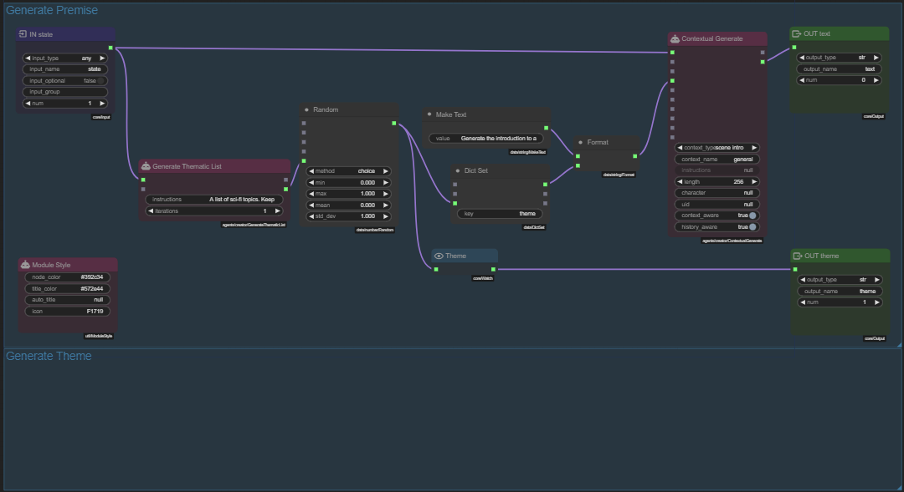

Select the three relevant theme generation nodes (Hold `Ctrl` or `Shift` and click the nodes)

- `Generate Thematic List`
- `Random`
- `Theme`

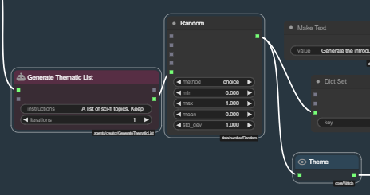

Then press `Ctrl+C` to copy them.

Then press `Ctrl+V` to paste them.

Immediately drag the new nodes into the `Generate Theme` group.

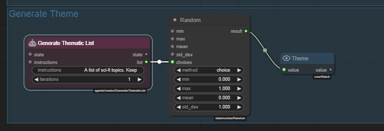

Next add the following nodes to the `Generate Theme` group:

- `Set State`
- `Stage`
- `Make Bool`

Then connect them:

- `<Make Bool>.value` :material-transit-connection-horizontal: `<Generate Thematic List>.state`
- `<Theme>.value` :material-transit-connection-horizontal: `<Set State>.value`
- `<Set State>.state` :material-transit-connection-horizontal: `<Stage>.state`

---

**Set State**

- **name**: `theme`
- **scope**: `local`

`Shift` click the title to auto title it to `SET local.theme`.

---

**Make Bool**

- **value**: `true`

`Shift` click the title to auto title it to `true`.

---

**Stage**

- **stage**: `1`

!!! tip "Local scope"
    The local state only exists for the duration of the module execution, so its ideal for passing data between stages.

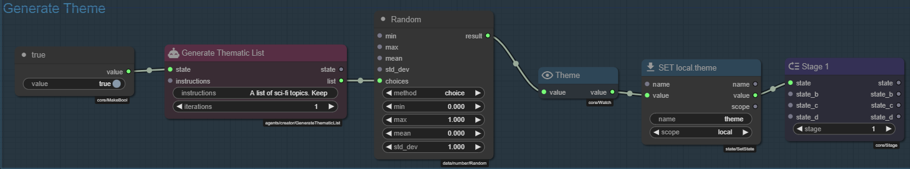

## 5.3 - Break out the Introduction generation into a new stage. (Stage 3)

Hold `Shift` and click the title of the `Generate Theme` Group to create a similarly sized group right beneath it.

Retitle the new group to `Generate Introduction`.

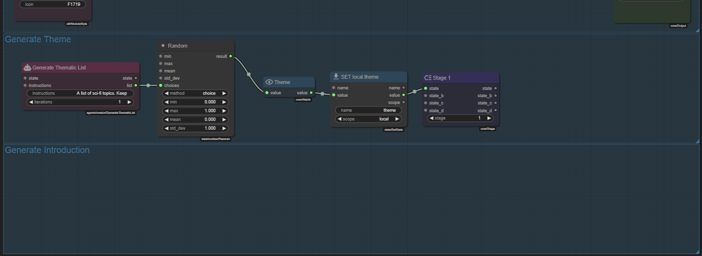

Select the three relevant introduction generation nodes (Hold `Ctrl` or `Shift` and click the nodes)

- `Make Text`
- `Dict Set`
- `Format`
- `Contextual Generate`

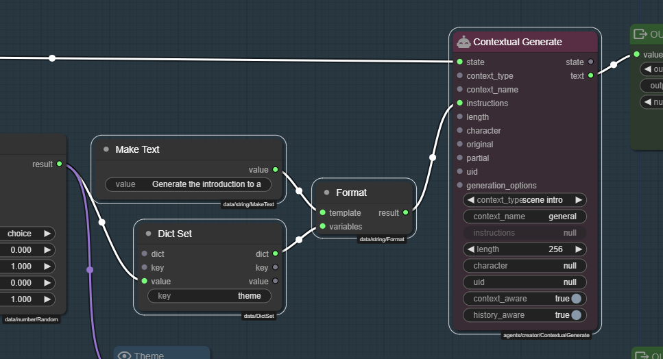

Then press `Ctrl+C` to copy them.

Then press `Ctrl+V` to paste them.

Immediately drag the new nodes into the `Generate Introduction` group.

You can then `Ctrl` click the group title to auto fit the group to the nodes.

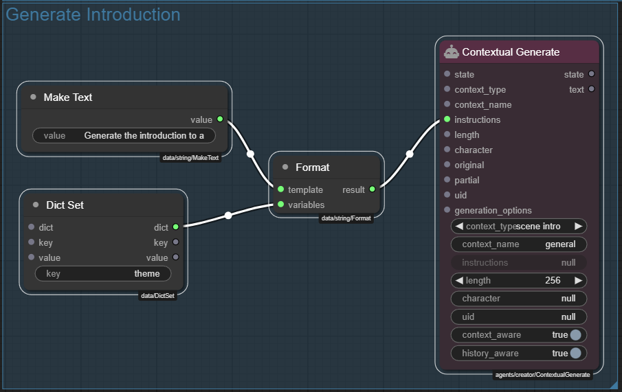

Add the following nodes to the `Generate Introduction` group:

- `Get State`
- `Set State`
- `Stage`
- `Make Bool`

Then connect them:

- `<Get State>.value` :material-transit-connection-horizontal: `<Dict Set>.value`
- `<Make Bool>.value` :material-transit-connection-horizontal: `<Contextual Generate>.state`
- `<Contextual Generate>.text` :material-transit-connection-horizontal: `<Set State>.value`
- `<Set State>.value` :material-transit-connection-horizontal: `<Stage>.state`

---

**Get State**

- **name**: `theme`
- **scope**: `local`

`Shift` click the title to auto title it to `GET local.theme`.

---

**Make Bool**

- **value**: `true`

`Shift` click the title to auto title it to `true`.

---

**Set State**

- **name**: `intro`
- **scope**: `local`

`Shift` click the title to auto title it to `SET local.intro`.

---

**Stage**

- **stage**: `3`

---

**Make Text**

Retitle the `Make Text` node to `Instruction Template`.

---

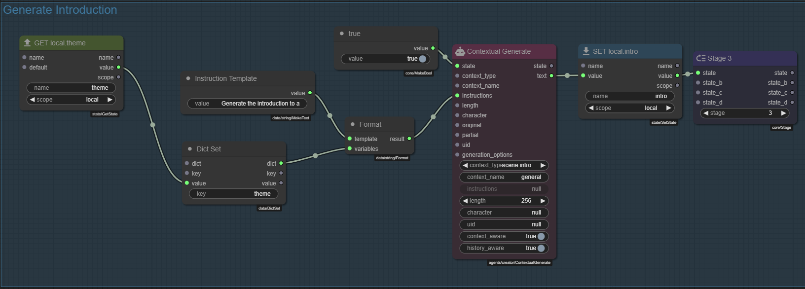

**Save** the graph.

## 5.4 - Reorganize inputs and outputs

Hold `Shift` and click the title of the `Generate Introduction` Group to create a similarly sized group right beneath it.

Retitle the new group to `Sockets`, Color it green.

Hold `Alt` and drag the existing `IN state` node to clone it and move the clone to the `Sockets` group.

Do the same for the existing output nodes `OUT text` and `OUT theme`.

Alt drag one of the output nodes again to clone it and make an `OUT state` node from it. Set the `output_name` to `state` and the `output_type` to `any`.

Renumber the output nodes so its:

- `OUT state.num` = `0`
- `OUT text.num` = `1`
- `OUT theme.num` = `2`

You should have something like this

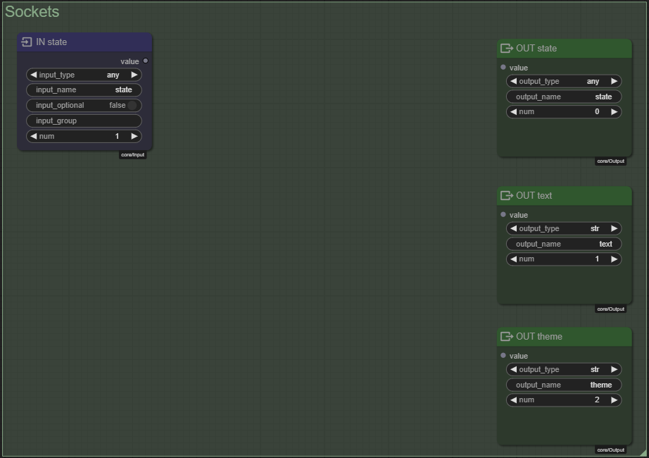

You can connect the `IN state` node to the `OUT state` node.

Next add two `Get State` nodes to the `Sockets` group.

---

**First Get State**

- **name**: `theme`
- **scope**: `local`

---

**Second Get State**

- **name**: `intro`
- **scope**: `local`

Connect them to their respective output nodes.

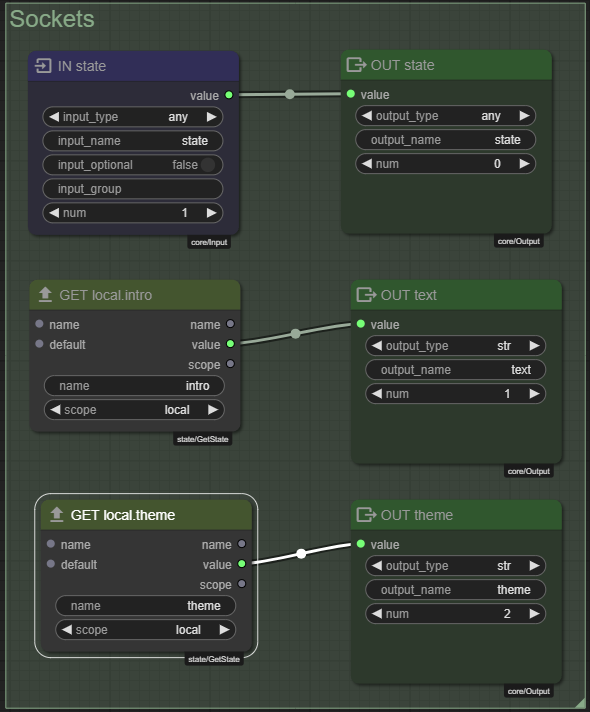

!!! tip "No stage node required"
    We want sockets to be evaluated at the END of the module execution, so we don't need a stage node.

!!! tip "Why does `IN state` not need to be connected to anything else?"
    Since the `IN state` node is a required input socket, it already fulfills its purpose as serving as an activator for the module execution.

    If the node connecting into the state socket is not active then due to the state being required the module execution will be blocked.

    Passing the state to the `OUT state` is not a requirement, but it is a good practice to do so.

**Save** the graph.

## 5.5 - Delete the original `Generate Premise` group

We have moved all the nodes and can now delete the original `Generate Premise` group.

Move the `Module Style` node out of the group first - that one we want to keep.

Then hold `Ctrl` and drag rectangle to select the nodes in the `Generate Premise` group and press the `Delete` key.

Then right click the `Generate Premise` group and select `Edit Group / Remove`.

You should now be left with three groups:

- `Generate Theme`
- `Generate Introduction`
- `Sockets`

and a `Module Style` node somewhere.

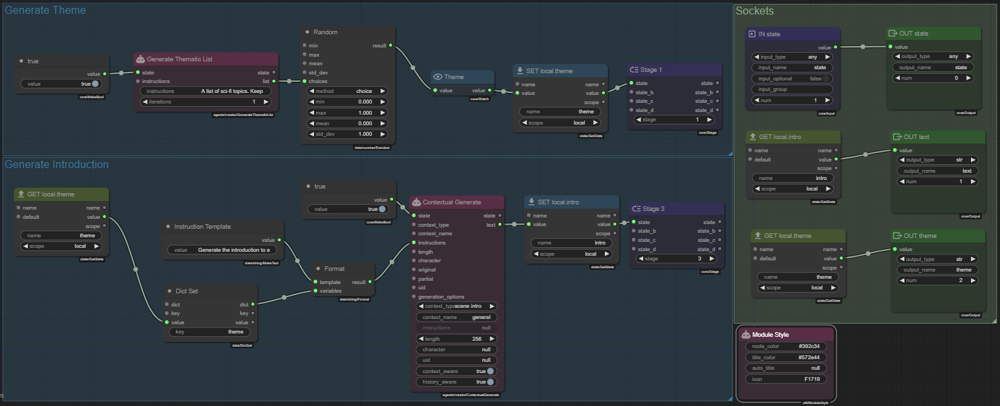

**Save** the graph.

## 5.6 - Quick test

Lets verify quick that the graph is working as expected.

This time instead of going back to the `On Scene Init` module and playing that we can just start the entire scene loop.

Since the `On Scene Init` module is invoked when the scene is loaded, it will run and call the `Generate Premise` module.

Click the **:material-movie-play:** icon in the top right corner of the graph to start the scene loop.

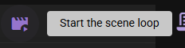

!!! note "Testing via scene loop requires a save."
    If you are inside of a sub-module and are testing by starting the scene loop, the child module **needs** to be saved first, otherwise changes will not be reflected in the test run.

Once the introduction is generated, we now need to manually stop the scene loop test, by pressing the **:material-stop:** icon in the top right corner of the graph.

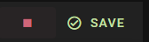

## 5.7 - Add a new stage to analyze the theme. (Stage 2)

Hold `Shift` and click the title of the `Generate Premis` Group to create a similarly sized group right beneath it.

Retitle the new group to `Analyze Theme`.

Add the following nodes to the `Analyze Theme` group:

- `Get State`
- `Get Agent`
- `Prompt from Template`
- `Generate Response`
- `Make Text`
- `Make Bool`
- `Set State`
- `Stage`
- `Dict Set`

Then connect them:

- `<Get State>.value` :material-transit-connection-horizontal: `<Dict Set>.value`
- `<Make Text>.text` :material-transit-connection-horizontal: `<Prompt from Template>.template_text`
- `<Dict Set>.dict` :material-transit-connection-horizontal: `<Prompt from Template>.variables`
- `<Prompt from Template>.prompt` :material-transit-connection-horizontal: `<Generate Response>.prompt`
- `<Make Bool>.value` :material-transit-connection-horizontal: `<Generate Response>.state`
- `<Get Agent>.agent` :material-transit-connection-horizontal: `<Generate Response>.agent`
- `<Generate Response>.response` :material-transit-connection-horizontal: `<Set State>.value`
- `<Set State>.value` :material-transit-connection-horizontal: `<Stage>.state`

---

**Get State**

- **name**: `theme`
- **scope**: `local`

`Shift` click the title to auto title it to `GET local.theme`.

---

**Get Agent**

- **agent_name**: `Summarizer`

`Shift` click the title to auto title it to `summarizer`.

---

**Make Text**

- **text**:
    ```
    Analyze the following sci-fi theme:
    {{theme}}

    Provide a detailed exploration of this theme, including:
    1. Key concepts or technologies involved
    2. Potential storylines or conflicts
    3. How it might affect the crew of the Starlight Nomad

    Your analysis will be used to set up the premise for the next storyline in the Infinity Quest series.
    ```

!!! note "Prompt from Template.template_text expects a jinja2 template"
    This means variable names need to be wrapped in `{{}}` to be interpreted as variables.

    So `{{ theme }}` instead of `{theme}` like we used before when passing to the string `Format` node.


Retitle the `Make Text` node to `Theme Analysis Template`.

---

**Dict Set**

- **key**: `theme`

---

**Make Bool**

- **value**: `true`

`Shift` click the title to auto title it to `true`.

---

**Generate Response**

- **response_length**: `768`
- **action_type**: `analyze`

---

**Set State**

- **name**: `theme_analysis`
- **scope**: `local`

`Shift` click the title to auto title it to `SET local.theme_analysis`.

---

**Stage**

- **stage**: `2`

---

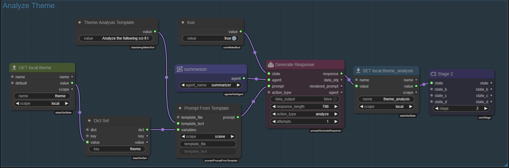

**Save** the graph.

Lets test the graph again.

We want to see somewhere what analysis the `Summarizer` agent has generated.

We could add another `Watch` node, but there is also a debug logging feature in the node editor that can be handy for this.

Open the node-editor :material-bug: debug options menu and check the checkbox next to `Set State` in the `Debug Logging` section:

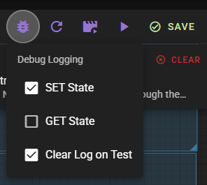

Now every `Set State` node will log its value to the editor log, including our `theme_analysis` state.

:material-movie-play: Start the scene loop again and you should see the `Summarizer` agent's analysis in the debug log.

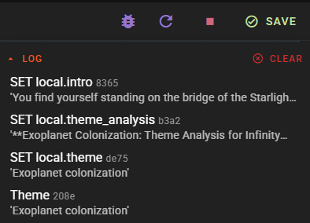

**Save** the graph.

## 5.8 - Use the analysis

Now that we have all three stages in place, the thing left to do is make sure that Stage 3 uses the analysis from Stage 2 to generate the introduction.

To begin with, if you followed along exactly, the groups are currently out of order:

1. Generate Theme
1. Generate Introduction
1. Analyze Theme

!!! note "The order does not matter"
    Technically the order of the groups does not matter, but it helps a lot with understanding the flow of the graph. If the groups are lined out in order of the stage execution.

    I also like to mention the stage of each group in the group title, once the stages are solidified.

You can move each group easily enough, just drag the groups into the correct order so its:

1. Generate Theme
1. Analyze Theme
1. Generate Introduction

Leaving you with a graph that looks like this:

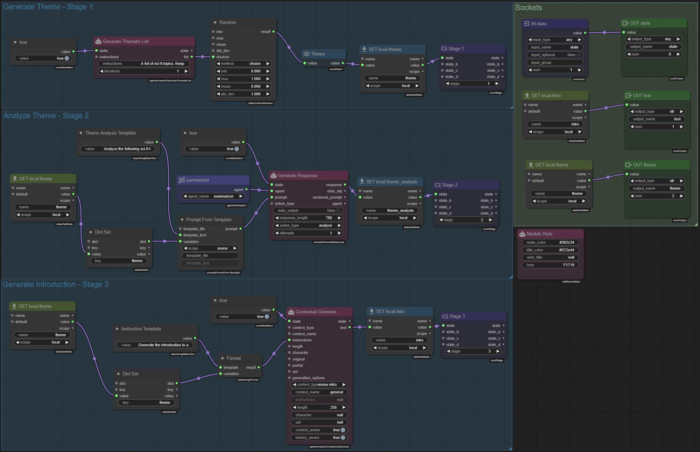

Now, in the `Generate Introduction` group, we need to use the `theme_analysis` state to generate the introduction.

Add another `Get State` node to the `Generate Introduction` group.

---

**Get State**

- **name**: `theme_analysis`
- **scope**: `local`

`Shift` click the title to auto title it to `GET local.theme_analysis`.

---

Hold `Alt` and drag the `Dict Set` node to clone it.

---

Connect the nodes:

- `<GET local.theme_analysis>.value` :material-transit-connection-horizontal: `<Dict Set>.value`
- `<GET local.theme_analysis>.name` :material-transit-connection-horizontal: `<Dict Set>.key`
- `<Dict Set>.dict` :material-transit-connection-horizontal: `<Dict Set>.dict`: feeding the new dict into the old dict

Lets also connect the `name` field of the `<GET local.theme>` node to the `key` field of its `<Dict Set>` node.

- `<GET local.theme>.name` :material-transit-connection-horizontal: `<Dict Set>.key`

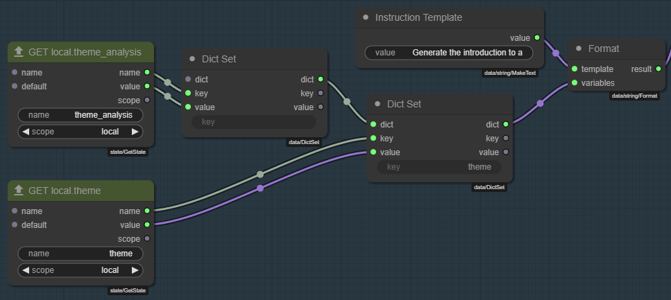

Next go to the `Instruction Template` node and update the template text to:

```
Generate the introduction to a random exciting scenario 
for the crew of the Starlight Nomad.

The theme is: "{theme}"

Use the following analysis to guide your creation of the scenario premise:

{theme_analysis}
```

**Save** the graph.

:material-movie-play: Start the scene loop again and you should see the `Generate Introduction` stage use the `theme_analysis` state to generate the introduction.

Lets look what the final prompt to the `Creator` agent looks like.

```
... Other context ...

## Task

Generate the introduction for the scene. This is the first text that is shown to Elmer when they start the scene. 

It must contain enough context for the reader to dive right in. Assume that the reader has not looked at the character or scene descriptions.

It must setup an interesting entry point for the reader to participate in the scene and interact with the other characters and the environment.

### Editorial Instructions
Generate the introduction to a random exciting scenario 
for the crew of the Starlight Nomad.

The theme is: "Quantum entanglement"

Use the following analysis to guide your creation of the scenario premise:

### Analysis of Quantum Entanglement Theme

#### 1. Key Concepts or Technologies Involved

**Quantum Entanglement:**
- **Definition:** Quantum entanglement is a physical phenomenon which occurs when pairs or groups of particles are generated, interact, or share spatial proximity in ways such that the quantum state of each particle cannot be described independently of the state of the others, even when the particles are separated by a large distance.
- **Key Properties:**
  - **Instantaneous Correlation:** Changes to one particle's state instantly affect the entangled partner, regardless of distance.
  - **Superposition:** Entangled particles exist in multiple states simultaneously until measured.
  - **Non-locality:** The effect is independent of the distance between the particles.

**Technologies Involved:**
- **Quantum Communicators:** Devices that use entangled particles to transmit information instantly across vast distances.
- **Quantum Computers:** Utilize entanglement for unprecedented processing power and problem-solving capabilities.
- **Entanglement-based Sensors:** Highly sensitive devices for detection and measurement, using the properties of entangled particles to achieve precision beyond classical limits.

#### 2. Potential Storylines or Conflicts

**Storyline 1: The Entangled Spy**
- **Premise:** A rogue AI creates a network of entangled spies across the galaxy, using quantum entanglement to transmit information instantly and securely.
- **Conflict:** The crew of the Starlight Nomad discovers that one of their own has been entangled with a spy device, unwittingly leaking critical information.
- **Resolution:** The crew must find a way to disrupt the entanglement without harming their comrade, while also tracking down the source of the spy network.

**Storyline 2: Lost in Superposition**
- **Premise:** During a routine mission, the Starlight Nomad encounters an ancient quantum experiment that has created a stable superposition of multiple realities.
- **Conflict:** The crew becomes trapped in a loop of overlapping realities, where their actions in one reality affect others in unpredictable ways.
- **Resolution:** They must navigate the complexities of quantum superposition to find a way back to their original reality, using their knowledge of entanglement to stabilize the experiment.

**Storyline 3: The Quantum Heist**
- **Premise:** A valuable quantum artifact, capable of controlling entanglement, is stolen from a research facility.
- **Conflict:** The thieves use the artifact to create a network of entangled traps, making it dangerous for the crew to pursue them directly.
- **Resolution:** The crew must outsmart the thieves by creating their own entangled devices to counter the traps and recover the artifact.

#### 3. How It Might Affect the Crew of the Starlight Nomad

**Technological Advantages:**
- **Instant Communication:** The crew can stay connected across vast distances, ensuring coordinated actions even in deep space.
- **Enhanced Sensing:** Entanglement-based sensors can provide early warnings of dangers, such as asteroid fields or enemy ships.

**Potential Challenges:**
- **Entanglement Malfunctions:** If an entangled device malfunctions, it could lead to miscommunications or false alarms, causing confusion and potential danger.
- **Quantum Interference:** Other quantum phenomena could interfere with their entangled devices, leading to unexpected outcomes.
- **Psychological Impact:** Crew members might feel a sense of dislocation or uncertainty due to the non-local nature of entanglement, affecting their mental health and decision-making.

**Character Development:**
- **Trust Issues:** The crew might become paranoid about who to trust if entanglement is used for spying, leading to internal conflicts and alliances.
- **Problem-Solving:** They will need to develop new strategies and technologies to handle quantum-based threats and opportunities[/INST]scene introduction:
```