# 6 - Reusable Module

## Recap

In the previous parts of this guide, we've built a dynamic story premise generator for our Infinity Quest project:

1. **Part 1**: Created the scene project, imported characters from the original Infinity Quest, and set up basic scene settings.

2. **Part 2**: Set up the Scene Loop by extending the default Talemate loop, created an event module to hook into scene initialization, and implemented logic to generate a dynamic introduction that only happens once when the scene is first loaded.

3. **Part 3**: Improved the introduction generation by switching to contextual generation, added a reset mechanism for testing, and implemented random theme generation to guide the premise creation and reduce AI bias.

4. **Part 4**: Organized our node graph by moving the premise generation logic into a separate submodule, added styling to visually identify agent actions, and improved the module interface.

5. **Part 5**: Implemented a multi-agent workflow with staging where:
    - Stage 1: Generates a random sci-fi theme
    - Stage 2: Uses the Summarizer agent to analyze the theme in depth
    - Stage 3: Uses the analysis to guide the creation of an introduction text

At this point, we have a fully functional random premise generator for the Infinity Quest project. However, one of the most powerful features of the Talemate node editor is the ability to create modular, reusable components that can be shared across different scenes and projects.

In this part, we'll transform our premise generator from a scene-specific module into a standalone, reusable component that can be plugged into any scene.

## 6.0 Backup

We're going to be moving and renaming stuff going forward, so you should backup your project.

Either copy the entire `scenes/infinity-quest-dynamic` folder somewhere or at least grab the `nodes` subfolder.

## 6.1 Starting Point

We've done quite a bit of work at this point, so lets quickly go over what we have:

### Event Module


This module is responsible for generating the dynamic introduction that only happens once when the scene is first loaded.


### Scene Loop Extension


An extension of the default Talemate scene loop where we added an instance of the on-scene-init event module.


### Premise Generation Module


This module is responsible for generating the a scene introduction based on random sci-fi theme with the help of the Summarizer agent for additional exploration of the concept.


## 6.2 Plan

In order to make our premise generator a standalone module, there are a few things we need to consider:

1. Rename the event module so its less generic as it will be the entry point for the module.
1. Right now the premise generator has some hardcoded values that make sense for the Infinity Quest project (sci-fi themed, start trek type of story). We need to be able to expose this from the premise module all the way to the scene loop extension as configurable properties.
1. A toggle for turning analyzation on and off.
1. Make the module available as a Talemate module, so it can be plugged into any new scene project.


## 6.1 Renaming the Event Module

Currently there is no good way to rename a module through the node editor. (Still early in the development of the node editor, so this will be added in the future.)

For now the easiest way to rename it is to simply create a copy.

So load the `on-scene-init` module and create a copy of it.


Click the **:material-plus: CREATE MODULE** button and then **Copy current**.

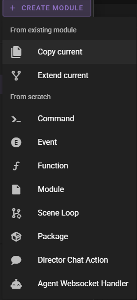

In the modal change

- **Name**: `Dynamic Premise`
- **Registry**: `scene/$N`


Now load the `scene-loop` module and replace the `On Scene Init` module with the new `Dynamic Premise` module.


Select the `On Scene Init` module and press the `delete` key.

Then add the `Dynamic Premise` module to the scene loop and set the `event_name` to `scene_loop_init`.


**Save** the graph.

**:material-movie-play:** Start the scene loop to test that everything's still working.

Then find the old `on-scene-init` module in the library and press the :material-close-circle-outline: button to delete it. Confirm the action.


## 6.2 Exposing a Reset Toggle

Load the `dynamic-premise` module.

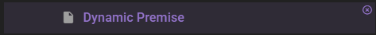

We have the node chain that lets us reset the premise generation.


It'd be practical for this to be a simple switch on the event node.

Create a new group somewhere in the module and call it `Properties`. Color it `cyan`.

Add the following nodes to the group:

- `Module Property`
- `Set State`
- `Stage`

Connect the nodes as follows:

- `<Module Property>.name` :material-transit-connection-horizontal: `<Set State>.name`
- `<Module Property>.value` :material-transit-connection-horizontal: `<Set State>.value`
- `<Set State>.value` :material-transit-connection-horizontal: `<Stage>.state`

In the `Module Property` node set the following:

- **property_name**: `reset`
- **property_type**: `bool`
- **default**: `false`

`Shift` click the title to auto-title it to `PROP reset`.

Leave the `Set State` node as is, but change its title to `SET local.reset`.

Make sure the `scope` is set to `local`.

!!! note "Can't auto-title the Set State node in this case"
    Since we are plugging the `name` output of the `Module Property` node into the `name` input of the `Set State` node, auto titling the Set State node currently doesn't work, so do it manually.


In the `Stage` node set the following:

- **stage**: `-1`

`Shift` click the title to auto-title it to `Stage -1`.

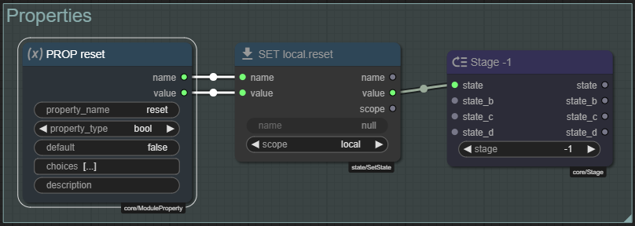

Next go back to the `Generate Introduction` group and add the following nodes:

- `Get State`

Replace the existing `Make Bool` (titled `RESET`) node with the `Get State` node, connecting it's value output to the `Switch.value` input.

Then in the `Get State` node set the following:

- **name**: `reset`
- **scope**: `local`

`Shift` click the title to auto-title it to `GET local.reset`.

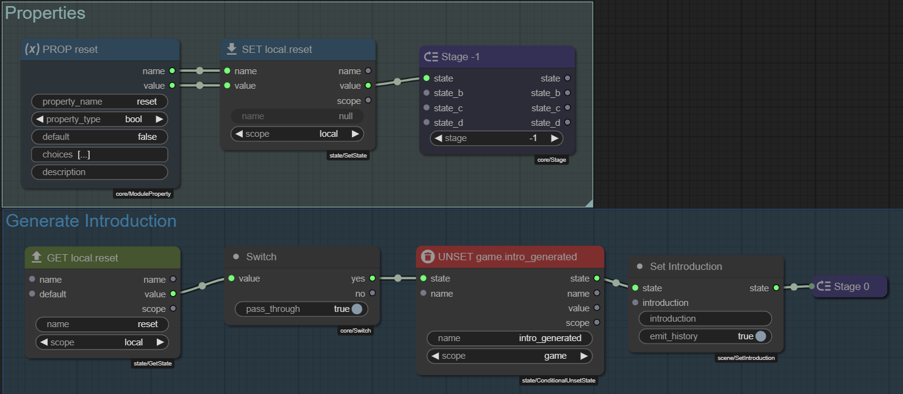

**Save** the graph.

Load the `scene-loop` module.


Confirm that the `Dynamic Premise` node now has a `reset` property that is a boolean on / off switch.


## 6.3 Fixing the registry path for the Generate Premise Module

Still in the `Dynamic Premise` module, looking at the `Generate Premise` node, it currently exposes no properties to edit.

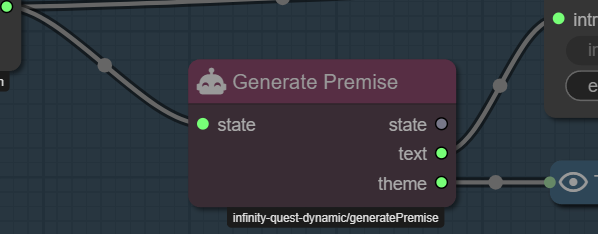

But, hold on, its path still is registered as `infinity-quest-dynamic/generatePremise` - that wont do for a reusable module.

So we need to change it.

Load the `generate-premise` module.


Create a copy of the module. (Same as before)

This time in the modal you can leave the **Name** as is, and simply replacde the `infinity-quest-dynamic` portion of the **Registry** with `scene` so it reads `scene/generatePremise`.

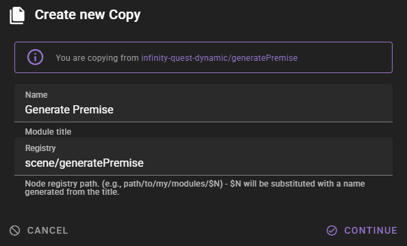

Click **Continue** to create the copy.

Since we are keeping the name the same, it will simply replace the existing `generate-premise` module in the library. However, the `dynamic-premise` module is still referencing the old `generate-premise` module.

!!! warning "Dont restart talemate right now"
    Currently the old reference is still loaded in talemate, so we can load the `dynamic-premise` module without any issues and remove it. Restarting talemate will cause the old reference to be removed and the dynamic premise module may no longer load.

Load the `dynamic-premise` module.


Delete the old `Generate Premise` node.

**Save** the graph.

Add the new `Generate Premise` node and connect it like how the old one was connected.

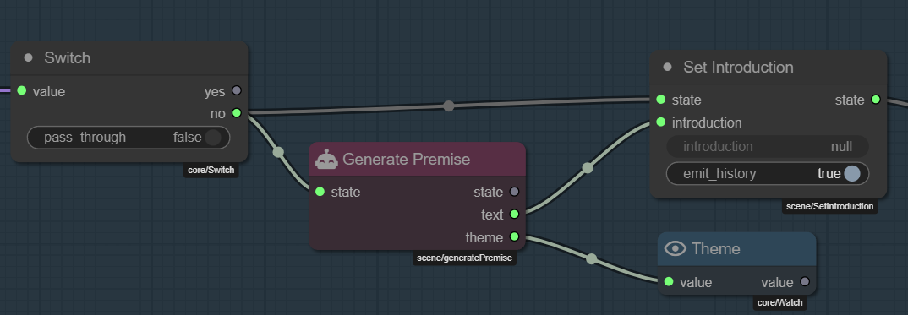

**Save** the graph.

!!! bug "The node editor can be a bit buggy here (v0.30.0)"
    It may be that when searching for the new node you will find the old one as well (or even multiples of it). Just make sure you select the one that has the path as `scene/generatePremise`.

    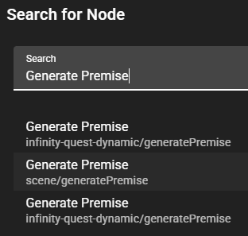

    The issue will go away the next time talemate is restarted.

## 6.4 Content control inputs

Load the `generate-premise` module.


### Investigating the current properties

Lets look which things we need to expose to allow us to control what kind of themes can be generated.

---

`<Generate Theme>.<Generate Thematic List>.instructions`

This controls the overarching theme topic. (sci-fi currenly)

```
A list of sci-fi topics. Keep each item short (1-3 words).

```

---

`<Analyze Theme>.<Theme Analysis Template>.value`

The **jinja2** prompt template for the theme analysis.

```
Analyze the following sci-fi theme:
{{theme}}

Provide a detailed exploration of this theme, including:
1. Key concepts or technologies involved
2. Potential storylines or conflicts
3. How it might affect the crew of the Starlight Nomad

Your analysis will be used to set up the premise for the next storyline in the Infinity Quest series.
```

---

`<Generate Introduction>.<Instruction Template>.value`

The prompt template for the introduction generation.

```
Generate the introduction to a random exciting scenario 
for the crew of the Starlight Nomad.

The theme is: "{theme}"

Use the following analysis to guide your creation of the scenario premise:

{theme_analysis}
```

---

So looking at the above, it seems we will need:

- A `topic` input that is a string.
- A `analysis_instructions` input that is a string

We will also rewrite the templates a bit to make them more flexible.

### Input Nodes

Create a new group somewhere in the module and call it `Inputs`. Color it `blue`.

Add the following nodes to the group:

- `Input` (x2)
- `Set State` (x2)
- `Stage`

---

**First `Input`**

- **input_name**: `topic`
- **input_type**: `str`
- **default**: edit to a blank string

`Shift` click the title to auto-title it to `IN topic`.

---

**Second `Input`**

- **input_name**: `analysis_instructions`
- **input_type**: `text`
- **default**: edit to a blank string

`Shift` click the title to auto-title it to `IN analysis_instructions`.

---

**First `Set State`**

- **name**: `topic`
- **scope**: `local`

`Shift` click the title to auto-title it to `SET local.topic`.

---

**Second `Set State`**

- **name**: `analysis_instructions`
- **scope**: `local`

`Shift` click the title to auto-title it to `SET local.analysis_instructions`.

---

**`Stage`**

Set title to `Stage -1`.

`Shift` click the title to auto-title it to `Stage -1`.

---

Connect the nodes as follows:

- `<IN topic>.value` :material-transit-connection-horizontal: `<SET local.topic>.value`
- `<SET local.topic>.value` :material-transit-connection-horizontal: `<Stage>.state`
- `<IN analysis_instructions>.value` :material-transit-connection-horizontal: `<SET local.analysis_instructions>.value`
- `<SET local.analysis_instructions>.value` :material-transit-connection-horizontal: `<Stage>.state_b`


**Save** the graph.

### Adjusting the Generate Theme stage

The topic of the theme will be set in `local.topic`, we need to get this and incorporate it into the `Generate Thematic List` node. We will also change to use the appropriate prompting nodes to build the prompt. So this will now use a jinja2 template syntax.

In the `Generate Theme` group add the following nodes:

- `Get State`
- `Make Text`
- `Prompt from Template`
- `Render Prompt`
- `Dict Set`

---

**Get State**

- **name**: `topic`
- **scope**: `local`

`Shift` click the title to auto-title it to `GET local.topic`.

---

**Make Text**

I am chosing to rewrite the instructions to be a bit more compatible with what a user might type into the `topic` input.

Its good to keep in mind that a user doesn't know what the entire prompt looks like, so their input may not always be ideal. Of course if you're just using this for yourself, this matters less.

- **value**
```
A list of topics to use for brain storming. The overarching theme is described as "{{ topic }}". Keep each item short (1-3 words). One of these items will be chosen to bootstrap a new story line.
```

Retitle to `Instructions`

---

Connect the nodes as follows:

- `<GET local.topic>.value` :material-transit-connection-horizontal: `<Dict Set>.value`
- `<GET local.topic>.name` :material-transit-connection-horizontal: `<Dict Set>.key`
- `<Instructions>.value` :material-transit-connection-horizontal: `<Prompt from Template>.template_text`
- `<Dict Set>.dict` :material-transit-connection-horizontal: `<Prompt from Template>.variables`
- `<Prompt from Template>.prompt` :material-transit-connection-horizontal: `<Render Prompt>.prompt`
- `<Render Prompt>.rendered` :material-transit-connection-horizontal: `<Generate Thematic List>.instructions`


### Adjusting the Analyze Theme stage

We will do the same for the `Analyze Theme` stage, conveniently this is already using `Prompt from Template` node, but the template itself is about to get a bit of a makeover, so there is a bit of work ahead of us.

However here I also want to include some extra context in the instructions to help improve the quality of the analysis.

In the `Analyze Theme` group add the following nodes:

- `Get State` (x2)
- `Dict Set` (x2)
- `Template variables`

---

**First Get State**

- **name**: `analysis_instructions`
- **scope**: `local`

`Shift` click the title to auto-title it to `GET local.analysis_instructions`.

---

**Second Get State**

- **name**: `topic`
- **scope**: `local`

`Shift` click the title to auto-title it to `GET local.topic`.

---

**Theme Analysis Template**

Here I want to add the scene `description` and the characters `description` to the template, thinking it will influence the analysis within the context of the story baseline. Knowing the characters will also help the agent come up with potenial storyline suggestions.

Additionally I am deciding to coerce the response to be a bit more concise and to the point. In my testing I found that the agent was getting a bit verbose and even with a 1024 token limit it was getting cut off.

- **value**
```
<|SECTION:STORY BASELINE|>
{{ scene.description }}

<|SECTION:PROTAGONISTS|>

### {{ character.name }}
{{ character.description }}


<|SECTION:CONTEXT OF YOUR TASK|>
A topic description of "{{ topic }}" was given and a random theme was picked to bootstrap a new storyline: "{{ theme }}".

<|SECTION:TASK|>
Analyze the theme "{{ theme }}" in the context of the topic "{{ topic }}".

Provide a brief exploration of this theme, including:
1. Key concepts or ideas involved and how they fit the context
2. Potential storylines or conflicts
3. How it might affect the protagonists of the story


{{ analysis_instructions }}


Keep your analysis concise and to the point.

Your analysis will be used to set up the premise for the next storyline in the `{{ scene.name }}` series.
```

!!! tip "Template variables"
    Its the `Template variables` node that is responsible for adding variables like `scene` to the template
    scope.

---

Connect the nodes as follows:

- `<GET local.analysis_instructions>.value` :material-transit-connection-horizontal: `<Dict Set>.value`
- `<GET local.analysis_instructions>.name` :material-transit-connection-horizontal: `<Dict Set>.key`

---

- `<GET local.topic>.value` :material-transit-connection-horizontal: `<Dict Set>.value`
- `<GET local.topic>.name` :material-transit-connection-horizontal: `<Dict Set>.key`

---

Chain all three `Dict Set` nodes together, with each connecting to the `dict` input of the next and the last one connecting to the `merge_with` input of the `Template variables` node.

---

- `<summarizer>.agent` :material-transit-connection-horizontal: `<Template variables>.agent`
- `<Template variables>.agent` :material-transit-connection-horizontal: `<Generate Response>.agent`
- `<Template variables>.variables` :material-transit-connection-horizontal: `<Prompt From Template>.variables`

---

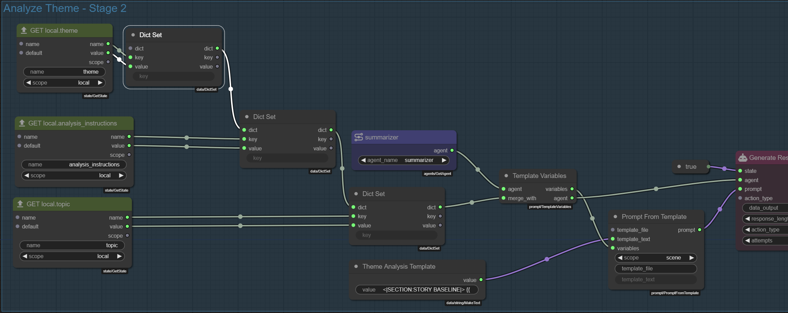

**Save** the graph.

### Adjusting the Generate Introduction stage

This i will leave as is for now, but i will update the `Instruction Template` text to remove the infinity quest reference.

```
Generate the introduction to a random exciting story-line.

The theme is: "{theme}"

Use the following analysis to guide your creation of the scenario premise:

{theme_analysis}
```

**Save** the graph.

## 6.5 - A switch for analysis

My general approach is that i want to be able to turn off long running queries to the agents.

So lets do this for the analysis.

The obvious splace to add this is the `state` input of the `Generate Response` node in the `Analyze Theme` group.

It is currently connected to a `Make Bool` node that is set to `true`.

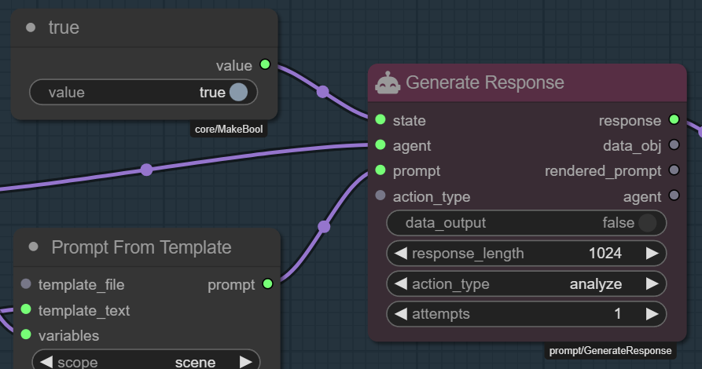

To build a switch add the following nodes:

- `Get State`
- `Switch`

---

**Get State**

- **name**: `analysis_enabled`
- **scope**: `local`

`Shift` click the title to auto-title it to `GET local.analysis_enabled`.

---

**Switch**

- **pass_through**: `false`

---

Connect the nodes as follows:

- `<GET local.analysis_enabled>.value` :material-transit-connection-horizontal: `<Switch>.value`
- `<Switch>.yes` :material-transit-connection-horizontal: `<Generate Response>.state`


**Save** the graph.

Next we need to add an `Input` node to expose this new `analysis_enabled` property.

Add the following nodes to the `Inputs` group:

- `Input`
- `As Bool`
- `Set State`

---

**Input**

- **input_name**: `analysis_enabled`
- **input_type**: `bool`

`Shift` click the title to auto-title it to `IN analysis_enabled`.

---

**As Bool**

- **default**: `true`

---

**Set State**

- **name**: `analysis_enabled`
- **scope**: `local`

`Shift` click the title to auto-title it to `SET local.analysis_enabled`.

---

Connect the nodes as follows:

- `<IN analysis_enabled>.value` :material-transit-connection-horizontal: `<As Bool>.value`
- `<As Bool>.value` :material-transit-connection-horizontal: `<SET local.analysis_enabled>.value`
- `<SET local.analysis_enabled>.value` :material-transit-connection-horizontal: `<Stage>.state_c`

---

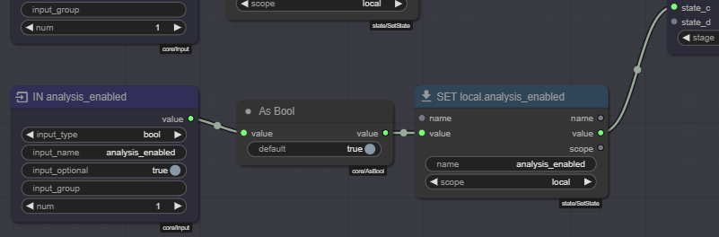

**Save** the graph.

## 6.6 - Propagating through Dynamic Premise

Load the `dynamic-premise` module.


Good news! Looks like the `Generate Premise` node is exposing the 3 new socket inputs we added to the `generate-premise` module.


!!! bug "If the `Generate Premise` node looks a bit glitchy"
    If you notice that our `Generate Premise` node looks a bit glitchy, where its size is not correct, causing the new widgets to overflow, simply resize it to fix this.

But, we need those properties to be propagated one more level, so someone can simply add the `Dynamic Premise` module to their scene loop and then be able to edit everything from there.

Easy enough, just do the now familiar flow of adding three `Module Property` nodes, `Set State` nodes to the existing `Properties` group and connect them to the stage.

- `analysis_enabled`: `bool` - default `true`
- `topic`: `str` - default blank string
- `analysis_instructions`: `text` - default blank string


**Save** the graph.

Now add three `Get State` nodes to the `Generate Introduction` group and connect them to the `topic`, `analysis_instructions` and `analysis_enabled` inputs of the `Generate Premise` node.


**Save** the graph.

## 6.7 - Testing

Load the `scene-loop` module.


Confirm the `Dynamic Premise` node now is exposing:

- `reset` - a boolean toggle to reset the premise generation (useful for testing)
- `analysis_instructions` - a text input to control the analysis instructions
- `analysis_enabled` - a boolean toggle to control whether the analysis is enabled (default `true`)
- `topic` - a string input to control the topic of the theme

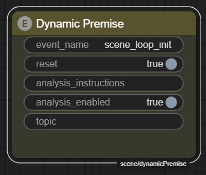

Fill in a `topic`.

> sci-fi with eldritch and cosmic horror elements

**:material-movie-play:** Start the scene loop to test that everything's still working.

## 6.8 - Making it a Talemate Module

Currently there is no UX for making a module a Talemate module.

While we work on the tooling for this, here is how to do it manually.

In the `talemate` directory find the `scenes` directory, and there find the folder for this project.

So if you followed the example to the point, it should be `scenes/infinity-quest-dynamic`.

In there find the `nodes` directory.

It should have three files in it:

- `dynamic-premise.json`
- `generate-premise.json`
- `scene-loop.json`

Copy **both** the `dynamic-premise.json` and `generate-premise.json` files to the `templates/modules` directory. (relative to the talemate folder)

!!! note
    If the `modules` directory does not exist, create it.

Restart talemate.

To test that this worked, create a new scene project.

Filter the **Modules** library for `premise` and both should be available. (albeit locked for editing)

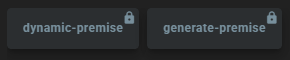

Extend the scene loop so we can edit it. (Remember how we did this in [part 1](./1-scene-project.md))

Search for the `Dynamic Premise` node and add it to the scene loop.

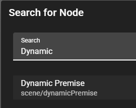


Looking good!

!!! tip "Keep editing through the original infinity-quest-dynamic scene"
    Since the `Infinity Quest Dynamic` scene still has its own copies of these modules, you can come back to it and make changes.

    The load order of modules assures that modules living with the scene take precedence over the ones in the `templates/modules` directory.

    So a good workflow is to make and test changes in a dedicated scene project and whenever you are happy with it copy the new modules to the `templates/modules` directory.

    This works as long as the module title and registry values are the same.