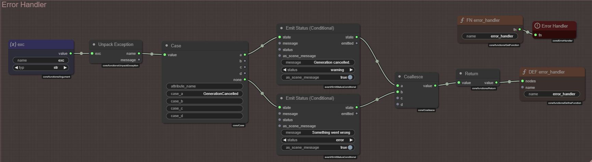

# 7 - Polish

Some things I am doing as i am wrapping up this tutorial and the `Dynamic Premise` module to ship with the next `0.30` release.

This part is going to be a bit more scattered as i am doing it on the fly as finish the implementation.

I don't think you need to do all (or even any) of these, but it's going to be beneficial to review the process and understand the concepts.

1. Status indication
1. Comments
1. Error Handling
1. Generate story intention
1. Defaulting to the `scene_loop_init` event

## 7.1 - Status Indication

We want to show some status indication wile the `Dynamic Premise` node is working.

--8<-- "docs/user-guide/howto/infinity-quest-dynamic/.snippets.md:load-generate-premise"

Looking at the stages we have Input processing at stage `-1` and then `Theme Generation` at stage `1`.

This makes stage `0` an ideal place to handle status indication.

Create a new group called `Init - Stage 0` and color it `yellow`.

Add the following nodes to the group:

- `Emit Status`
- `Stage`

---

**Emit Status**

- **message**: `Generating a new story line...`
- **status**: `busy`
- **as_scene_message**: `true`

---

**Stage**

- **stage**: `0`

---

Connect the nodes as follows:

- `<Emit Status>.emitted` :material-transit-connection-horizontal: `<Stage>.state`

I am also dragging the existing `Module Style` node into this group as well, just to make it more tidy.

--8<-- "docs/snippets/common.md:save-graph"

**:material-movie-play:** Start the scene loop to test.

## 7.2 - Comments

I am not going to go through all the comments i am adding, but i want to point out that you CAN in fact add comments to your modules.

`Right click` anywhere on the canvas and select **Comment**.

Then `double click` the comment to edit it.

## 7.3 - Error Handling

Right now if something goes wrong in the `Generate Premise` node, the status emission will stick around. 

Lets fix that.

--8<-- "docs/user-guide/howto/infinity-quest-dynamic/.snippets.md:load-generate-premise"

Add a new group called `Error Handling` and color it `red`.

Add the following nodes to the group:

- `Emit Status (Conditional)` x2 - Will be used to send a new status message
- `Argument` - Error handlers are function definitions, we need an argument to pass the exception to
- `Unpack Exception` - Unpacks the exception into a name and message
- `core/Case` - Used to select which message to emit based on the exception name
- `Coallesce` - Coallesce into single return value
- `Return` - Return value for the error handler function (needs to be True to indicate error was caught)
- `Define Function` - Defines the error handler function
- `Get Function` - Retrieves the error handler function
- `Error Handler`

---

**Argument**

- **name**: `exc`

`Shift` + click the node title to auto-title it to `exc`.

---

**Case**

- **case_a**: `GenerationCancelled`

---

**Emit Status (Conditional) - Generation Cancelled**

- **message**: `Generation cancelled`
- **status**: `warning`
- **as_scene_message**: `true`

---

**Emit Status (Conditional) - Generation Failed**

- **message**: `Something went wrong.`
- **status**: `error`
- **as_scene_message**: `true`

---

**Define Function**

- **name**: `error_handler`

`Shift` + click the node title to auto-title it to `DEF error_handler`.

---

**Get Function**

- **name**: `error_handler`

`Shift` + click the node title to auto-title it to `FN error_handler`.

---

Then connect the nodes as follows:

- `<exc>.value` :material-transit-connection-horizontal: `<Unpack Exception>.exc`
- `<Unpack Exception>.name` :material-transit-connection-horizontal: `<Case>.value`
- `<Case>.a` :material-transit-connection-horizontal: `<Emit Status (Conditional) - Generation Cancelled>.state`
- `<Case>.none` :material-transit-connection-horizontal: `<Emit Status (Conditional) - Generation Failed>.state`
- `<Emit Status (Conditional) - Generation Cancelled>.state` :material-transit-connection-horizontal: `<Coallesce>.a`
- `<Emit Status (Conditional) - Generation Failed>.state` :material-transit-connection-horizontal: `<Coallesce>.b`
- `<Coallesce>.value` :material-transit-connection-horizontal: `<Return>.value`
- `<Return>.value` :material-transit-connection-horizontal: `<DEF error_handler>.nodes`

---

- `<FN error_handler>.fn` :material-transit-connection-horizontal: `<Error Handler>.fn`

--8<-- "docs/snippets/common.md:save-graph"

!!! note "Learn more about functions and error handling"
    Learn more about functions and error handling in the [Functions](/talemate/user-guide/node-editor/core-concepts/functions/) and [Error Handling](/talemate/user-guide/node-editor/core-concepts/error-handling/) sections of the documentation.

## 7.4 - Generate Story Intention

Story intention is a feature that was also added with `0.30`. Its main purpose at this point is to aid the new `auto-direction` feature.

However since it is included in most contex, we can also use it to ensure the initial theme selection and proposed story line isn't lost past the introductory text. There is only so much information the intro text can hold.

I am doing this as the 4th stage in the `Generate Premise` module.

It's revisiting already learned concepts, so i won't go through the entire process. Hopefully at this point you can look at the image below and understand what is going on.

I will note that i am adding another `Set State` node to `Stage 3` to store the template variables we generate there, just so i don't have to repeat the same nodes in `Stage 4`.

## 7.5 - Defaulting to the `scene_loop_init` event

The user shouldn't have to manually set the `scene_loop_init` event for the `Dynamic Premise` module to work.

Good thing we can set a default.

--8<-- "docs/user-guide/howto/infinity-quest-dynamic/.snippets.md:load-dynamic-premise"

Find the `Properties` panel in the upper left corner of the node editor and expand it.

Enter `scene_loop_init` in the `Event to listen for` field.

--8<-- "docs/snippets/common.md:save-graph"

I am also noting that there are 3 unlabled inputs in that panel from the `Module Property` nodes we have added.

To fix this, simply set the description of each of the `Module Property` nodes.

--8<-- "docs/snippets/common.md:save-graph"

**Reload** the module.

If we add a new `Dynamic Premise` node to a scene loop, we can see that the `event_name` property is now set to `scene_loop_init` by default.

## 7.6 - Final thoughts

### A missing stage and some reorganization

After testing the module for a bit, i am noting that story intention should be generated before the introduction.

There could also be a benefit of adding another stage after analysis that picks and expands on one of the story line suggestions put forth by the analysis.

I will likely do this, but since none of this introduces any new concepts it will not be part of the tutorial.

You can always open up the final `Generate Premise` module and see how it is put together in the end.