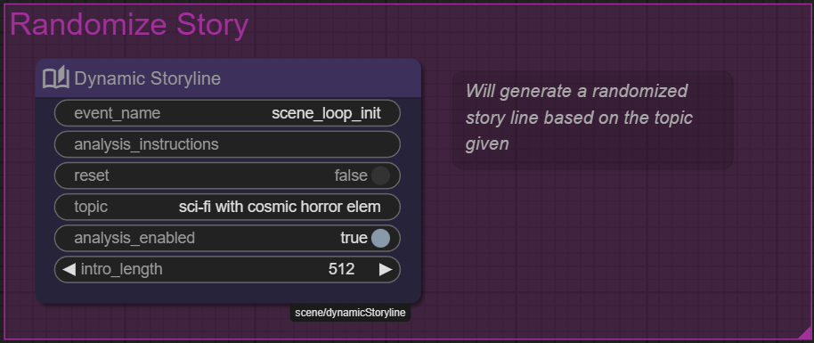

# Building a Dynamic Story Generator with the Node Editor

This tutorial will guide you through creating a dynamic story generator using Talemate's node editor. You'll learn how to build a system that automatically creates unique story introductions based on random themes, with AI-powered analysis to make each story engaging and coherent.

!!! info "Tutorial origins"
    This tutorial documents some of the process of porting the original Infinity Quest project from its template-based system to Talemate's new node editor. The end result of this port is the `Dynamic Premise` node, which is now available in Talemate v0.30 and later. Although there are some final improvements in the module that are not covered in this tutorial.

    

The tutorial follows a practical learning path:

1. First, we'll create a scene-specific story generator for the Infinity Quest project
2. Then, we'll transform it into a reusable module that can be used in any scene

The tutorial is designed to be approachable even if you're new to node editing, starting with basic concepts and gradually introducing more advanced features.

## What You'll Learn
- How to set up and organize node-based workflows
- Working with different AI agents (Creator, Summarizer) to generate content
- Using stages to control the flow of your node graph
- Creating reusable modules that can be shared across projects
- Best practices for error handling and status feedback

## Tutorial Parts
1. **Scene Project** - Setting up your project and importing characters
2. **Initial Nodes** - Creating your first node graph and hooking into scene initialization
3. **Improvements** - Enhancing the story generation with better prompts and theme selection
4. **Get Organized** - Learning how to structure your node graph into multiple sub-modules
5. **Agentic Workflow** - Using multiple AI agents to create richer story content
6. **Reusable Module** - Making your story generator available for any scene
7. **Polish** - Adding error handling and status feedback.

Each part builds on the previous one, but you can stop at any point and have something useful. The complexity increases gradually, so you can learn at your own pace.