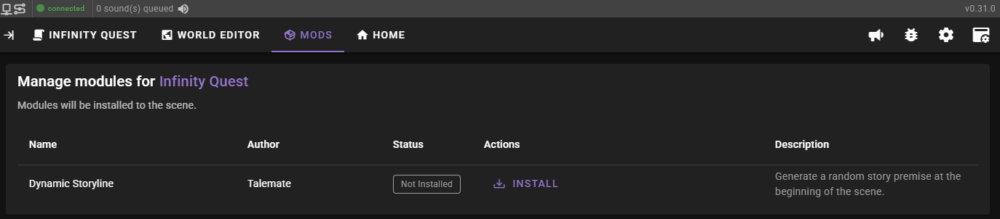
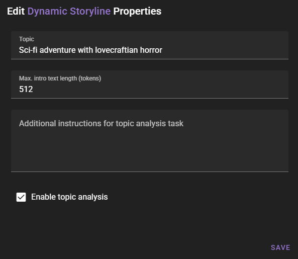

# Use the dynamic story module

This tutorial will show you how to use the `Dynamic Storyline` module (added in `0.30`) to randomize the scene introduction for ANY scene.

!!! note "A more streamlined approach is coming soon"
    I am aware that some people may not want to touch the node editor at all, so a more streamlined approach is planned.

    For now this will lay out the simplest way to set this up while still using the node editor.

!!! learn-more "For those interested..."

    There is tutorial on how the `Dynamic Storyline` module was made (or at least the beginnings of it).

    If you are interested in the process, you can find it [here](/talemate/user-guide/howto/infinity-quest-dynamic).

## Save a foundation scene copy

This should be a save of your scene that has had NO progress made to it yet. We are generating a new scene introduction after all.

The introduction is only generated once. So you should maintain a save-file of the original scene that has no progress yet. You can then load this copy whenever you want to start a new story.

To ensure this foundation scene save isn't overwritten you can go to the scene settings in the world editor and turn on the Locked save file flag:

Save the scene.

## Switch to the node editor

In your scene tools find the :material-puzzle-edit: creative menu and click on the **Node Editor** option.

Find the `COPY AS EDITABLE MODULE FOR ..` button beneath the node editor.

Click it.

In the next window, don't even read any of the stuff, just click **Continue**.

## Find a blank area

Use the mousewheel to zoom out a bit, then click the canvas and drag it to the side so you're looking at some blank space. Literally anywhere that's grey background is fine.

Double click the empty area to bring up the module searcand type in "Dynamic Story" into th

Select the `Dynamic Storyline` node to add it to the scene.

Click the `topic` input and type in a general genre or thematic guide for the story.

Some examples

- `sci-fi with cosmic horror elements`
- `dungeons and dragons campaign ideas`
- `slice of life story ideas`

Whatever you enter will be used to generate a list of story ideas, of which one will be chosen at random to bootstrap a new story, taking the scene context that exists already into account. 

This will NOT create new characters or world context.

It simply bootstraps a story premise based on the random topic and what's already there.

Once the topic is set, save the changes by clicking the node editor's **Save** button in the upper right corner.

Exit the node editor through the same menu as before.

Once back in the scene, if everythign was done correctly you should see it working on setting the scene introduction.

