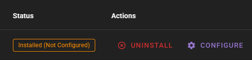
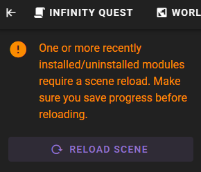
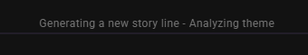

# Use the dynamic story module

This tutorial will show you how to use the `Dynamic Storyline` module (added in `0.30`) to randomize the scene introduction for ANY scene.

## Save a foundation scene copy

This should be a save of your scene that has had NO progress made to it yet. We are generating a new scene introduction after all.

The introduction is only generated once. So you should maintain a save-file of the original scene that has no progress yet. You can then load this copy whenever you want to start a new story.

To ensure this foundation scene save isn't overwritten you can go to the scene settings in the world editor and turn on the Locked save file flag:

Save the scene.

## Install the module

Click the `Mods` tab in the world editor.
    

Find the `Dynamic Storyline` module and click **Install**.

It will say installed (not configured)

Click **Configure** and set topic to something like `Sci-fi adventure with lovecraftian horror`.

!!! note "Optional settings"

    ##### Max intro text length
    How many tokens to generate for the intro text.

    ##### Additional instructions for topic analysis task
    If topic analysis is enabled, this will be used to augment the topic analysis task with further instructions

    ##### Enable topic analysis
    This will enable the topic analysis task

**Save** the module configuration.

Finally click "Reload Scene" in the left sidebar.

If everything is configured correctly, the storyline generation will begin immediately.

!!! note "Switch out of edit mode"

    If nothing is happening after configuration and reloading the scene, make sure you are not in edit mode.

    You can leave edit mode by clicking the "Exit Node Editor" button in the creative menu.
    
    