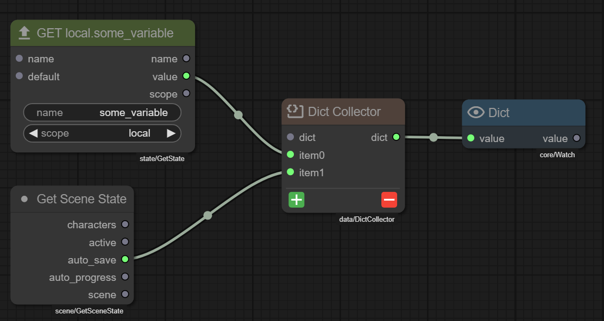
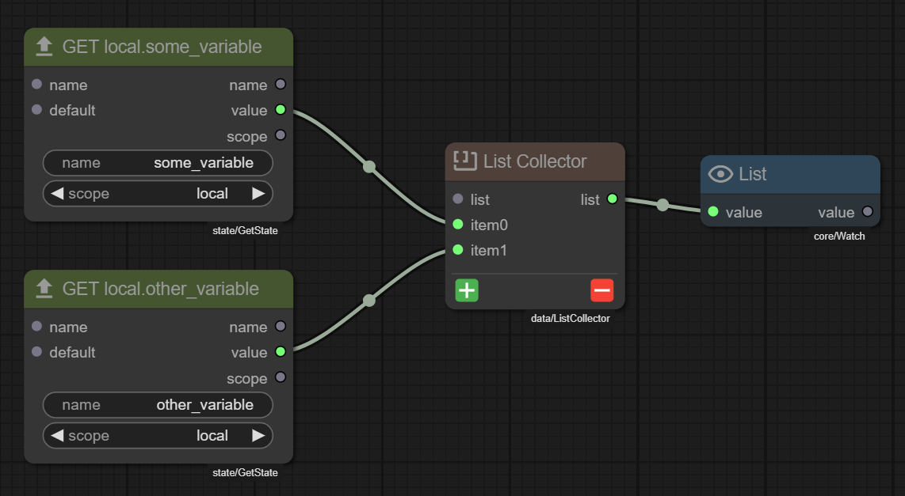
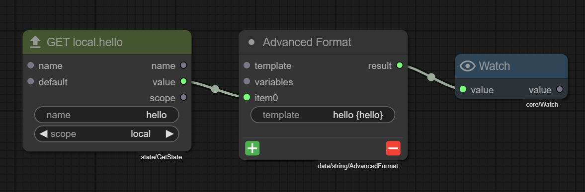
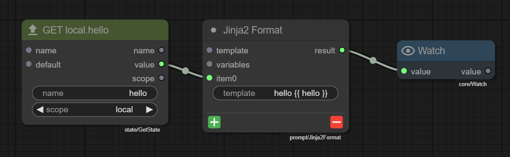

# Collector Nodes

!!! info "New in version 0.33"
    Collector nodes with dynamic sockets were introduced in Talemate version 0.33.0.

Collector nodes are specialized nodes that aggregate multiple inputs into a single data structure. They feature **dynamic sockets** that can be added or removed as needed, making them flexible for various data aggregation scenarios.

## Types of Collector Nodes

### Dict Collector



**Expected output from the example above:**

```json
{
    "some_variable": "hello",
    "auto_save": true
}
```

The **Dict Collector** node collects key-value pairs into a dictionary.

**Inputs:**

- `dict` (optional): An existing dictionary to add items to
- `item{i}` (dynamic): Multiple dynamic input slots for key-value pairs

**Outputs:**

- `dict`: The resulting dictionary containing all collected key-value pairs

**How it works:**

1. Each dynamic input can accept either:
   - A **tuple** in the format `(key, value)` from nodes like [Make Key-Value Pair](../img/dict-collector.png)
   - Any **value**, in which case the key is inferred from the connected node's properties

2. When a tuple `(key, value)` is provided, the key and value are directly added to the dictionary

3. When a non-tuple value is provided, the collector attempts to infer the key name by checking the source node for:
   - A `name` property/input
   - A `key` property/input
   - An `attribute` property/input
   - Falls back to the socket name if none are found

4. The final dictionary contains all collected key-value pairs

**Common use cases:**

- Collecting multiple values into a structured dictionary
- Building configuration objects from separate nodes
- Aggregating character properties or attributes
- Creating data structures from unpacked objects

### List Collector



**Expected output from the example above:**

```json
["hello", "world"]
```

The **List Collector** node collects items into a list.

**Inputs:**

- `list` (optional): An existing list to append items to
- `item{i}` (dynamic): Multiple dynamic input slots for list items

**Outputs:**

- `list`: The resulting list containing all collected items

**How it works:**

1. Each dynamic input accepts any value type
2. Values are appended to the list in the order of the dynamic inputs (item0, item1, item2, etc.)
3. If an existing list is provided, new items are appended to it
4. If no list is provided, a new empty list is created

**Common use cases:**

- Collecting multiple values into an ordered list
- Aggregating results from multiple nodes
- Building lists for iteration or processing
- Combining outputs from multiple sources

## Managing Dynamic Sockets

Collector nodes support **dynamic input sockets** that can be added or removed as needed.

### Adding Input Sockets

There are two ways to add input sockets:

1. **Using the on-node buttons**: Click the green **+** button at the bottom of the node
2. **Using the context menu**: Right-click the node and select `Add Input Slot`

### Removing Input Sockets

There are two ways to remove input sockets:

1. **Using the on-node buttons**: Click the red **-** button at the bottom of the node (removes the last dynamic input)
2. **Using the context menu**: Right-click the node and select `Remove Last Input`

!!! note "Only the last dynamic input can be removed"
    You can only remove the most recently added dynamic input. To remove an input from the middle, you must first remove all inputs after it.

## Working with Key-Value Pairs

When working with **Dict Collector**, you'll often use the **Make Key-Value Pair** node to create properly formatted tuple outputs.

**Make Key-Value Pair Node:**

- **Inputs**: `key` (string), `value` (any type)
- **Outputs**: `kv` (tuple), `key` (string), `value` (any)

The `kv` output produces a tuple in the format `(key, value)` which can be directly connected to Dict Collector's dynamic inputs.

**Example:**

```
[Make Key-Value Pair]     [Make Key-Value Pair]     [Get State]
  key: "name"               key: "age"                scope: local
  value: "Alice"            value: 30                 name: "works"
        ↓ kv                      ↓ kv                     ↓ value
        └────────┐          ┌─────┘                        │
                 ↓          ↓                               ↓
              [Dict Collector]                         [Dict Collector]
                item0  item1                               item2
                     ↓
              {"name": "Alice", "age": 30, "works": true}
```

## Nested Collection

Collector nodes can be chained together to create nested data structures:

- **Dict into Dict**: A Dict Collector's output can feed into another Dict Collector's `dict` input to add more key-value pairs
- **List into List**: A List Collector's output can feed into another List Collector's `list` input to combine lists
- **Mixed nesting**: Lists can contain dictionaries and vice versa

**Example of nested collection:**

```
[Dict Collector A] → [Dict Collector B]
  item0: ("x", 10)     dict: (from A)
  item1: ("y", 20)     item0: ("z", 30)

Result: {"x": 10, "y": 20, "z": 30}
```

## Examples

### Dict Collector Example

In the Dict Collector screenshot above, two nodes are connected:

- **item0**: `value` output from "GET local.some_variable"
- **item1**: `auto_save` output from "Get Scene State"

Since no explicit key-value tuples are provided, the Dict Collector uses key inference:

- **item0**: Infers key from the source node's `name` property → `"some_variable"`
- **item1**: Uses the socket name → `"auto_save"`

**Expected output:**

```python
{
    "some_variable": <value from local.some_variable>,
    "auto_save": <value from scene state's auto_save property>
}
```

For example, if `local.some_variable` contains `"hello"` and `auto_save` is `True`:

```python
{
    "some_variable": "hello",
    "auto_save": True
}
```


### List Collector Example

In the List Collector screenshot above, two Get State nodes are connected:

- **item0**: `value` from "GET local.some_variable"
- **item1**: `value` from "GET local.other_variable"

The List Collector simply appends values in order.

**Expected output:**

```python
[
    <value from local.some_variable>,
    <value from local.other_variable>
]
```

For example, if `local.some_variable` contains `"hello"` and `local.other_variable` contains `"world"`:

```python
["hello", "world"]
```

## String Formatting with Collected Data

Collector nodes work seamlessly with formatting nodes to convert collected data into formatted strings. Two powerful formatting nodes that support dynamic inputs are **Advanced Format** and **Jinja2 Format**.

### Advanced Format



**Expected output from the example above:**

```json
"hello world"
```

The **Advanced Format** node uses Python-style string formatting with dynamic inputs similar to Dict Collector.

!!! warning "Use single curly braces `{}`"
    Advanced Format uses Python's `.format()` syntax. Variables are referenced with **single curly braces**: `{variable_name}`

**Inputs:**

- `template` (required): A format string with placeholders (e.g., `"hello {hello}"`)
- `variables` (optional): Base dictionary to merge with dynamic inputs
- `item{i}` (dynamic): Multiple dynamic input slots for format variables

**Outputs:**

- `result`: The formatted string

**How it works:**

1. Each dynamic input can accept either:
   - A **tuple** in the format `(key, value)`
   - Any **value**, in which case the key is inferred from the connected node's properties (same logic as Dict Collector)

2. Variables from dynamic inputs are merged with the optional `variables` dictionary

3. The template is formatted using Python's `.format()` method with all collected variables

4. Placeholders in the template like `{hello}` are replaced with their corresponding values

**Example from screenshot:**

- Template: `"hello {hello}"`
- Dynamic input `item0`: Connected to "GET local.hello" which has value `"world"`
- Key inferred as `"hello"` from the source node's `name` property
- Result: `"hello world"`

### Jinja2 Format



**Expected output from the example above:**

```json
"hello world"
```

The **Jinja2 Format** node extends Advanced Format but uses Jinja2 templating instead of Python's `.format()`.

!!! warning "Use double curly braces `{{}}`"
    Jinja2 Format uses Jinja2 template syntax. Variables are referenced with **double curly braces**: `{{ variable_name }}`

**Inputs:**

- `template` (required): A Jinja2 template string (e.g., `"hello {{ hello }}"`)
- `variables` (optional): Base dictionary to merge with dynamic inputs
- `item{i}` (dynamic): Multiple dynamic input slots for template variables

**Outputs:**

- `result`: The rendered template string

**How it works:**

1. Inherits all the dynamic input behavior from Advanced Format
2. Uses Jinja2 template syntax: `{{ variable }}` for variables, `` for logic
3. Supports all Jinja2 features: filters, conditionals, loops, etc.
4. Perfect for complex formatting needs beyond simple placeholder replacement

**Example from screenshot:**

- Template: `"hello {{ hello }}"`
- Dynamic input `item0`: Connected to "GET local.hello" with value `"world"`
- Key inferred as `"hello"` from the source node's `name` property
- Result: `"hello world"`

### Combining Collectors with Formatters

A common pattern is to use collectors to gather data, then format it into strings:

```
[Get State] ──→ [Dict Collector] ──→ [Advanced Format]
[Get State] ──→      item0              variables
                     item1              ↓
                       ↓            template: "Name: {name}, Age: {age}"
                   {"name": "Alice",
                    "age": 30}
```

Or use dynamic inputs directly on the formatter:

```
[Get State] ──→ [Advanced Format]
[Get State] ──→    item0
                   item1
                template: "{name} is {age} years old"
```

### Format vs Advanced Format vs Jinja2 Format

| Feature | Format | Advanced Format | Jinja2 Format |
|---------|--------|-----------------|---------------|
| **Dynamic Inputs** | No | Yes | Yes |
| **Syntax** | Python `.format()` | Python `.format()` | Jinja2 `{{ }}` |
| **Key Inference** | No | Yes | Yes |
| **Conditionals** | No | No | Yes |
| **Loops** | No | No | Yes |
| **Filters** | No | No | Yes |
| **Best For** | Simple static formatting | Dynamic formatting with multiple inputs | Complex templates with logic |