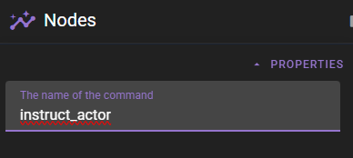
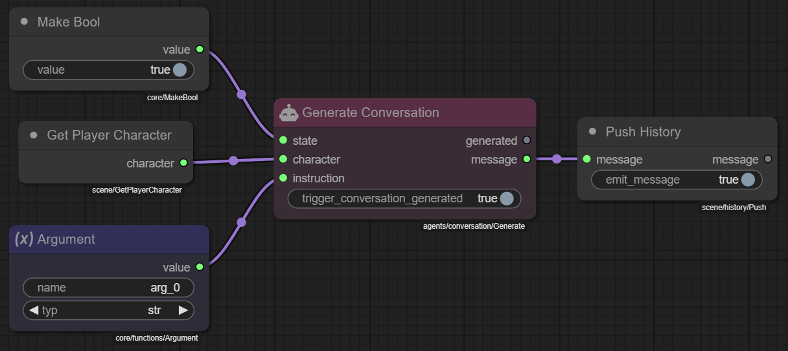
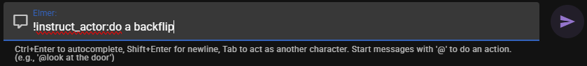
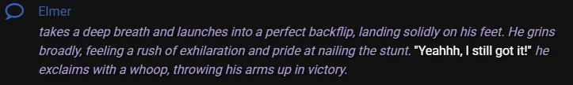
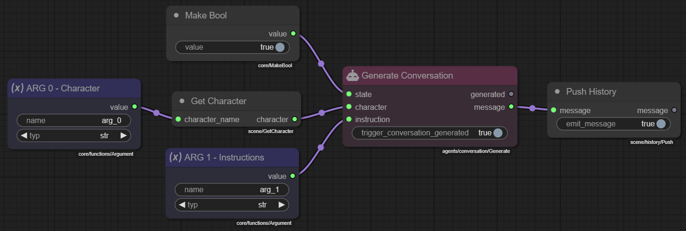

# Command Modules

You can register scene commands via the `Command` module type.

A registered command can be run by prefixing a message you send to the scene with a `!` followed by the command name.

Arguments are placed after a `:` in the message. Individual arguments are delimited by a `;`.

For example:

```
!instruct_actor:alice;Stay alert, the enemy is near.
```

• `instruct_actor` – command name  
• `alice` – `arg_0`  
• `Stay alert, the enemy is near.` – `arg_1`

The parser always turns the positional fields into `arg_0`, `arg_1`, …

## Creating a Command Module

1. In the **Module Library** (bottom of the editor) click **:material-plus: Create Module** and choose **Command**.  In the dialog that pops up **enter a title** and **set the registry path** (you can use `$N` as a placeholder for an auto-generated name).
1. Expand the **Properties** panel in the upper left of the editor and enter a **name** for the command.



That `name` is what players will type after `!` to invoke the command.

### Building the command logic

Command modules are specialised *Function* modules.  Internally they work exactly like the functions described in the [Functions guide](functions.md) – you define one or more *Argument* nodes, process them, then connect the last node to **Define Function** (or simply rely on the module wrapper).

#### Recommended pattern

1. **Argument nodes** – Add one for each parameter you want to accept (`arg_0`, `arg_1`, …).  Give them meaningful titles so the canvas is readable.
2. **Processing nodes** – Do whatever the command should do (get characters, move the camera, push history, etc.).

!!! note "Command modules are automatically loaded"
    You **do not** need to load the command module into the scene graph as a node. It is automatically loaded when the scene is loaded making it available to use in the scene.
---

## Example – `!instruct_actor`

The series of screenshots below show a command that tells a character to follow new instructions and generates a short AI response:










Key points:

* `arg_0` – character name.  Goes into **Get Character**, which retrieves the Character object.
* `arg_1` – free-text instructions.  Passed to **Generate Conversation** so the agent produces a reply.
* **Make Bool** simply activates the `state` socket of *Generate Conversation* (any truthy value works).
* The generated `message` flows into **Push History** to add it to the scene log for players to read.

Now players (or tests) can type:

```
!instruct_actor:alice;Patrol the northern wall and report back at dusk.
```

The graph runs, the AI generates a response as Alice, and the message appears in the scene.

---

## Tips

* Keep argument order consistent; users cannot skip positions.
* Use **Error Handler** inside the module to gracefully handle bad input.

!!! tip "Functions"
    Command modules rely on the same function mechanics described in the Functions guide
    
    → [Back to Function nodes](functions.md) 