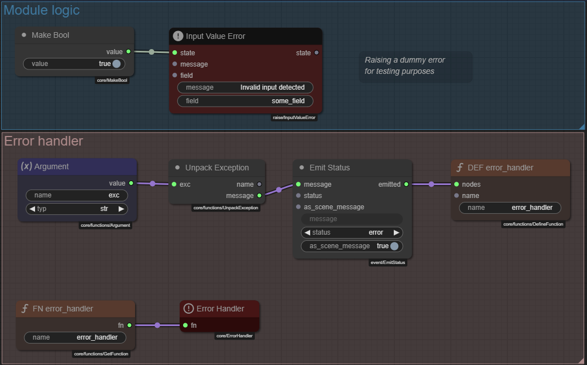

# Error Handling

Robust modules need a way to gracefully recover from unexpected problems.  Talemate provides a small set of nodes that let you catch exceptions, inspect them, and respond – all without breaking execution.

---

## Core concepts

| Node | Purpose |
|------|---------|
| **Error Handler** (`core/ErrorHandler`) | Boundary node that listens for *uncaught* exceptions in the current graph.  When an error bubbles up, it invokes a user-supplied function so you can decide what to do (log, retry, ignore…). |
| **Unpack Exception** (`core/functions/UnpackException`) | Converts an `ExceptionWrapper` into two plain outputs: `name` and `message`.  Useful for displaying or branching on specific error types. |

### How the Error Handler works

1. **Define a handler function** – Create an inline function (or Function Module) that accepts a single argument `exc` (type `exception`).  The function can look at `exc.name` and `exc.message`, emit a status message, retry something, etc.
2. **Wrap it** – Use a **Define Function** node and expose it with **Get Function** (exactly like any other function).  See the Functions guide linked below if you're unfamiliar with this pattern.
3. **Attach it** – Feed the wrapper into an **Error Handler** node placed anywhere in the graph.  From now on, whenever an uncaught exception occurs *upstream* of that node, your function gets a chance to run.

## Example

The screenshot below implements a simple handler that logs the error to scene history:

- **Module logic** group (blue) raises a dummy `InputValueError` for demonstration.
- **Error handler** group (purple) defines `error_handler` which:
    1. Unpacks the exception.
    2. Sends a red **Status** message summarising the problem.
- The **Error Handler** node connects the two.

---

## Tips

* Keep handler functions small and side-effect-free; they run in the same event loop as the rest of the graph.
* Use **Unpack Exception** when you need to show user-friendly messages or branch on `exc.name`.

---

!!! tip "Recap: creating handler functions"
    Error handlers are ordinary Talemate functions.  If you're unsure how to build and call one, read the **Functions** documentation first.
    
    → [Back to Function nodes](functions.md)
