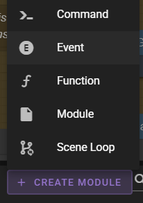
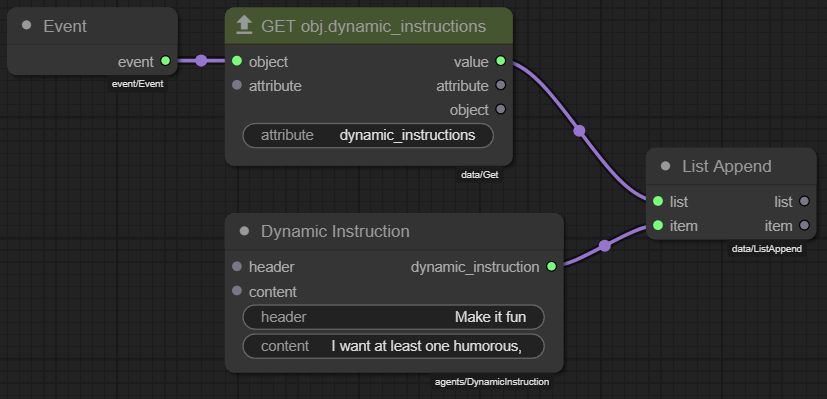
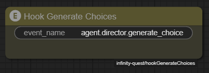

# Events

--8<-- "docs/snippets/common.md:documentation-is-a-work-in-progress"

The **:material-alpha-e-circle: Event** module base type allows the creation of node modules that listen to specfic events and run when they are emitted.

!!! note "Event reference"
    You can find a listing of available events in the [reference](../reference/events.md).

They are created like any other node module, through the **:material-plus: Create module** menu and selecting **:material-alpha-e-circle: Event**.

In the event module itself you can get access to the `event` emission object via the `Event` node.

There currently are no typed event emission nodes, so you will need to use the `Get` and `Set` nodes to get and set properties on the event object.

You can find the various event payloads in the [reference](../reference/events.md).

Once your event module is saved, you enable it by adding its node to the scene loop of your scene.

Once added to the scene loop you must also specify the `event_name`.

## Practical Example

The following example demonstrates how to use events node modules.

We will create a new event node module called `Hook Generate Choices` that will be used to add a custom instruction to the director agent's generate choices prompt.

First find the **:material-plus: Create module** menu and select **:material-alpha-e-circle: Event**.

Create the module and name it `Hook Generate Choices`.

In the node graph add these nodes:

- `Event`
- `Get`
- `Dynamic Instruction`
- `List Append`

Set them up

!!! payload "Get"

    | Property | Value |
    |----------|-------|
    | attribute | `dynamic_instructions` |

!!! payload "Dynamic Instruction"

    | Property | Value |
    |----------|-------|
    | header | `Make it fun` |
    | content | `I want at least one humorous choice!` |

Then connect them:

- `<Event>.event` :material-transit-connection-horizontal: `<Get>.object`
- `<Get>.value` :material-transit-connection-horizontal: `<List Append>.list`
- `<Dynamic Instruction>.dynamic_instruction` :material-transit-connection-horizontal: `<List Append>.item`

--8<-- "docs/snippets/common.md:save-graph"

In order to activate the event node module, we need to add it to the scene loop.

So load the scene loop and add the `Hook Generate Choices` node.

Set the `event_name` to `agent.director.generate_choices.inject_instructions`. (Again see the [reference](../reference/events.md) for the full list of events.)

