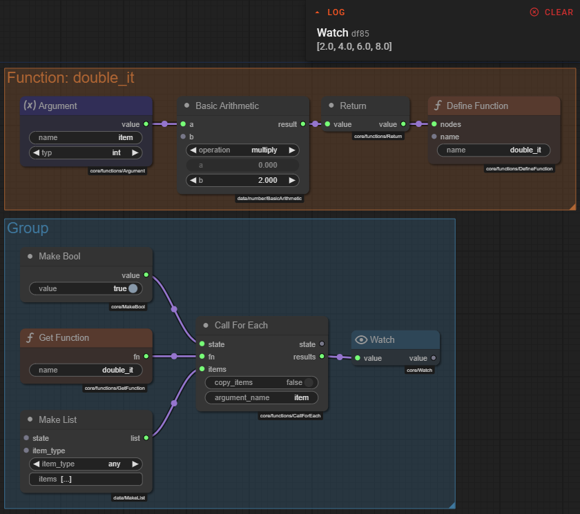
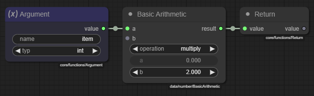
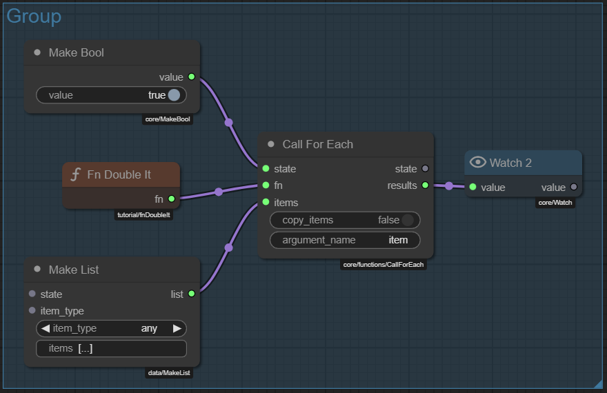
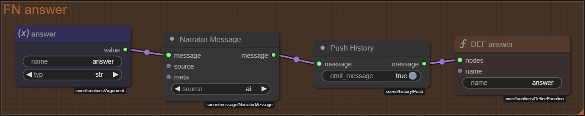
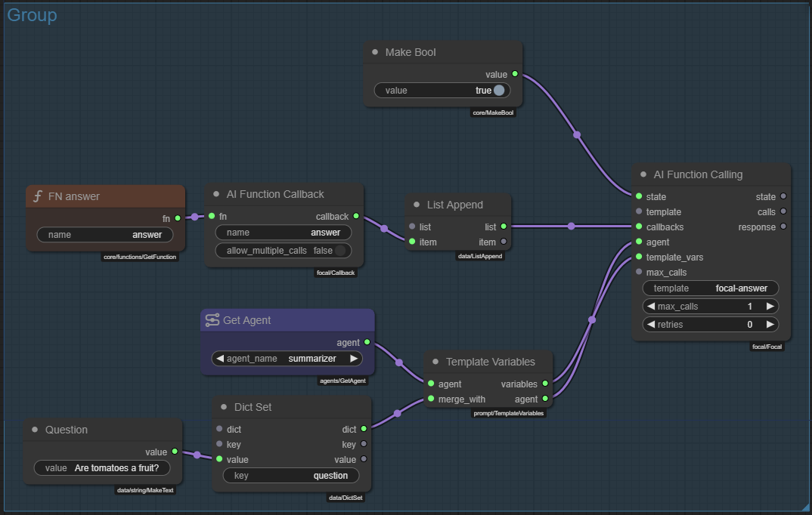

# Functions

Talemate allows you to encapsulate a collection of nodes into a **callable function**.  
Functions behave much like Python functions – they can receive typed arguments, return a value, and be reused from anywhere in your graphs (or even be exposed to the AI through FOCAL).  
This page explains the two flavours of functions that Talemate offers and shows how they integrate with the AI function-calling workflow.

--8<-- "docs/snippets/common.md:documentation-is-a-work-in-progress"

---

## Inline functions

Inline functions are created **inside an existing graph**.  They are ideal when the logic is only relevant to that one graph but you still want to keep the patch tidy or you need to delegate work to the AI.

The nodes involved are located in the *core/functions/* category:

| Node | Purpose |
|------|---------|
| **Argument** | Declares a function parameter.  The *name* and *type* properties map directly to the argument that will be visible when the function is called. |
| **Return**   | Emits the return value **and stops execution** of the enclosing graph. |
| **Define Function** | Marks a sub-graph as the body of a function and stores it under the given *name*.  The node has one input called **nodes** – connect it to *any* output socket of the **last** node in the body (typically the **Return** node). |
| **Get Function** | Retrieves the function wrapper by *name*.  The wrapper appears on the **fn** output socket. |
| **Call Function** | Executes the wrapper and returns the result on **result**.  It has an optional **args** input/property for supplying a *dict* of arguments. |
| **Call For Each** | Utility node that iterates over a list and calls the supplied function once per item. |

### Example – doubling every number in a list

The screenshot below (`functions-0001.png`) shows a complete inline-function setup that doubles each element of a list:



1. **Make List**

A *Make List* node creates the list `[1, 2, 3, 4]` (you set this in its **items** property).  Its **list** output is what we want to process.

2. **Function body**

Build the function that doubles a single number:

- *Argument* node named `item` – represents the incoming number.  
- *Basic Arithmetic* – multiplies `item × 2`.  
- *Return* node – outputs the result.  

3. **Define Function** 

The *Define Function* node sits outside the dashed box.  Give it a *name* like `double_number` and connect its **nodes** input to the **Return** node (the tail of the body).  This wraps the sub-graph as a callable function.

4. **Get Function**

Elsewhere drop a *Get Function* node, set its *name* to `double_number`, and take the **fn** output.

5. **Call For Each** 

Feed the original list into **items** and the function wrapper into **fn**.  Set *argument_name* to `item`.  The node iterates through `[1, 2, 3, 4]`, calls the function for each, and outputs a list `[2, 4, 6, 8]` on **results**.

And that's it: you now have a reusable, inline function that can be called any number of times without cluttering your main graph.

Because inline functions live in the parent graph they **inherit its state**.  They are therefore able to read & write shared `state.data` values or even call `StopGraphExecution`, just like any other node.

!!! note 

    If you need the same function in multiple graphs, convert it into a *Function Module* instead of repeating the Define/Get pattern in every graph.

---

## Function modules

A Function Module is a **self-contained node module** you create with the editor and register under the core type `Function`.  After creation it appears in the **Module Library** like any other node and exposes a single output called **fn**.

!!! tip "When should I use a Function Module?"
    In most cases a *regular* module is all you need—regular modules already behave like self-contained nodes that you can drop into a graph to run reusable logic.  
    Create a **Function** module *only* when:
    
    1. You want to expose the module to the AI through FOCAL function calling.
    2. You need to **iteratively call** the module from other graphs using **Call Function** / **Call For Each**.
    
    For everything else, a normal module keeps things simpler.

### Creating a Function Module

1. In the **Module Library** (bottom of the editor) click **:material-plus: Create Module** and choose **Function**.  In the dialog that pops up **enter a title** and **set the registry path** (you can use `$N` as a placeholder for an auto-generated name).
2. Add *Argument* and *Return* nodes exactly like with inline functions.  The module *itself* doesn't need Define/Get nodes – the editor automatically exposes the **fn** output.
3. (Optional) Add *Module Property* nodes if you want the caller to configure behaviour.
4. Save the module.

*In the **FN Double it** `Function` module:*


### Using a Function Module

1. Add the node to the graph via the right-click context menu or the node search.
2. Connect its **fn** output to *Call Function* (or to a FOCAL Callback).  
3. Pass arguments normally and receive the return value.

Under the hood the module is instantiated as a `FunctionWrapper`, the same class used by inline functions.  All life-cycle semantics (argument discovery, shared state, StopGraphExecution, etc.) therefore match 1-to-1.



---

## Utility nodes

Besides the core nodes there are a few helpers that make working with functions easier:

* **Call For Each** – Iterate over a list and invoke the function for every item.  Property *argument_name* sets the parameter that receives the current element.
* **Breakpoint** – Pause execution when hit so you can inspect the current *GraphState* (useful while developing a complex function).
* **Error Handler** – Catch exceptions and delegate them to a user-defined function for graceful recovery.

---

## AI function calling using FOCAL nodes

Talemate's **FOCAL** system allows an LLM to *dynamically* decide which of your functions to call, with rich structured arguments.

!!! note "What is FOCAL?"
    FOCAL (Function Orchestration and Creative Argument Layer) is Talemate's prompt-orchestration layer: it first lets the language model propose one or more structured *function calls*, then executes those calls and optionally loops back with results.  This keeps creative text generation and deterministic logic neatly separated.

!!! tip "FOCAL vs. built-in AI tool calls"
    FOCAL is **not** based on proprietary *"AI tool call"* APIs.  Instead it works by showing the model **clear JSON examples plus a schema description** for every callback you expose.  Any model that can emit valid JSON and follow instructions can therefore use it.  The upside is broad compatibility; the downside is that less capable models may struggle to produce well-formed calls or adhere to the schema, especially for complex argument types.

The integration is provided by the **focal/** node set:

| Node | Purpose |
|------|---------|
| **AI Function Callback** | Wraps a `FunctionWrapper` so it can be exposed to the AI.  The node scans the function for *Argument* nodes and builds a fully-typed `focal.Callback` description. |
| **AI Function Calling** | Sends a prompt template to the selected agent, telling it which callbacks it may call.  Returns a list of `focal.Call` objects and the raw LLM response. |
| **Process AI Function Call** | Extracts a single call from the list, exposing its *name*, *arguments*, *result*, and *called* flag. |

### Typical workflow

1. Create (or reuse) a function via the methods above.
2. Add an **AI Function Callback** node, connect the function wrapper to its **fn** input, and set the *name* that the AI should use.
3. Collect one or more **AI Function Callback** nodes into an **AI Function Calling** node along with a prompt *template*.  
   – Add any *template vars* you need via the input socket or property.  
   – Optionally raise *max_calls* or *retries* if the AI needs more attempts.
4. The **calls** output yields a list of `focal.Call` objects.  Feed them into **Process AI Function Call** to inspect the result or route execution based on what was invoked.

### Example – answering a question with FOCAL

The next two screenshots show a complete, runnable setup that asks the model a question and records the answer via a callback.





Step-by-step:

1. **Define the callback function**  

- Inside the orange group we build a small inline function called `answer`: an *Argument* node (`answer`) → a *Narrator Message* node that turns the text into a chat message → *Push History* to add it to the scene log → *Return*.  
- A **Define Function** node (`DEF answer`) wraps this graph, while **Get Function** (`FN answer`) lets other nodes retrieve it.

2. **Expose it to the AI**  

- An **AI Function Callback** node takes the wrapper from *Get Function*.  Its *name* property is set to `answer`, matching the parameter in our prompt template.

3. **Compose the prompt**  

- The Jinja2 template `focal-answer.jinja2` (see below) prints out FOCAL instructions followed by the actual question (`{question}`).  
- A **Template Variables** node merges the user's question into a dict and feeds it to **AI Function Calling**.

4. **AI Function Calling**  

- `template`: `focal-answer`  
- `callbacks`: the list coming from *List Append* which currently contains just our `answer` callback.  
- `agent`: whatever agent you want to use (e.g. `summarizer`).  
- `state`: optional – here a *Make Bool* just feeds `true` so the state socket is live.

5. **Process AI Function Call** (not shown in the screenshots but usually added afterwards) can inspect the returned `calls` list to confirm the function was invoked and examine the arguments.

Jinja template excerpt  (`focal-answer.jinja2`):

*The template file should live in the **current scene's template directory** (e.g. `scenes/my-scene/templates/focal-answer.jinja2`).*

```jinja2
<|SECTION:FUNCTION CALLING INSTRUCTIONS|>
{{ focal.render_instructions() }}

{{
    focal.callbacks.answer.render(
        "Give your answer to the posed question.",
        answer="Your brief answer to the question. (1-4 sentences)",
        examples=[
          {"answer": "Paris is the capital of France."},
          {"answer": "It states that force equals mass times acceleration (F = m × a)."},
          {"answer": "H2O is the chemical symbol for water."}
        ]
    )
}}
<|SECTION:TASK|>
Answer the following question: {{question}}

Use the `answer` function to submit the answer.
```

When the prompt reaches the LLM, it sees explicit JSON examples for the `answer` callback.  The model responds with something like:

```json
{
  "name": "answer",
  "arguments": {
    "answer": "Yes – botanically, tomatoes are fruits because they develop from the ovary of a flower."
  }
}
```

`AI Function Calling` captures this, executes the `answer` function (which writes to scene history), and the result appears in **calls** for further processing.

### Tips

* The Argument *type* property is honoured by FOCAL.  Setting it to `int`, `bool`, etc. improves JSON extraction accuracy.
* If a function may be called more than once in a single prompt response, set *allow_multiple_calls* on the **AI Function Callback** node.