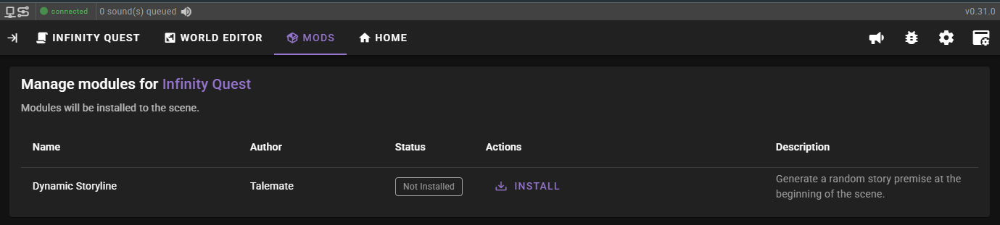
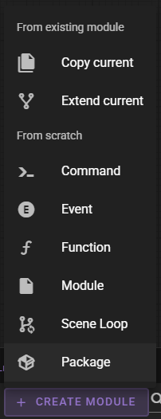
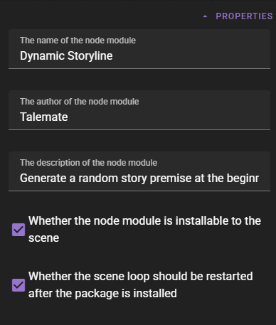
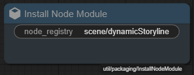
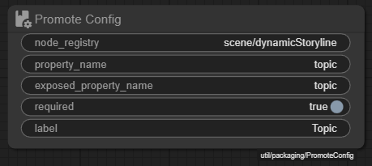

# Installable Packages

It is possible to "package" your node modules so they can be installed into a scene.

This allows for easier controlled set up and makes your node module more sharable as users no longer need to use the node editor to install it.

Installable packages show up in the Mods list once a scene is loaded.



## 1. Create a package module

To create a package - click the **:material-plus: Create Module** button in the node editor and select **Package**.



The package itself is a special kind of node module that will let Talemate know that your node module is installable and how to install it.

## 2. Open the module properties

With the package module open find the module properties in the upper left corner of the node editor.



Fill in the fields:

##### The name of the node module

This is what the module package will be called in the Mods list.

Example:

```
Dynamic Storyline
```

##### The author of the node module

Your name or handle. This is arbitrary and just lets people know who made the package.

##### The description of the node module

A short description of the package. This is displayed in the Mods list.

Example:

```
Generate a random story premise at the beginning of the scene.
```

##### Whether the node module is installable to the scene

A checkbox to indicate if the package is installable to the scene.

Right now this should always be checked, there are no other package types currently.

##### Whether the scene loop should be restarted when the package is installed

If checked, installing this package will restart the scene loop. This is mostly important for modules that require to hook into the scene loop init event.

## 3. Install instructions

Currently there are only two nodes relevant for the node module install process.


1. `Install Node Module` - this node is used to make sure the target node module is added to the scene loop when installing the package. You can have more than one of these nodes in your package.
1. `Promote Config` - this node is used to promote your node module's properties to configurable fields in the mods list. E.g., this dictates what the user can configure when installing the package.

### Install Node Module



!!! payload "Install Node Module"

    | Property | Value |
    |----------|-------|
    | node_registry | the registry path of the node module to install |

### Promote Config



!!! payload "Promote Config"

    | Property | Value |
    |----------|-------|
    | node_registry | the registry path of the node module |
    | property_name | the name of the property to promote (as it is set in the node module) |
    | exposed_property_name | expose as this name in the mods list, this can be the same as the property name or a different name - this is important if youre installing multiple node modules with the same property name, so you can differentiate between them |
    | required | whether the property is required to be set when installing the package |
    | label | a user friendly label for the property |

### Make talemate aware of the package

For talemate to be aware of the package, you need to copy it to the public node module directory, which exists as `templates/modules/`.

Create a new sub directory:

```
./templates/modules/<your-package-name>/
```

Copy the package module and your node module files into the directory.

Restart talemate and the package should now show up in the Mods list.