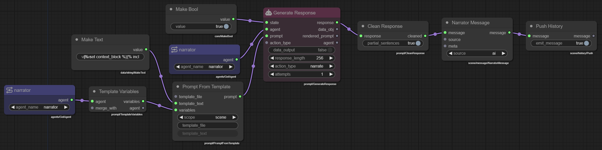
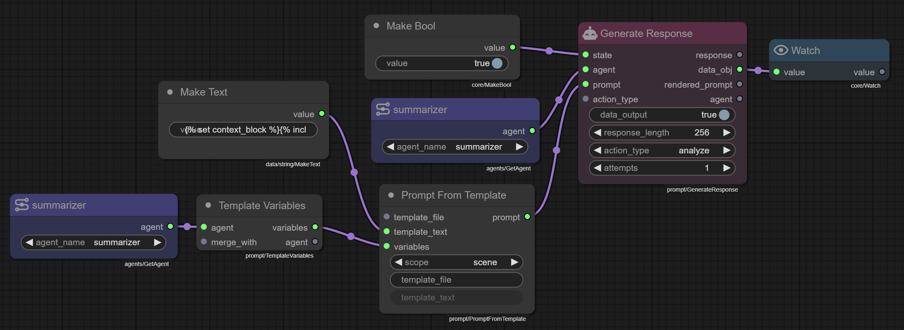
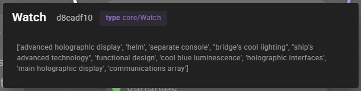

# Prompt Templates

Prompt templates in the node editor allow you to create dynamic, reusable prompts that can be customized with variables and sent to agents for processing.

## Overview

The prompt template system uses [Jinja2 templating](https://jinja.palletsprojects.com/en/3.0.x/) syntax, enabling you to:

- Create prompts with dynamic variables (e.g., `{{variable_name}}`)
- Use control structures like conditionals and loops
- Build reusable prompt structures for consistent agent interactions

!!! note "Common template patterns"

    Check out the [template pattern cheat sheet](../reference/useful-template-patterns.md) for common patterns and examples.

## Core Nodes

**`Prompt from Template`** 

- The primary node for working with templates. It accepts:
- `template_text` - For inline template content via a connected string input
- `template_file` - For loading templates from files
- `variables` - A dictionary of values to substitute into the template

## Template Sources

### Inline Templates
Connect a text-producing node (like `Make Text`) to the `template_text` input to define templates directly in your graph.

### File-based Templates
Set the `template_file` property to load templates stored as `.jinja2` files in your scene's template directory.

## Variables

Templates use `{{variable_name}}` syntax for variable substitution. Pass variables through the `variables` input as a dictionary, typically built using chained `Dict Set` nodes.

## Node Workflow

The typical node chain for working with prompt templates involves:

1. **Template Source** → `Prompt from Template`
   - Either `Make Text` (inline) or `template_file` property (file-based)

2. **Variable Preparation** → `Prompt from Template`
   - `Dict Set` nodes to build the variables dictionary

3. **Agent Selection**
   - `Get Agent` to retrieve the target agent

4. **Prompt Execution**
   - `Prompt from Template` → `Generate Response` → Output

## Template Scope and File Storage

The `scope` property on the `Prompt from Template` node determines where template files are searched and should be stored:

### Scene Templates (`scope: "scene"`)
- **Location**: `[scene_directory]/templates/`
- **Usage**: General-purpose templates for the scene
- **Example**: `scenes/my_scene/templates/analyze_situation.jinja2`

### Agent-Specific Templates (`scope: "[agent_type]"`)
- **Location**: `[scene_directory]/templates/[agent_type]/`
- **Usage**: Templates designed for specific agents
- **Available agent types**: `narrator`, `director`, `creator`, `editor`, `summarizer`, `world_state`
- **Example**: `templates/prompts/narrator/describe_location.jinja2`

### File Naming
- All template files must use the `.jinja2` extension
- Reference templates by name without the extension (e.g., use `analyze_situation` not `analyze_situation.jinja2`)
- Use descriptive names that indicate the template's purpose

## Prompting for data structures

In some cases you may want to prompt the agent to generate a data structure, like a dict or a list.

To do this, you can set the `data_response` property on the `Prompt from Template` node to `true`.

Just flipping the `data_response` property to `true` is not enough. The prompt needs to provide a clear instruction of the data structure you want to generate. An example is also highly recommended.

Remember you are interfacing with a language model, its not a mind reader, so you need to let it know what you want.

!!! note "This has a potential to fail."

    Especially older models sometimes struggle to output coherent json or yaml. Talemate will attempt to salavage any such response, but some are not recoverable, in which case an error will be logged.

## Example: Prompting the narrator to describe the environment



The inline template is defined in the `Make Text` node. The `Prompt from Template` node is used to render the template.

We use the the `Template Variables` node to set some common variables that are often used in talemate promps, such as `scene` and `max_tokens`.

The result of the `Generate Response` prompt is first fed into a `Clean Response` node to remove any partial sentences. Then the text is turned into a `Narrator Message` object, which is finally pushed onto the scene history, causing it to be rendered to the reader.

!!! payload "Content of Make Text"

    ```
    
    {{ context_block }}
    

    
    <|SECTION:TASK|>
    Describe the current environment and setting in detail.

    Consider:
    - Physical details of the location
    - Atmospheric elements (lighting, sounds, smells)
    - Current time of day and weather (if relevant)
    - Notable objects or features
    - The overall mood or ambiance

    Your description should enhance the reader's understanding of where the scene is taking place.
    <|CLOSE_SECTION|>
    ```

    Template explained:

    ```
    
    ```

    We render character information into a block called `context_block`. We do this so we can count how many tokens we are spending on character information.

    ```
    {{ context_block }}
    ```

    We then render the character information into the prompt.

    ```
    
    ```

    The budget for the scene history is calculated by subtracting the number of tokens in the character context and the response length from the total budget.

    ```
    
    ```

    We then render the scene history into the prompt.

    ```
    <|SECTION:TASK|>
    ```

    This indicates the start of the task section. Sections are used to group related information together. And the prompt will automatically format this in a way that is easy for the agent to understand.

    What then follows is the task itself.

    We close the section with the `CLOSE_SECTION` token.

    ```
    <|CLOSE_SECTION|>
    ```

## Example: Prompting for a data structure



In this example we are prompting the agent to generate a list of objects in the scene.

We use the `Generate Response` node to generate the list. We set the `data_response` property to `true` to tell the agent to generate a data structure.

The `data_obj` output will hold the parsed data structure.



!!! payload "Content of Make Text"

    ```
    
    {{ context_block }}
    

    
    <|SECTION:TASK|>
    List the items currently in the environment.

    Provide this list as a json list of strings, for example:

        ```json
        [
        "an old shelf",
        "a dirty carpet"
        ]
        ```
    Limit your list to a maximum of 10 items.

    <|CLOSE_SECTION|>
    ```

    Note how we are telling the agent to generate a json list of strings.

    An example helps a lot and you will also want to limit it, so it doesnt generate a broken partial list, which can't be parsed.