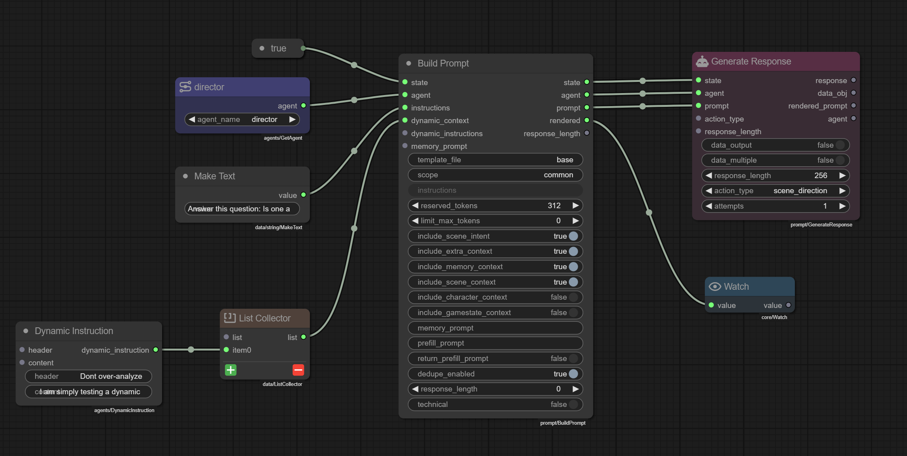

# Prompt Building

!!! info "New in version 0.33"
    The Build Prompt node was introduced in Talemate version 0.33.0.

The **Build Prompt** node is a high-level alternative to manually constructing prompts with templates. It automatically assembles prompts with contextual information based on configurable needs, making it much faster to create agent prompts without managing template files.

## Build Prompt vs Prompt Templates

While [Prompt Templates](prompt-templates.md) give you complete control over every aspect of your prompt construction, **Build Prompt** provides a streamlined approach:

| Feature | Build Prompt | Prompt Templates |
|---------|--------------|------------------|
| **Complexity** | Simple configuration | Full template control |
| **Context Management** | Automatic | Manual |
| **Token Budgeting** | Built-in | Manual calculation |
| **Setup Time** | Fast | Requires template creation |
| **Flexibility** | Predefined options | Complete customization |
| **Best For** | Quick prompts, standard patterns | Complex custom prompts |

**Use Build Prompt when:**

- You need standard contextual prompts quickly
- You want automatic context and memory management
- You're using common prompt patterns (analysis, direction, creation, etc.)

**Use Prompt Templates when:**

- You need precise control over prompt structure
- You have complex custom requirements
- You want to reuse specific prompt patterns across scenes

## The Build Prompt Node



**Expected output from the example above:**

A fully assembled prompt with:

- Base template structure from `common.base`
- Director agent context
- Dynamic instructions: "Don't over-analyze"
- Scene context with memory, intent, and extra context
- Question: "Answer this question: Is there a tiger in the room?"

### Inputs

- **`state`**: The graph state (required)
- **`agent`**: The agent that will receive the prompt (required)
- **`instructions`** (optional): Text instructions to include in the prompt
- **`dynamic_context`** (optional): List of `DynamicInstruction` objects for context
- **`dynamic_instructions`** (optional): List of `DynamicInstruction` objects for instructions
- **`memory_prompt`** (optional): Semantic query for memory retrieval

### Outputs

- **`state`**: Passthrough of the input state
- **`agent`**: Passthrough of the input agent
- **`prompt`**: The constructed `Prompt` object
- **`rendered`**: The rendered prompt as a string
- **`response_length`**: The calculated response length for token budgeting

### Properties

#### Template Configuration

- **`template_file`** (default: `"base"`): The template file to use
- **`scope`** (default: `"common"`): The template scope (common, agent-specific, etc.)

!!! warning "Template Compatibility"
    The Build Prompt node requires templates specifically designed to work with its configuration options. The default `common/base.jinja2` template is pre-configured to respect all the `include_*` boolean properties and dynamic instruction inputs.

    If you change the `template_file` or `scope`, ensure the template is compatible with Build Prompt's variable structure, or the context control properties may not work as expected.

#### Context Control

- **`include_scene_intent`** (default: `true`): Include the scene's current intent/direction
- **`include_extra_context`** (default: `true`): Include pins, reinforcements, and content classification
- **`include_memory_context`** (default: `true`): Include relevant memories from the scene via RAG (Retrieval-Augmented Generation). Works best when `memory_prompt` is provided to guide semantic search
- **`include_scene_context`** (default: `true`): Include scene history and state
- **`include_character_context`** (default: `false`): Include active character details
- **`include_gamestate_context`** (default: `false`): Include game state variables

#### Advanced Settings

- **`reserved_tokens`** (default: `312`): Tokens reserved from the context budget before calculating how much scene history to include. This provides a buffer for the response and any template overhead (range: 16-1024)
- **`limit_max_tokens`** (default: `0`): Maximum token limit (0 = use client context limit)
- **`response_length`** (default: `0`): Expected length of the response
- **`technical`** (default: `false`): Include technical context (IDs, typing information)
- **`dedupe_enabled`** (default: `true`): Enable deduplication in the prompt
- **`memory_prompt`** (default: `""`): Semantic query string for memory retrieval. Provide this to guide what memories are retrieved when `include_memory_context` is enabled
- **`prefill_prompt`** (default: `""`): Text to prefill the response
- **`return_prefill_prompt`** (default: `false`): Return the prefill with response

## Dynamic Instructions

Dynamic instructions allow you to inject contextual information into prompts at runtime. They come in two types:

### Dynamic Context

Provides background information and context to the agent. Use the **Dynamic Instruction** node connected to the `dynamic_context` input (typically via a List Collector).

### Dynamic Instructions

Provides specific instructions or directives to the agent. Use the **Dynamic Instruction** node connected to the `dynamic_instructions` input (typically via a List Collector).

**Dynamic Instruction Node Properties:**

- **`header`**: The instruction header/title
- **`content`**: The instruction content/body

## Example Workflow

The example screenshot shows a typical workflow:

1. **Agent Selection**: Get the `director` agent
2. **Dynamic Instructions**: Create a "Don't over-analyze" instruction using the Dynamic Instruction node
3. **Collect Instructions**: Use a List Collector to gather dynamic instructions
4. **Instructions**: Provide the main instruction via Make Text node: "Answer this question: Is there a tiger in the room?"
5. **Build Prompt**: Configure context needs (scene intent, extra context, memory, scene context enabled)
6. **Generate Response**: Send the built prompt to the agent with appropriate settings

## Common Patterns

### Simple Question Prompt

```
[Get Agent] → [Build Prompt] → [Generate Response]
                    ↑
            [Make Text: "Your question here"]
```

### Prompt with Dynamic Instructions

```
[Dynamic Instruction] → [List Collector] → [Build Prompt] → [Generate Response]
[Get Agent] ────────────────────────────────────↑
[Make Text: "Main instruction"] ────────────────↑
```

### Analysis with Full Context

Enable all context options:
- `include_scene_intent`: true
- `include_extra_context`: true
- `include_memory_context`: true
- `include_scene_context`: true
- `include_character_context`: true
- `include_gamestate_context`: true

### Quick Direction with Minimal Context

Disable unnecessary context:
- `include_character_context`: false
- `include_gamestate_context`: false
- `include_memory_context`: false (if not needed)

## Token Budget Management

Build Prompt automatically manages token budgets for scene history inclusion:

1. **Start with max context**: Uses `max_tokens` from the agent's client
2. **Subtract reserved tokens**: Removes `reserved_tokens` to create a buffer for the response
3. **Count rendered context**: Calculates tokens used by all enabled contexts (intent, memory, instructions, etc.)
4. **Calculate scene history budget**: `budget = max_tokens - reserved_tokens - count_tokens(rendered_contexts)`
5. **Fill with scene history**: Includes as much scene history as fits in the remaining budget

The `reserved_tokens` setting (default: 312) ensures there's always space reserved for the agent's response and prevents the context from being completely filled. Increase it if responses are getting cut off; decrease it if you want more scene history included.

## How Build Prompt Works with Templates

The Build Prompt node works by passing all its configuration options as variables to the template. The default `common/base.jinja2` template is specifically structured to:

1. **Check boolean flags**: Uses `` to conditionally include context sections
2. **Include sub-templates**: Dynamically includes templates like `scene-intent.jinja2`, `memory-context.jinja2`, etc.
3. **Process dynamic instructions**: Renders both `dynamic_context` and `dynamic_instructions` lists
4. **Calculate token budgets**: Uses `count_tokens()` to budget space for scene history
5. **Apply prefill prompts**: Handles the `prefill_prompt` and `return_prefill_prompt` options

This is why changing the template requires ensuring compatibility - a different template must expect and use these same variables.

## Template Scopes

The `scope` property determines where templates are loaded from:

- **`common`**: Shared templates in `templates/prompts/common/`
- **Agent types**: Agent-specific templates in `templates/prompts/{agent_type}/`
  - `narrator`, `director`, `creator`, `editor`, `summarizer`, `world_state`

The `template_file` property references the template name without the `.jinja2` extension.
