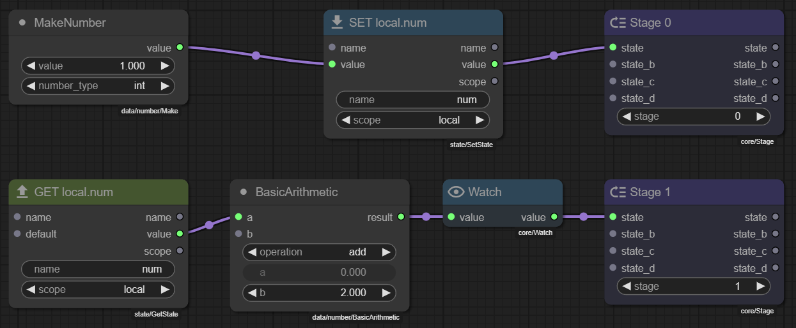

# Staging

!!! tip "Using Stages"

    Use `core/Stage` nodes to break a long node chain into smaller chunks.

    - Drop and connect a `Stage` node anywhere in the graph where you want a new execution step.
    - Set the `stage` number: `0` runs first, `1` runs after all stage-0 nodes, and so on.
    - You can also use **negative** stage numbers (e.g. `-1`) to make nodes run *before* stage 0.
    - Add more Stage nodes to create additional steps.
    - If a later stage needs data from an earlier stage, store it with **Set State** and retrieve it with **Get State** (local scope).
    - **Quick shortcut**: While dragging a connection from an output, press `X` to instantly create and connect a Stage node with the next available stage number.

    

Stage nodes are a way to organise and control the execution flow inside a node module.  
Instead of creating a single, very long chain of nodes, you can split your logic into
separate *stages*.  Each stage is processed in a well-defined order, which makes the
graph easier to read and maintain.

## What is a Stage?

A Stage is a special node (`core/Stage`) that acts as an **execution marker** in the graph. It holds
an integer **priority** (`stage` property) that the engine uses to decide when the
nodes *after* this marker should run.

The Stage node contains four inputs and four matching outputs (`state`, `state_b`,
`state_c`, `state_d`). These sockets do **not** exist to pass data through the
Stage—they exist so the node can physically attach to any point in your graph, either
inline between two nodes or at the start or end of a chain.

In other words, the Stage node is designed to be "wire-compatible" with most places
in a graph so you can drop it wherever you need a stage boundary without rerouting
existing connections. The **actual data** on those connections is *ignored* by the
Stage node—only the existence of a wire matters.

During execution the engine walks backwards from each node to find the lowest stage
value on its path. That value becomes the node's execution priority (lower numbers run earlier, and
**negative values are allowed**):

1. Nodes that are reachable through a Stage with `stage = -1` run before stage 0.
2. Nodes that are reachable through a Stage with `stage = 0` run next.
3. Nodes behind a Stage with `stage = 1` run after all stage-0 nodes have finished.
4. And so on for higher stage numbers.

## Why use Stages?

- **Readable graphs** – Shorter, focused chains are easier to understand than one long chain.
- **Deterministic order** – You decide exactly when a group of nodes should run.
- **Incremental design** – Start with stage 0, add more behaviour later in stage 1, 2, …

## Communicating between Stages

If you need to share data between stages you can use the `state/GetState` and
`state/SetState` nodes (with *Local* scope):

1. Inside an earlier stage, use **Set State** to store a value.
2. In a later stage, retrieve that value with **Get State**.

Because both nodes operate on the module's local state their values are available for
the remainder of the module execution but do not leak outside the module.

## Best Practices

- **Keep stage numbers small and contiguous** – e.g. 0, 1, 2. Large gaps make the
  order harder to follow. Although it can be beneficial that if you want a specific chain to always run at the end to use a larger stage so you dont have to constantly increment it as you add more stages.

- **One responsibility per stage** – Try to group nodes that achieve the same
  objective into the same stage.

- **Only one Stage per chain** – Placing more than one Stage node on the same direct
  path does not break execution, but only the lowest `stage` value on that path is
  considered. Additional Stage nodes become redundant.

Stage nodes give you a simple, explicit way to break large graphs into manageable
sections, improving both readability and maintainability.
