# Switches and conditional routing

Conditional routing is fundamental to creating dynamic, responsive graphs in Talemate. The switch and router nodes in `core/*` allow you to direct data flow based on conditions, create branching logic, and make decisions within your modules.

!!! tip "When to use switches and routers"

    - Use **Switch** nodes to activate different paths based on whether a value is truthy.
    - Use **RSwitch** nodes to select between different values based on a condition.
    - Use **Logical Routers** (OR/AND) when you need to combine multiple conditions.
    - Use **Case** nodes for multi-way branching based on exact value matching.

---

## Basic Switch Nodes

### `core/Switch`

The most fundamental conditional node. It checks if an input value is truthy and activates either the `yes` or `no` output path.

!!! info "Switch payload"

    | Type | Name | Description |
    |------|------|-------------|
    | **Input** | `value` | The value to check for truthiness |
    | **Property** | `pass_through` | If true, passes the input value to the active output. If false, passes `true` instead (default: true) |
    | **Output** | `yes` | Activated when the value is truthy |
    | **Output** | `no` | Activated when the value is falsy (None, False, or UNRESOLVED) |

!!! note "Truthy vs Falsy"
    In Talemate's node system, a value is considered falsy if it is `None`, `False`, or `UNRESOLVED`. Everything else is truthy, including empty strings, zero, and empty lists.

A simple example of a switch node is shown below. The `value` input is checked for truthiness, and if it is truthy, the `yes` output is activated, otherwise the `no` output is activated.

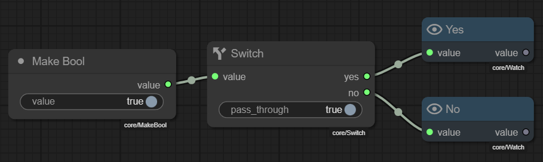

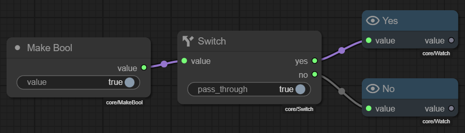

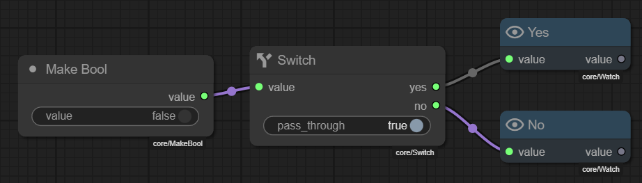

### `core/RSwitch` (Route Switch)

Routes one of two input values to the output based on a condition. Think of it as a ternary operator: `check ? yes : no`.

!!! info "RSwitch payload"

    | Type | Name | Description |
    |------|------|-------------|
    | **Input** | `check` | The condition to evaluate |
    | **Input** | `yes` | Value to output when check is truthy |
    | **Input** | `no` | Value to output when check is falsy |
    | **Output** | `value` | The selected value (either `yes` or `no` input) |

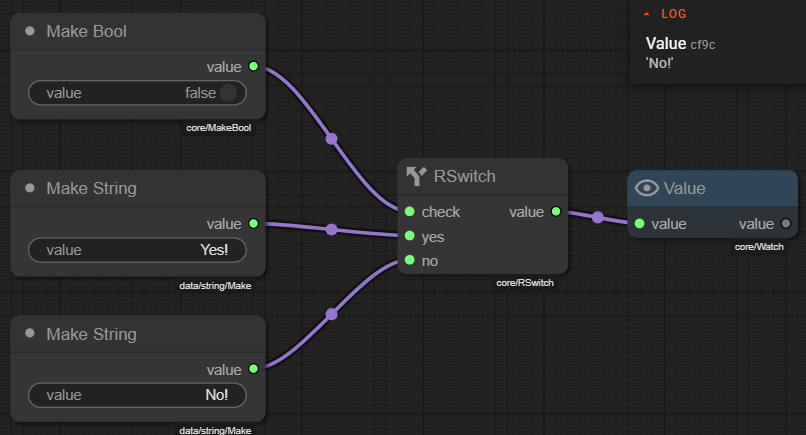

### `core/RSwitchAdvanced`

Similar to RSwitch but with separate outputs for each path, allowing different downstream processing for each case. 

!!! info "RSwitchAdvanced payload"

    | Type | Name | Description |
    |------|------|-------------|
    | **Input** | `check` | The condition to evaluate |
    | **Input** | `yes` | Value to route to `yes` output |
    | **Input** | `no` | Value to route to `no` output |
    | **Output** | `yes` | Receives the `yes` input value when check is truthy (deactivated otherwise) |
    | **Output** | `no` | Receives the `no` input value when check is falsy (deactivated otherwise) |

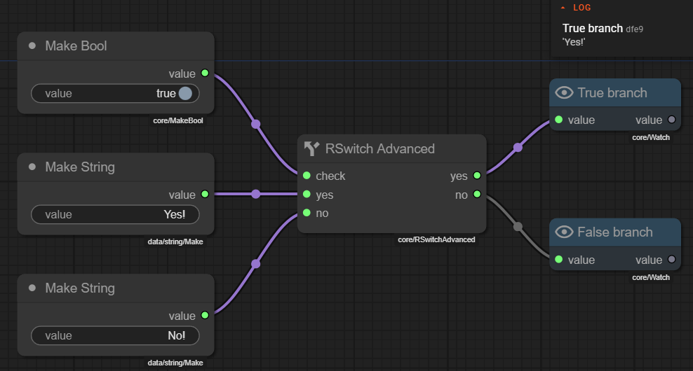

---

## Logical Router Nodes

These nodes combine multiple boolean conditions using logical operations.

### `core/ORRouter`

Routes based on OR logic – if **any** connected input is truthy, the `yes` path activates.

!!! info "ORRouter payload"

    | Type | Name | Description |
    |------|------|-------------|
    | **Input** | `a` | Boolean flag A (group: "flags") |
    | **Input** | `b` | Boolean flag B (group: "flags") |
    | **Input** | `c` | Boolean flag C (group: "flags") |
    | **Input** | `d` | Boolean flag D (group: "flags") |
    | **Input** | `value` | Optional value to pass through |
    | **Output** | `yes` | Activated if any connected flag is truthy |
    | **Output** | `no` | Activated if all connected flags are falsy |

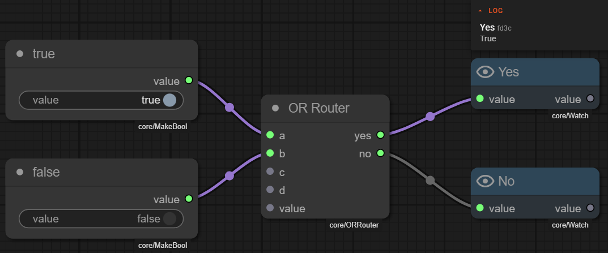

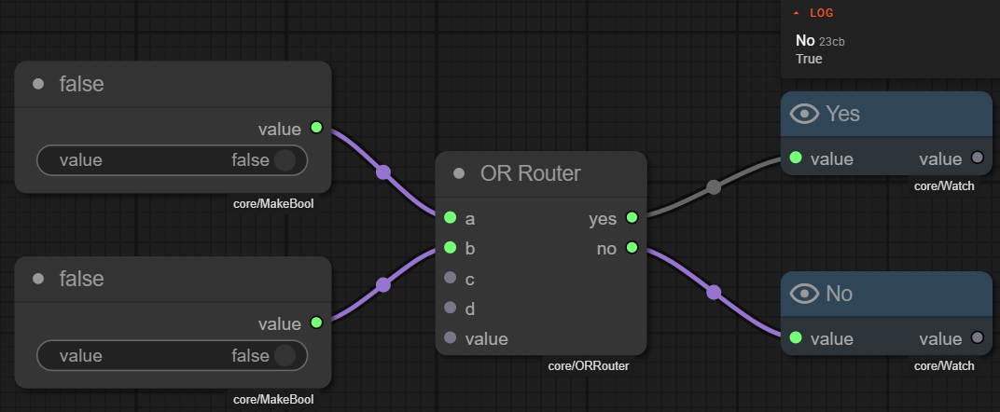

---

### `core/ANDRouter`

Routes based on AND logic – **all** connected inputs must be truthy for the `yes` path to activate.

!!! info "ANDRouter payload"

    | Type | Name | Description |
    |------|------|-------------|
    | **Input** | `a` | Boolean flag A (group: "flags") |
    | **Input** | `b` | Boolean flag B (group: "flags") |
    | **Input** | `c` | Boolean flag C (group: "flags") |
    | **Input** | `d` | Boolean flag D (group: "flags") |
    | **Input** | `value` | Optional value to pass through |
    | **Output** | `yes` | Activated only if all connected flags are truthy |
    | **Output** | `no` | Activated if any connected flag is falsy |

!!! note "Input Groups"
    The flag inputs (`a`, `b`, `c`, `d`) are in a group called "flags". This means at least one must be connected for the node to run, but you don't need to connect all four.

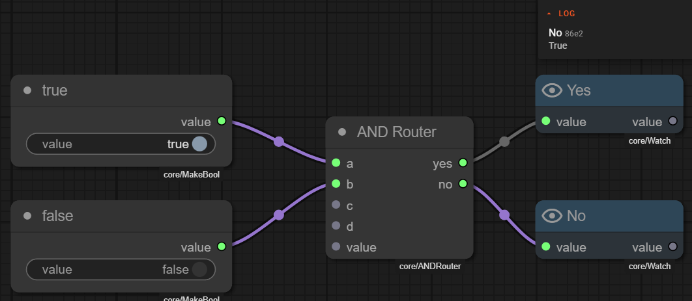

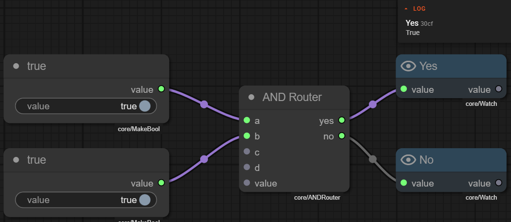

## Multi-way Branching

### `core/Case`

Performs multi-way branching based on exact value matching, similar to a switch/case statement in programming.

!!! info "Case payload"

    | Type | Name | Description |
    |------|------|-------------|
    | **Input** | `value` | The value to check |
    | **Property** | `attribute_name` | If specified, checks this attribute of the value instead of the value itself |
    | **Property** | `case_a` | The value to match for output `a` |
    | **Property** | `case_b` | The value to match for output `b` |
    | **Property** | `case_c` | The value to match for output `c` |
    | **Property** | `case_d` | The value to match for output `d` |
    | **Output** | `a` | Activated when the value matches case_a |
    | **Output** | `b` | Activated when the value matches case_b |
    | **Output** | `c` | Activated when the value matches case_c |
    | **Output** | `d` | Activated when the value matches case_d |
    | **Output** | `none` | Activated when no cases match |

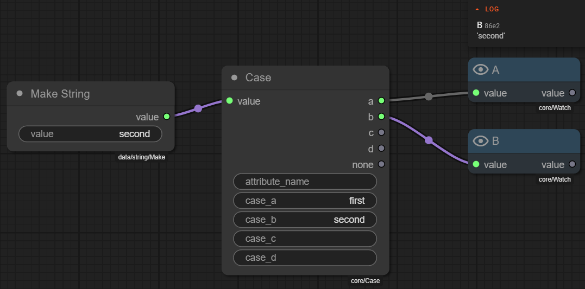

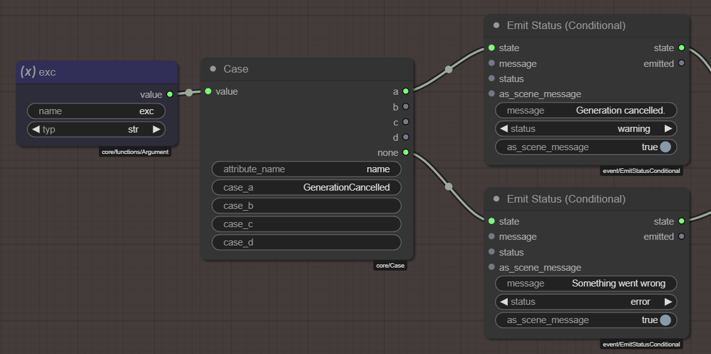

---

## Supporting Nodes

### `core/Invert`

Simple boolean NOT operation.

!!! info "Invert payload"

    | Type | Name | Description |
    |------|------|-------------|
    | **Input** | `value` | Boolean value to invert |
    | **Output** | `value` | The inverted boolean |

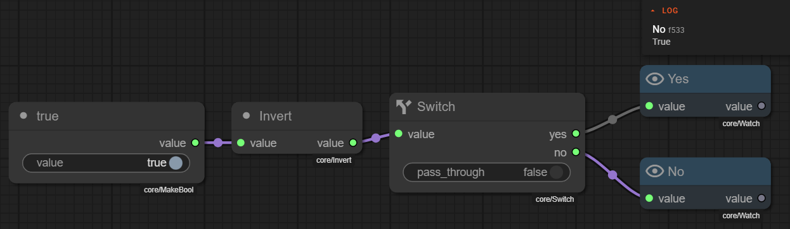

### `core/Coallesce`

Returns the first non-UNRESOLVED value from multiple inputs. Useful for providing fallback values.

!!! info "Coallesce payload"

    | Type | Name | Description |
    |------|------|-------------|
    | **Input** | `a` | First value to check (optional) |
    | **Input** | `b` | Second value to check (optional) |
    | **Input** | `c` | Third value to check (optional) |
    | **Input** | `d` | Fourth value to check (optional) |
    | **Output** | `value` | The first truthy value found, or UNRESOLVED if none are truthy |

---

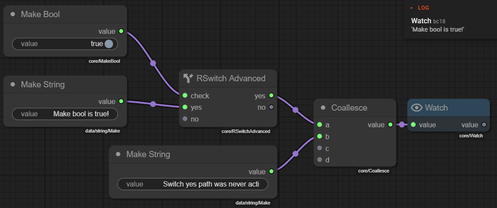

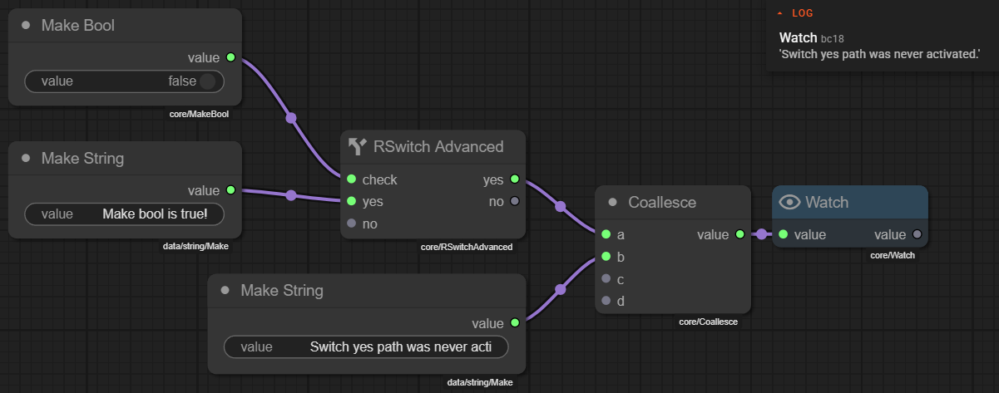

!!! bug "Coallesce node will show activated paths"
    Currently there exists a display bug where all paths leading into a coallesce node will be shown as activated. This is a known issue and will be fixed in a future update.

    But we can see from the log out put that the node is working as expected.

---

## Practical Patterns

### Conditional Execution

Use a Switch node to conditionally execute a branch:

1. Check condition → `Switch`
2. Connect processing nodes to `yes` output
3. Connect bypass or alternative to `no` output

### Value Selection

Use RSwitch for inline value selection:

1. Condition → `RSwitch.check`
2. Primary value → `RSwitch.yes`
3. Fallback value → `RSwitch.no`
4. Result → `RSwitch.value`

### Complex Conditions

Combine multiple conditions with logical routers:

1. Individual checks → `ORRouter` inputs `a`, `b`, `c`
2. If any are true → `ORRouter.yes` activates
3. If all are false → `ORRouter.no` activates

### Multi-way Routing

Use Case for routing based on specific values:

1. Input value → `Case.value`
2. Define cases in properties
3. Connect different processing to each output