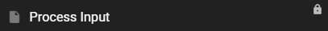

# Using the node editor

--8<-- "docs/snippets/common.md:documentation-is-a-work-in-progress"

The node editor is available in the main scene window once the scene is switched to creative mode.

Open the node editor by clicking the :material-chart-timeline-variant-shimmer: icon in the main toolbar (upper left).

Exit the node editor the same way by clicking the :material-exit-to-app: icon in the main toolbar (upper left).

## Module Library

The **:material-file-tree: Modules** Library can be found at the left sidebar of the editor. If the sidebar is closed, click the :material-file-tree: icon in the main toolbar (upper left) to open it.

It holds all the node modules that talemate has currently installed and is the main way to add new modules to the editor or open existing modules for inspection or editing.

### Module listing

Node modules are organized into hierarchical groups:

- **scene**: Scene-level modules that live with your project
- **agents/{agent}**: Agent-specific modules organized by agent name
- **core**: Core talemate system modules
- **installed/{project}**: Installed modules grouped by project (from `templates/modules/{project}`)
- **templates**: General template modules

All modules can be opened and inspected, but **only scene level modules can be edited**.

Installed and core modules will have a **:material-lock: Lock** icon next to their name. This means that they cannot be edited, but they can still be opened and inspected and copied into an editable scene level module.

!!! note "Modularity and load order explained"
    Read the [Modularity](modularity.md#module-load-order) section for more information on the load order of the modules.

### Filtering modules

Type search terms into the **Filter** field to only show modules that match the search terms.

### Opening modules

To open a module, click on the module you want to open.

Onced opened the module will be loaded into to node editor.

### Creating modules

To create a new scene module, click the **:material-plus: Create Module** button.

Select the appropriate module type.

| Module Type | Description |
|-------------|-------------|
| :material-file-multiple: Copy current | Copies the currently open module into a new module |
| :material-source-fork: Extend current | [Extends](module-inheritance.md) the currently open module into a new module |
| :material-console-line: Command | Creates a new [command](command-module.md) module |
| :material-alpha-e-circle: Event | Creates a new [event](events.md) module |
| :material-function: Function | Creates a new [function](functions.md) module |
| :material-file: Module | Creates a new module |
| :material-source-branch-sync: Scene Loop | Creates a new scene loop module |
| :material-package-variant: Package | Creates a new package module |
| :material-chat: Director Chat Action | Creates a new director chat action module |
| :material-robot-happy: Agent Websocket Handler | Creates a new agent websocket handler module |

In the upcoming dialog you can name the new module and set the registry path.

The registry path is the path to the module in the module library. 

The registry path must have at least two parts, the first part is the path to the module in the module library, the second part is the name of the module.

!!! note "Use $N in the registry path"
    The registry path can contain a `$N` placeholder. This will be replaced with a name generated from the module title.

    For example, if the module title is "My Module", the registry path will be `path/to/my/modules/$N`.

    The `$N` placeholder will be replaced with a name generated from the module title.

### Deleting modules

To delete a scene module click the :material-close-circle-outline: icon next to the module name.

!!! warning "Cannot be undone"
    Deleting a module is irreversible and cannot be undone.

## Node Editor

The node editor is made up of the toolbar, the canvas and the log watcher.

### Canvas

The canvas is the main area where you can add, connect and edit nodes.

### Log Watcher

Certain nodes can log messages to the log watcher. It is located in the upper right corner of the editor.

### Toolbar 

The toolbar shows the path of the currently open module and provides:

- A debug menu
- Testing controls
- Save

#### :material-bug: Debug Menu

Allows you to toggle on or off some debug options.

| Debug Option | Description |
|-------------|-------------|
| Set State | Causes Set State nodes to log their state to the log watcher |
| Get State | Causes Get State nodes to log their state to the log watcher |
| Clear Log on Test | Clears the log watcher on test |

#### :material-movie-play: Start Scene Test

Clicking the :material-movie-play: button will start the scene loop for testing.

This is useful if you want to stay in the module that you are currently editing, but want to start a testing run of the scene.

!!! note "Saving the module before testing"
    In order for the scene loop to pick up the current changes in the open module, you need to save the module first.

#### :material-play: Start Module Test

Clicking the :material-play: button will start a disconnected test run of the currently open module.

#### :material-stop: Stop Test

Clicking the :material-stop: button will stop the current test run.

#### Breakpoint controls

When a `Breakpoint` node is processed the module execution will pause and the toolbar will show the breakpoint controls.

| Breakpoint Control | Description |
|-------------|-------------|
| :material-debug-step-over: | Will open the module that triggered the breakpoint |
| :material-play-pause:| Releases the breakpoint and continues the module execution |

### Nodes

#### Adding a node

To add a node to the module, right click the canvas and select **Add Node**, then browse through the context menu to find the node you want to add.

#### Node Search

Alternatively, double clicking the canvas will open the node search.

Type in the search field to filter the nodes.

Click on the node you want to add to the canvas.

!!! tip "Press enter to add the top result"
    Pressing enter will add the top result to the canvas.

#### Connecting nodes

To connect nodes, click and drag from the output slot (right) of one node to the input slot (left) of another node.

#### Disconnecting nodes

Drag the output slot of one node to the canvas to disconnect it.

#### Selecting nodes

To select a single node, click on it, it will have a white border to indicate that it is selected.

To select *multiple* nodes, hold the `Ctrl` key and drag a rectangle around the nodes you want to select.

To add to a selection, hold the `Shift` key and click on the node.

To add multiple nodes to a selection, hold the `Ctrl+Shift` key and drag a rectangle around the nodes you want to add to the selection.

#### Deleting nodes

Select the node(s) and hit the `DEL` key to delete it.

#### Moving nodes

To move a single node simply hold the mouse button down and drag the node to the desired location.

To move multiple selected nodes hold the `Shift` key and drag the nodes to the desired location.

#### Resizing a node

To resize a node, move the mouse around the bottom right corner of the node until the resize cursor appears.

Then hold and drag the bottom right corner to resize the node.

#### Copying nodes

##### Ctrl+C / Ctrl+V

To copy a node, select it and hit `Ctrl+C`.

To paste a node, select the location where you want to paste it and hit `Ctrl+V`.

##### Alt drag to duplicate

You can also hold the `Alt` key and drag the selected node(s) to duplicate them and drag the duplicate to the desired location.

##### Alt+Shift drag to create counterpart

Certain nodes support creating a "counterpart" node. Hold `Alt+Shift` and drag the node to create its paired counterpart node.

For example:

- **Set State → Get State**: Creates a Get State node with matching scope and variable name
- **Input → Output**: Creates the corresponding socket node with matching configuration

The counterpart node is positioned near the original and can be immediately dragged to the desired location.

!!! note "Limited node support"
    This feature is currently only available for specific node types like Get/Set State and Input/Output socket nodes.

#### Node Properties

Most nodes come with properties that can be edited. To edit a node property, click on the corresponding input widget in the node.

A window will open with an appropriate input method to update the property.

#### Node title

You can change the title of any node by right clicking on it and then selecting `Title`.

##### Auto titling

Some nodes support auto titling. To auto title a node, hold `Shift` and click the node's title. 

The `Get State` node for example will auto title to display the `<scope>` and the `<variable name>`.

### Groups

Groups allow you to group nodes together by color schemes.

Any nodes inside a group will move with the group when the group is moved.

#### Adding a group

Right click on the canvas and select `Add Group`.

#### Group Properties

Edit a group's properties by right clicking the group and the n`Edit Group` option.

##### Title

Set the title of the group.

##### Color

Set the color of the group.

#### Deleting a group

Right click on the group and select `Edit Group` -> `Remove Group`.

#### Moving a group

Click and hold the group title to move the group.

#### Resizing a group

Move the mouse around the bottom right corner of the group until the resize cursor appears.

Then hold and drag the bottom right corner to resize the group.

#### Group control shortcuts

There are some convenience shortcuts for groups, they are activated by **clicking the group title while holding a modifier key**.

| Modifier Key| Description |
|-------------|-------------|
| `Ctrl` | Resize the group to neatly frame the nodes inside it |
| `Shift` | Create a new group beneath with the same width, color and title |
| `Alt` | Snap the group the group above it, aligning its top-left corner with the bottom-right corner of the other group |

### Comments

To add a comment right click the canvas and select `Comment`.

Double click the comment to edit the text.

##### Quick Watch node creation

While dragging a connection from an output socket, press the `W` key to automatically create and connect a `core/Watch` node. The Watch node will be:

- Created at your current mouse cursor position
- Automatically connected to the output you're dragging from
- Titled with the name from the source node's `input_name`, `name`, or `attribute` property (checked in that order), falling back to the output socket's name if none are found

This is useful for quickly inspecting values flowing through your node graph without having to manually create and connect Watch nodes.

!!! tip "Watch nodes for debugging"
    Watch nodes output their input values to the log watcher when running in creative mode, making them perfect for debugging and inspecting data flow in your modules.

##### Quick SetState node creation

While dragging a connection from an output socket, press the `S` key to automatically create and connect a `state/SetState` node. The SetState node will be:

- Created at your current mouse cursor position
- Automatically connected to the output you're dragging from (connected to the `value` input)
- Automatically configured with the `name` property set from the source node's `input_name`, `name`, or `attribute` property (checked in that order), falling back to the output socket's name if none are found
- Auto-titled if the node supports auto-titling (e.g., "SET {scope}.{name}")

This is useful for quickly creating state variables from node outputs without having to manually create and configure SetState nodes.

!!! tip "SetState nodes for state management"
    SetState nodes allow you to store values in different scopes (local, shared, scene loop, etc.) for use throughout your module or across module boundaries. The auto-configured name property makes it easy to create state variables that match your data flow.

##### Quick Stage node creation

While dragging a connection from an output socket, press the `X` key to automatically create and connect a `core/Stage` node. The Stage node will be:

- Created at your current mouse cursor position
- Automatically connected to the output you're dragging from (connected to the `state` input)
- Automatically configured with the `stage` property set to the next available stage number (highest existing stage value + 1, or 0 if no stages exist)
- Auto-titled with the stage number

This is useful for quickly breaking a long node chain into separate execution stages. See [Staging](staging.md) for more information on how stages control execution flow.

### Node alignment

When multiple nodes are selected, you can quickly align them using keyboard shortcuts.

#### Horizontal alignment

Press `X` (with two or more nodes selected and no connection being dragged) to align all selected nodes horizontally. All nodes will be moved to match the x-position of the leftmost selected node.

#### Vertical alignment

Press `Y` (with two or more nodes selected) to align all selected nodes vertically. All nodes will be moved to match the y-position of the topmost selected node.

### Color picker for color inputs

Nodes that have color properties (such as the `ModuleStyle` node) display a color widget with a visual swatch. Clicking on a color widget opens a color picker dialog where you can:

- Select a color visually using the color picker interface
- Enter a hex color code directly in the text field (format: `#RRGGBB`)

The color picker ensures consistent color formatting and provides a more intuitive way to select colors compared to manually entering hex codes.
