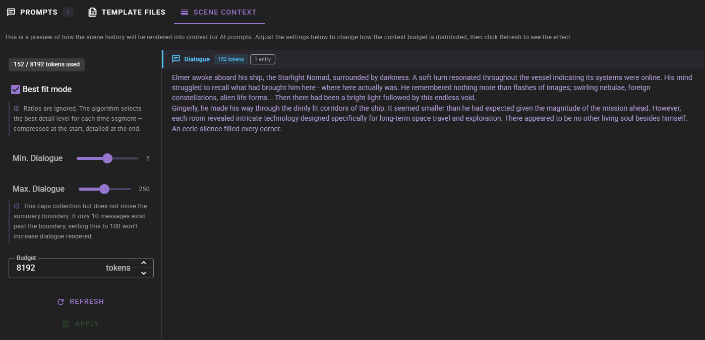

# Scene Context History Review

!!! info "New in 0.36.0"
    The context history review panel is a new tool for understanding and tuning how scene history is rendered into AI context.

The Scene Context History Review panel visualizes exactly how your scene history is assembled into the context that gets sent to the AI. It shows the rendered text broken into sections with per-section token counts, budget allocation, and adjustable settings that let you tune the context distribution and preview the result before applying changes.

## Accessing the Review Panel

The context review panel is available as the **Scene Context** tab within the [Prompt Manager](index.md). It is only active when a scene is loaded.

1. Open the **Prompt Manager** from the application toolbar
2. Click the **Scene Context** tab
3. Click **Refresh** to build the initial context preview

## Understanding the Preview

The preview displays the context broken into color-coded sections:

### Section Types

| Section | Color | Description |
|---------|-------|-------------|
| **Layered History** | Purple | Compressed summaries from the layered history system. Earlier events are more heavily compressed. |
| **Archived (Base Summarization)** | Orange | Standard summaries of archived dialogue, providing moderate detail for recent past events. |
| **Dialogue** | Blue | Recent verbatim dialogue and narration from the scene history. |

Each section header shows:

- **Section label** with an icon
- **Token count** for that section
- **Entry count** (number of individual entries in the section)
- **Budget** allocated to the section (when applicable)
- **Incomplete** warning if the section could not fit all available content within its budget

The total token usage is displayed at the top of the sidebar, showing how much of the total budget is consumed.

## Adjustable Settings

The sidebar provides controls that determine how the context budget is distributed across sections. Changes can be previewed by clicking **Refresh** and applied permanently by clicking **Apply**.

### Best Fit Mode

When enabled, best fit mode automatically distributes the budget across all history layers to cover the full timeline with a detail gradient -- compressed summaries at the start, full dialogue at the end. This mode replaces manual dialogue and detail ratio sliders with automatic optimization.

!!! tip "Recommended for most users"
    Best fit mode is the easiest way to get good context coverage. It automatically balances compression and detail to make the best use of your available budget.

When best fit mode is enabled, two additional controls become available:

- **Min. Dialogue** -- minimum number of recent dialogue messages to always include (0-10)
- **Max. Dialogue** -- maximum number of dialogue messages to include (10-500)

### Manual Mode Settings

When best fit mode is disabled, you have direct control over the budget distribution:

##### Dialogue Ratio

Controls what percentage of the total budget is allocated to verbatim dialogue (10%-90%). Higher values preserve more recent conversation at the expense of summarized history.

##### Summary Detail Ratio

Controls what percentage of the summary budget is allocated to detailed (base layer) summaries versus compressed (layered) summaries (10%-90%). Higher values favor more detailed summaries.

##### Enforce Boundary

When enabled, strictly enforces the boundary between dialogue and summary sections. Without enforcement, sections may borrow unused budget from each other for a more flexible distribution.

!!! warning
    Enabling enforce boundary can result in wasted budget if one section does not need its full allocation while another is truncated.

### Max Budget

The maximum number of tokens to allocate for scene history context (0-262144). When set to 0, the preview uses 8192 tokens as a default budget for display purposes. The actual budget used during generation is determined by the client's context window minus other prompt components.

## Workflow

A typical workflow for tuning context settings:

1. **Open the review panel** and click Refresh to see the current configuration
2. **Examine the sections** to see how your history is distributed
3. **Adjust settings** using the sidebar controls
4. **Click Refresh** to preview the effect of your changes
5. **Check for warnings** -- look for "incomplete" badges on sections, which indicate content was truncated
6. If the context history is incomplete, reduce the detail ratio or increase the budget
7. **Click Apply** to save the settings to the summarization agent configuration

The Apply button is only enabled when you have made changes that differ from the currently saved configuration.

## Related Documentation

- [Prompt Manager](index.md) -- the parent interface containing the context review panel
- [Summarizer Agent Settings](/talemate/user-guide/agents/summarizer/settings/) -- the underlying settings that this panel configures
- [World Editor History](/talemate/user-guide/world-editor/history/) -- managing history entries and layered history
