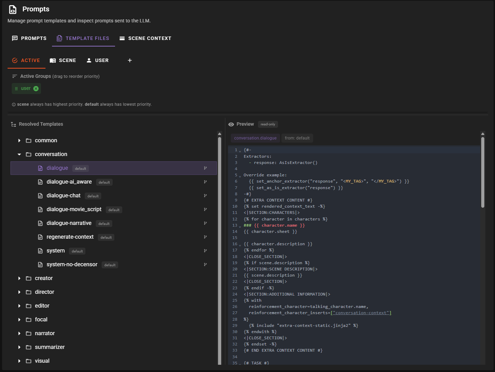
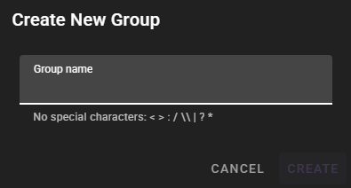
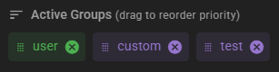
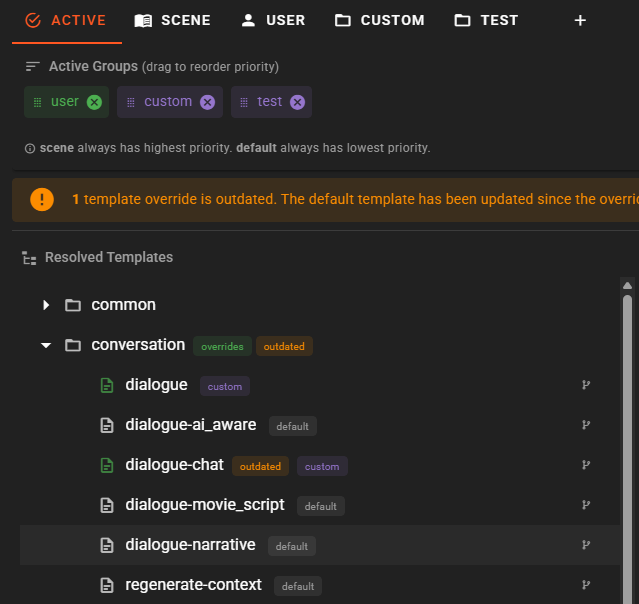
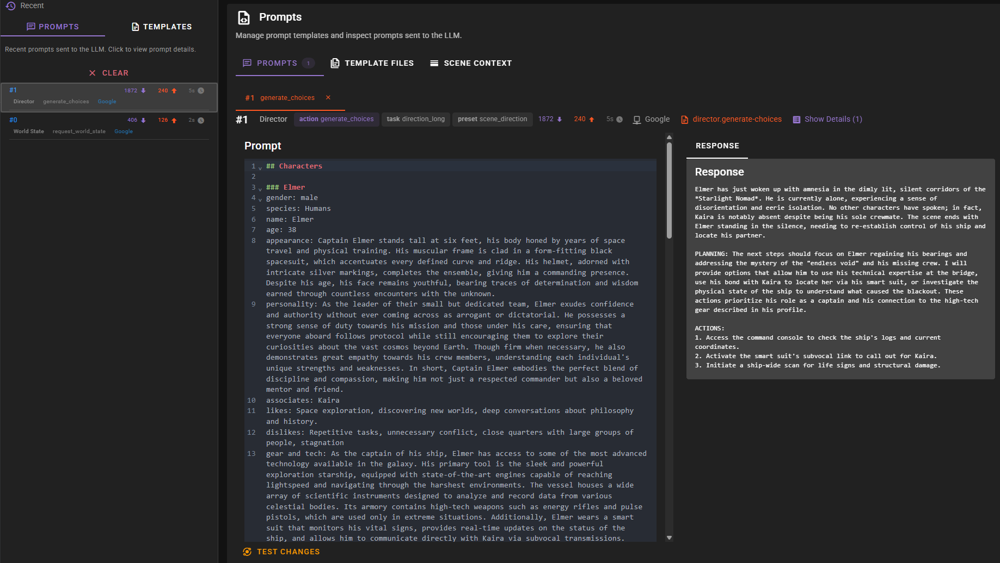

# Prompt Manager

!!! info "New in 0.36.0"
    The Prompt Manager is a new unified interface for managing prompt templates, inspecting sent prompts, and reviewing scene context.

The Prompt Manager provides a centralized interface for working with the Jinja2 prompt templates that drive all AI interactions in Talemate. It replaces the need to manually locate and edit template files, offering visual tools for template management, override tracking, and prompt inspection.

## Accessing the Prompt Manager

The Prompt Manager is accessible from the main application toolbar. Click the **Prompts** icon to open the manager.

The Prompt Manager is organized into three main tabs:

- **Prompts** -- inspect recently rendered templates and recently sent prompts
- **Template Files** -- browse, edit, and manage template groups and overrides
- **Scene Context** -- review how scene history is rendered into AI context (see [Scene Context History Review](context-history-review.md))

## Template Groups

Templates are organized into groups that control override priority. Each group is a collection of Jinja2 template files organized by agent (narrator, director, conversation, etc.).

### Built-in Groups

| Group | Description | Editable |
|-------|-------------|----------|
| **default** | Built-in templates shipped with Talemate. Always the fallback if no override exists. | No (read-only) |
| **user** | Your personal template overrides stored in `./templates/prompts/`. | Yes |
| **scene** | Scene-specific templates stored alongside the scene file. Only visible when a scene is loaded. | Yes |

### Custom Groups

You can create additional named groups for organizing template collections. Custom groups are stored in `./templates/prompt_groups/{group_name}/`. This is useful for maintaining different sets of templates for different purposes, such as genre-specific templates or experimental modifications.

To create a new group, click the **+** tab in the Template Files view and enter a name.

### Priority Order

When multiple groups contain a template with the same name, Talemate resolves which version to use based on a configurable priority:

1. **Scene** templates (highest priority when a scene is loaded)
2. **Explicit per-template overrides** (configured in the Active tab)
3. **Group priority list** (walked in order; `user` is included by default)
4. **Default** templates (lowest priority, always the fallback)

You can reorder the group priority list in the **Active** tab to control which group takes precedence when multiple groups provide the same template.

## Active Tab (Resolved Template Tree)

The **Active** tab shows the complete resolved template tree -- every template that Talemate will use, with a clear indication of which group each template is sourced from. Templates are color-coded by their source group, making it easy to see at a glance which templates are customized and which use the default.

### Override Indicators

The Active tab provides visual indicators to help manage overrides:

- **Override badge** -- directories or templates that have overrides from non-default groups are marked with a visual indicator
- **Outdated indicator** -- if a default template has been updated more recently than your override, it is flagged as potentially outdated. This is especially important after upgrading Talemate, as default templates may have changed

### Setting Per-Template Sources

For fine-grained control, you can set the source group for individual templates directly from the Active tab. This creates an explicit override that bypasses the normal priority resolution, allowing you to pick and choose templates from different groups.

## Editing Templates

To edit a template, navigate to its group tab (user, scene, or a custom group) and select the template file. The built-in editor opens with the full Jinja2 source.

!!! warning "Default templates are read-only"
    You cannot edit templates in the `default` group directly. To customize a default template, create a copy in the `user` group or another editable group.

To create a customized version of a default template:

1. Open the **Active** tab and locate the template you want to customize
2. View the template content in the default group
3. Switch to the target group tab (e.g., **user**)
4. Create a new template with the same agent directory and filename
5. Paste and modify the content

Templates are standard Jinja2 files with access to Talemate's template context variables and functions. For developer-level template documentation, see the [Developer Templates Guide](/talemate/dev/templates/).

## Response Extraction Directives

!!! info "Advanced Feature"
    Response extraction directives are primarily useful for developers and power users creating custom agent behaviors or node editor pipelines.

Templates can define how the LLM response should be parsed using extractor directives embedded in template comments. This allows templates to specify extraction patterns that are applied automatically when the prompt is processed.

### Available Extractors

| Extractor | Description |
|-----------|-------------|
| **AnchorExtractor** | Extracts content between two markers (e.g., `<MESSAGE>...</MESSAGE>`) |
| **ComplexAnchorExtractor** | Extracts multiple named sections between anchor pairs |
| **AsIsExtractor** | Returns the response without any modification |
| **AfterAnchorExtractor** | Extracts everything after a specific marker |
| **RegexExtractor** | Extracts content matching a regular expression pattern |
| **StripPrefixExtractor** | Removes a prefix pattern from the response |
| **CodeBlockExtractor** | Extracts content from fenced code blocks |
| **ComplexCodeBlockExtractor** | Extracts multiple named code blocks |

These extractors are also available as node editor nodes for building extraction pipelines in the node graph. See the [Node Editor documentation](/talemate/user-guide/node-editor/) for details.

## Inspecting Prompts

The **Prompts** tab tracks recently rendered templates and recently sent prompts, giving you full visibility into what is being sent to the LLM.

### Recently Rendered

Shows templates that were recently rendered by the system. Each entry includes a link to navigate directly to the template source for editing, making it easy to find and modify the template responsible for a particular prompt.

### Recently Sent

Shows the full prompt text that was sent to the LLM, including all assembled context and instructions. This is invaluable for:

- Debugging unexpected AI behavior
- Understanding how template changes affect the final prompt
- Verifying that context is being included correctly
- Checking token usage for different prompt components

## Upgrading from Previous Versions

!!! warning "Template Restructuring in 0.36.0"
    Significant housekeeping and restructuring of the default templates has been done in this release. If you have existing template overrides from a previous version, they may need to be reviewed and adjusted.

After upgrading to 0.36.0:

1. Open the Prompt Manager and go to the **Active** tab
2. Look for templates marked with the **outdated** indicator
3. Review each outdated override and compare it with the updated default version
4. Update your overrides as needed, or delete them to fall back to the improved defaults

### Removed Templates

The following default templates have been removed in 0.36.0. Any overrides for them should be cleaned up:

- `fix-continuity-errors`, `fix-exposition`, `summarize-events-list-milestones`, `timeline`
- `direct-determine-next-action`
- Per-agent `extra-context`, `memory-context`, `scene-context`, and `character-context` templates (replaced by shared common templates)
- `conversation/edit.jinja2`
