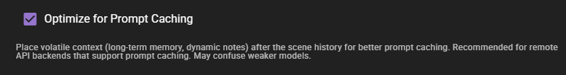

# Volatile Context Placement

!!! info "New in 0.36.0"
    Volatile context can now be placed after scene history to improve prompt caching hit rates on supported API backends.

Volatile context refers to frequently changing content included in AI prompts, such as:

- **Long-term memory (RAG)** -- retrieved context from the semantic memory database
- **Dynamic notes** -- automatically generated notes and context
- **Other dynamic context** -- any context that changes between requests

By default, this volatile content is placed **before** the scene history in the prompt. Version 0.36.0 introduces the option to place it **after** the scene history instead.

## Why It Matters

API providers like Anthropic and OpenAI support **prompt caching**, where the provider caches the prefix of your prompt to avoid re-processing unchanged content. This significantly reduces latency and cost for subsequent requests.

The key insight is that the stable portion of your prompt (system instructions, character definitions, scene history) changes less frequently than volatile content (RAG results, dynamic notes). When volatile content sits before the history, any change to it invalidates the cache for everything after it, including the large history block.

By moving volatile content **after** the history, the stable prefix remains unchanged between requests, resulting in better cache hit rates:

```
Default placement:
[System] [Characters] [Volatile Context] [Scene History] [Instructions]
                       ^^^ changes often, invalidates cache for history

Optimized placement:
[System] [Characters] [Scene History] [Volatile Context] [Instructions]
                                       ^^^ changes often, but history cache is preserved
```

## Configuration

Volatile context placement is controlled at two levels: per-client and per-agent.

### Per-Client Setting

The primary toggle is the **Optimize for Prompt Caching** setting on each LLM client.



1. Open the client settings by clicking on a client in the sidebar
2. Find the **Optimize for Prompt Caching** toggle
3. Enable it to move volatile context after scene history

This setting applies to all agents using this client, unless overridden at the agent level.

!!! warning "Use with capable models only"
    This setting defaults to **off**. Moving volatile context after the history changes the prompt structure, which may confuse weaker or smaller models. Use this with capable API-backed models (such as Claude, GPT-4, or Gemini) that can handle non-standard context ordering.

### Per-Agent Override

Individual agents can override the client-level setting through their action settings. This allows fine-grained control -- for example, you might enable prompt caching optimization for the narrator but not for the conversation agent if the conversation agent's model handles it poorly.

The per-agent setting has three values:

| Value | Behavior |
|-------|----------|
| **Auto** (default) | Uses the client's setting |
| **On** | Forces volatile context after history, regardless of client setting |
| **Off** | Forces volatile context before history, regardless of client setting |

## When to Enable

Enable prompt caching optimization when:

- You are using an API provider that supports prompt caching (Anthropic, OpenAI, Google)
- Your model is capable enough to handle the modified prompt structure
- You want to reduce API costs and latency

Do **not** enable it when:

- Using local models that do not benefit from prompt caching
- Using smaller or weaker models that may be confused by the changed context order
- You are not sure whether your model handles it well (test first)

## How It Works Internally

When a prompt template is rendered, it calls the `volatile_context_placement()` function to determine where to place volatile content. This function checks:

1. The active agent's per-agent override setting (`optimize_prompt_caching` in action config)
2. If set to `auto` or not present, falls back to the client's `optimize_prompt_caching` property
3. Returns either `"before_history"` (default) or `"after_history"`

The prompt templates use this value to conditionally order the context sections. The actual templates handle the placement logic, so enabling this setting automatically restructures all relevant prompts.

## Related Documentation

- [LLM Clients Overview](/talemate/user-guide/clients/) -- configuring LLM clients
- [Prompt Manager](index.md) -- inspecting rendered prompts to verify context ordering
- [Memory Agent Settings](/talemate/user-guide/agents/memory/settings/) -- long-term memory configuration
