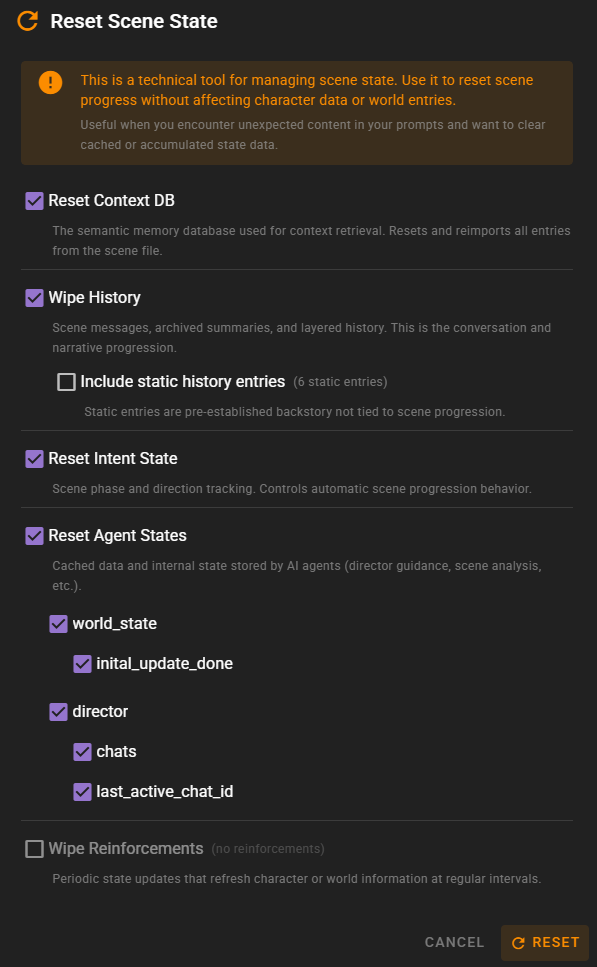

# Reset Scene State

!!! info "New in 0.36.0"
    The Reset Scene State dialog replaces the previous scattered reset commands with a single unified interface.

The Reset Scene State dialog provides granular control over clearing and resetting various components of your scene's internal state. This is a technical tool for managing scene data -- it allows you to reset scene progress without affecting character definitions or world entries.

## When to Use

The Reset Scene State dialog is useful when you:

- Encounter unexpected content in AI prompts caused by stale cached data
- Want to start a scene's progression over while keeping the characters and world setup intact
- Need to clear accumulated agent state that may be influencing AI behavior
- Want to selectively remove specific reinforcements or agent caches

## Accessing the Dialog

The Reset Scene State dialog can be accessed from the World State Manager in the scene tools menu.

## Components

The dialog presents each resettable component as a checkbox with a description. You can select any combination of components to reset in a single operation.

### Context DB

Resets the semantic memory database used for context retrieval (long-term memory / RAG). This performs a full reimport of all entries from the scene file, rebuilding the vector database from scratch.

Use this when context retrieval is returning stale or incorrect results, or after making significant changes to world entries that should be reflected in the memory database.

### History

Wipes scene messages, archived summaries, and layered history. This removes the entire conversation and narrative progression.

The dialog shows counts of current history entries:

- **Messages** -- active scene messages (dialogue, narration, etc.)
- **Archived** -- summarized history entries
- **Layered** -- compressed history layers

#### Preserve Static Entries

When wiping history, you can choose whether to include or preserve **static history entries**. Static entries are pre-established backstory that is not tied to scene progression. By default, static entries are preserved.

!!! warning "This action cannot be undone"
    Wiping history permanently removes all conversation and narrative progression. Save your scene before performing this operation if you want to be able to revert.

### Intent State

Resets the scene phase and direction tracking. This controls automatic scene progression behavior, including the scene intent system that guides the AI toward story goals.

### Agent States

Resets cached data and internal state stored by AI agents. Each agent that has stored state is listed individually, and you can expand each agent to select specific state keys to reset.

For example, the director agent may store guidance data, scene analysis results, or other cached information that influences its behavior. Resetting specific keys allows targeted cleanup without losing all agent state.

The dialog supports three levels of selection:

- **Select all agents** -- reset all agent state at once
- **Select a specific agent** -- reset all state for that agent
- **Select specific keys** -- reset individual state entries within an agent

### Reinforcements

Removes selected [state reinforcements](/talemate/user-guide/tracking-a-state/) from the scene. Each reinforcement is listed with its associated character (or "Global" for world-level reinforcements) and its tracking question.

You can select individual reinforcements to remove, or select all at once.

## Executing the Reset

After selecting the components you want to reset:

1. Click the **Reset** button
2. A confirmation dialog appears summarizing all actions that will be performed
3. Review the summary carefully
4. Click **Confirm Reset** to execute

After the reset completes, the frontend automatically refreshes to reflect the updated state.

## Related Documentation

- [World Editor History](/talemate/user-guide/world-editor/history/) -- managing history entries
- [Tracking a State](/talemate/user-guide/tracking-a-state/) -- understanding reinforcements
- [World State](/talemate/user-guide/world-state/) -- world state overview
