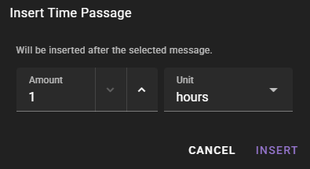
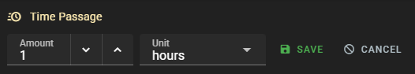

# Time Passage Management

!!! info "New in 0.36.0"
    Time passage messages can now be inserted, edited, and deleted directly in the scene view. The World State Manager history view also supports inline editing of time passage entries.

Time passage messages mark the flow of time within your scene. They appear as clock-themed markers between scene messages and influence how the AI understands the temporal context of your story.

## Inserting Time Passages

### From the Scene Tools Menu

The primary way to advance time is through the **Advance Time** option in the [Scene Tools](scenario-tools.md#advance-time) menu. This opens a submenu with preset durations ranging from 5 minutes to 10 years. By default, the [Narrator Agent](/talemate/user-guide/agents/narrator/) will narrate the time jump.

### From the Scene View

!!! info "New in 0.36.0"

You can now insert time passage markers at any point in the scene history, not just at the end. This is done through the context menu on individual scene messages.

To insert a time passage after a specific message:

1. Locate the message in the scene view after which you want time to pass
2. Use the message's context menu to insert a time passage
3. Specify the duration (amount and unit)

Available time units: minutes, hours, days, weeks, months, years.

## Editing Time Passages

### In the Scene View

Time passage markers in the scene view can be edited by double-clicking them. This opens inline editing controls where you can change the duration amount and unit.

1. **Double-click** the time passage message to enter edit mode
2. Adjust the **Amount** (numeric value) and **Unit** (minutes, hours, days, etc.)
3. Click **Save** to apply the changes, or **Cancel** to discard them

### In the World State Manager

The World State Manager's history view also displays time passage entries with editable duration fields. This provides an alternative interface for managing time passages, especially useful when reviewing the full history timeline.

To edit a time passage in the World State Manager:

1. Open the **World State Manager** from the scene tools
2. Navigate to the **History** view
3. Locate the time passage entry
4. **Double-click** the entry to open inline editing
5. Adjust the amount and unit, then click **Save**

## Deleting Time Passages

### From the Scene View

Each time passage marker in the scene view has a close button (visible on hover) that allows you to delete it. Click the close button to remove the time passage from the history.

### From the World State Manager

In the World State Manager history view, hover over a time passage entry to reveal a delete button. Click it and confirm the deletion.

!!! warning "Effect on Timestamps"
    Deleting or editing a time passage automatically recalculates all timestamps in the scene history that follow the changed entry. This ensures temporal consistency throughout the scene.

## How Time Passages Affect AI Context

Time passage messages serve several purposes in the AI context:

- They provide temporal context so the AI understands how much time has elapsed between events
- They influence the [Summarizer Agent](/talemate/user-guide/agents/summarizer/) -- events before a time jump are summarized separately
- They clear [actor directions](/talemate/user-guide/agents/director/settings/#direction-stickiness), ensuring directions given in one time period do not carry over

## Related Documentation

- [Scene Tools -- Advance Time](scenario-tools.md#advance-time) -- the main interface for advancing time
- [Narrator Agent Settings](/talemate/user-guide/agents/narrator/settings/#narrate-time-passage) -- configuring time passage narration
- [World Editor History](/talemate/user-guide/world-editor/history/) -- managing scene history
- [Scene Context History Review](prompts/context-history-review.md) -- reviewing how history is assembled into context
