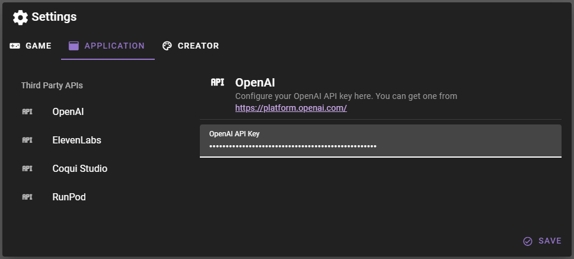
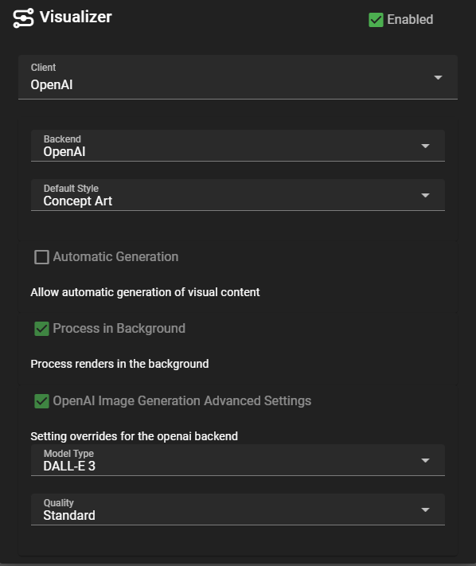
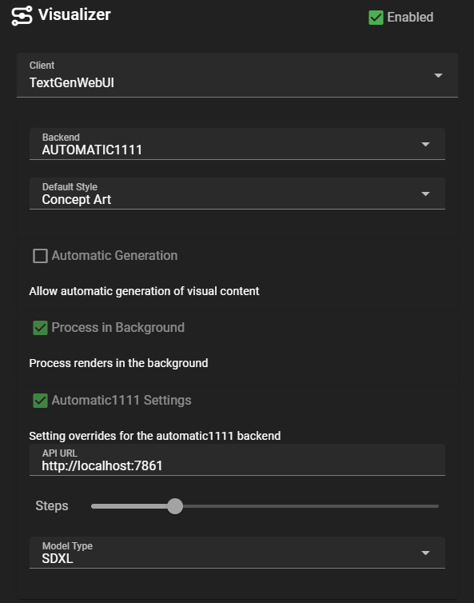
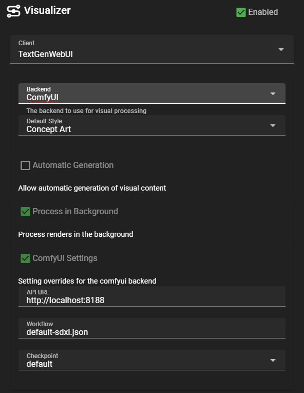
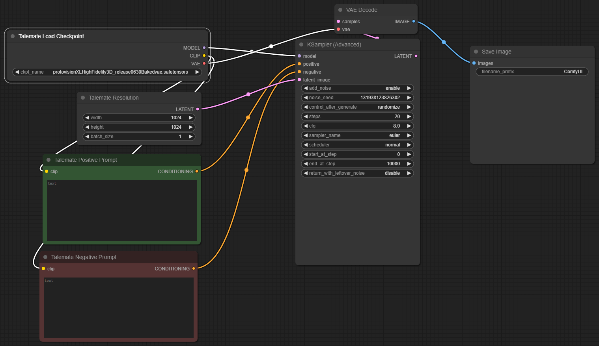
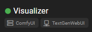
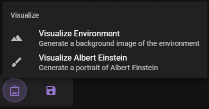
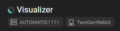
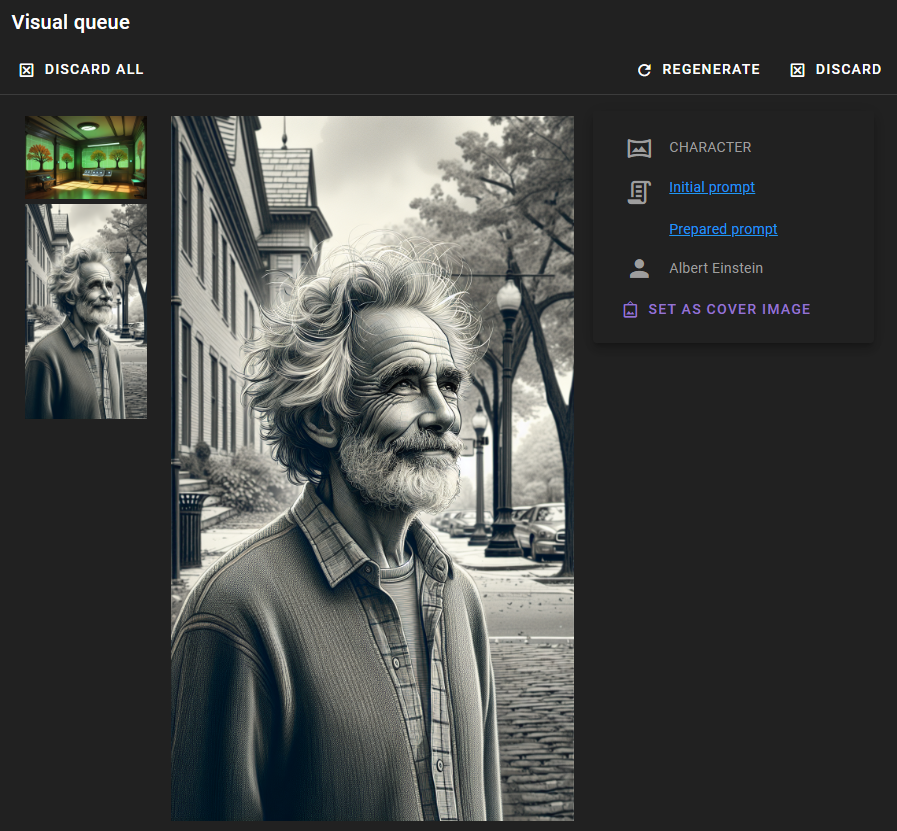

# Visual Agent

The visual agent currently allows for some bare bones visual generation using various stable-diffusion APIs. This is early development and experimental.

Its important to note that the visualization agent actually specifies two clients. One is the backend for the visual generation, and the other is the text generation client to use for prompt generation.

The client for prompt generation can be assigned to the agent as you would for any other agent. The client for visual generation is assigned in the Visualizer config.

## Index

- [OpenAI](#openai)
- [AUTOMATIC1111](#automatic1111)
- [ComfyUI](#comfyui)
- [How to use](#how-to-use)

## OpenAI

Most straightforward to use, as it runs on the OpenAI API. You will need to have an API key and set it in the application config.



Then open the Visualizer config by clicking the agent's name in the agent list and choose `OpenAI` as the backend.



Note: `Client` here refers to the text-generation client to use for prompt generation. While `Backend` refers to the visual generation backend. You are **NOT** required to use the OpenAI client for prompt generation even if you are using the OpenAI backend for image generation.

## AUTOMATIC1111

This requires you to setup a local instance of the AUTOMATIC1111 API. Follow the instructions from their [GitHub](https://github.com/AUTOMATIC1111/stable-diffusion-webui) to get it running.

Once you have it running, you will want to adjust the `webui-user.bat` in the AUTOMATIC1111 directory to include the following command arguments:

```bat
set COMMANDLINE_ARGS=--api --listen --port 7861
```

Then run the `webui-user.bat` to start the API.

Once your AUTOAMTIC1111 API is running (check with your browser) you can set the Visualizer config to use the `AUTOMATIC1111` backend 



#### Extra Configuration

- `api url`: the url of the API, usually `http://localhost:7861`
- `steps`: render steps
- `model type`: sdxl or sd1.5 - this will dictate the resolution of the image generation and actually matters for the quality so make sure this is set to the correct model type for the model you are using.

## ComfyUI

This requires you to setup a local instance of the ComfyUI API. Follow the instructions from their [GitHub](https://github.com/comfyanonymous/ComfyUI) to get it running.

Once you're setup, copy their `start.bat` file to a new `start-listen.bat` file and change the contents to.

```bat
call venv\Scripts\activate
call python main.py --port 8188 --listen 0.0.0.0
``` 

Then run the `start-listen.bat` to start the API.

Once your ComfyUI API is running (check with your browser) you can set the Visualizer config to use the `ComfyUI` backend.



### Extra Configuration

- `api url`: the url of the API, usually `http://localhost:8188`
- `workflow`: the workflow file to use. This is a comfyui api workflow file that needs to exist in `./templates/comfyui-workflows` inside the talemate directory. Talemate provides two very barebones workflows with `default-sdxl.json` and `default-sd15.json`. You can create your own workflows and place them in this directory to use them. :warning: The workflow file must be generated using the API Workflow export not the UI export. Please refer to their documentation for more information.
- `checkpoint`: the model to use - this will load a list of all available models in your comfyui instance. Select which one you want to use for the image generation.

### Custom Workflows

When creating custom workflows for ideal compatibility with Talemate, ensure the following.

- A `CheckpointLoaderSimple` node named `Talemate Load Checkpoint`
- A `EmptyLatentImage` node name `Talemate Resolution`
- A `ClipTextEncode` node named `Talemate Positive Prompt`
- A `ClipTextEncode` node named `Talemate Negative Prompt`
- A `SaveImage` node at the end of the workflow.



## How to use

Once you're done setting up the visualizer agent should have a green dot next to it and display both the selected image generation backend and the selected prompt generation client.



Your hotbar should then also enable the visualization menu for you to use (once you have a scene loaded).



Right now you can generate a portrait for any NPC in the scene or a background image for the scene itself.

Image generation by default will actually happen in the background, allowing you to continue using Talemate while the image is being generated. 

You can tell if an image is being generated by the blueish spinner next to the visualization agent.



Once the image is generated, it will be avaible for you to view via the visual queue button on top of the screen.


Click it to open the visual queue and view the generated images.



### Character Portrait

For character potraits you can chose whether or not to replace the main portrait for the character (the one being displated in the left sidebar when a talemate scene is active).

### Background Image

Right now there is nothing to do with the background image, other than to view it in the visual queue. More functionality will be added in the future.